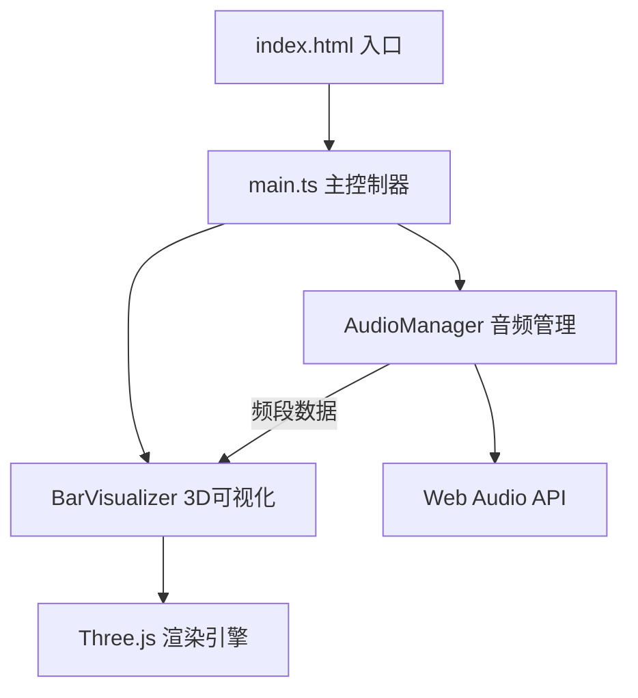

## 1. 架构设计



## 2. 技术说明

- **前端框架**：TypeScript + Three.js 0.160.0 + Vite
- **构建工具**：Vite，配置支持TypeScript和静态资源
- **音频处理**：Web Audio API（AnalyserNode进行FFT分析）
- **3D渲染**：Three.js（PerspectiveCamera、Mesh、Points、OrbitControls模拟）
- **无后端**：纯前端应用，所有处理在浏览器本地完成

## 3. 文件结构

| 文件路径 | 用途 |
|---------|------|
| `package.json` | 项目依赖：three@0.160.0、@types/three、typescript、vite |
| `tsconfig.json` | TypeScript严格模式，target: ES2020 |
| `vite.config.js` | Vite构建配置 |
| `index.html` | 入口页面，包含 `#root` 容器 |
| `src/main.ts` | 初始化Three.js场景、相机、渲染器，启动动画循环 |
| `src/audioManager.ts` | 音频上传、解码、播放控制、FFT分析 |
| `src/barVisualizer.ts` | 3D柱体创建/更新、相机控制、粒子系统、光晕效果 |

## 4. 核心模块接口

### AudioManager

```typescript
class AudioManager {
  constructor(container: HTMLElement, onProgressChange?: (time: number, duration: number) => void);
  getFrequencyData(): Uint8Array;        // 获取当前频段数据
  getBarCount(): number;                  // 获取当前柱体数量（响应式）
  isPlaying(): boolean;
  play(): void;
  pause(): void;
  stop(): void;
  seek(progress: number): void;           // progress: 0~1
  dispose(): void;
}
```

### BarVisualizer

```typescript
class BarVisualizer {
  constructor(container: HTMLElement, barCount: number, starCount: number);
  update(frequencyData: Uint8Array): void;  // 每帧调用更新柱体
  setBarCount(count: number): void;         // 响应式切换
  resize(): void;
  dispose(): void;
}
```

### 缓动函数

```typescript
function easeOutCubic(t: number): number {
  return 1 - Math.pow(1 - t, 3);
}
```

## 5. 性能优化策略

- 使用 `requestAnimationFrame` 驱动渲染循环，目标帧率≥45FPS
- 柱体高度变化使用目标值插值，避免每帧重建几何体
- 复用Geometry和Material，减少GC开销
- 响应式切换柱体/粒子数量时批量重建
- 频域数据降采样到目标柱体数量，避免冗余计算
