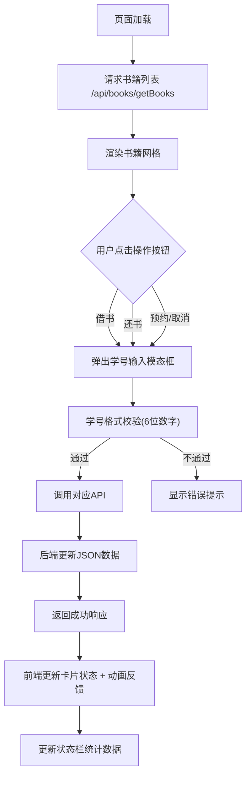

## 1. 产品概述

学校图书馆自助借还书管理系统，让学生通过浏览器自助完成书籍预约、状态查询和归还登记，减少人工窗口压力。

- 主要面向图书馆学生用户，提供便捷的线上借还书服务
- 目标是提升图书馆运营效率，降低排队等待时间

## 2. 核心功能

### 2.1 用户角色
| 角色 | 注册方式 | 核心权限 |
|------|---------|---------|
| 学生用户 | 学号验证 | 书籍查询、借书、还书、预约/取消预约 |

### 2.2 功能模块
1. **书籍展示面板**：书籍网格展示、状态标签、操作按钮
2. **借书流程**：学号验证模态框、状态更新、视觉反馈
3. **还书流程**：学号匹配验证、状态重置
4. **预约功能**：预约/取消预约、状态切换
5. **状态栏统计**：实时显示书籍总数、在馆、借出、预约数量

### 2.3 页面详情
| 页面名称 | 模块名称 | 功能描述 |
|---------|---------|---------|
| 主页 | 顶部状态栏 | 毛玻璃效果，显示书籍统计数据 |
| 主页 | 书籍网格区域 | 响应式网格布局，展示所有书籍卡片 |
| 主页 | 书籍卡片 | 封面占位、书名、作者、状态标签、操作按钮 |
| 主页 | 操作模态框 | 学号输入验证、实时格式校验、确认/取消按钮 |

## 3. 核心流程

用户进入页面后自动加载书籍列表，通过点击卡片上的操作按钮触发借书/还书/预约流程：输入学号验证 → 发送API请求 → 后端处理并返回结果 → 前端更新状态并展示动画反馈。

## 4. 用户界面设计

### 4.1 设计风格
- **主色调**：科技蓝 #0a192f，背景渐变 #0a192f → #020c1b
- **状态标签色**：在馆 #4caf50（绿色）、预约中 #ff9800（橙色）、已借出 #f44336（红色）
- **按钮样式**：半透明白色 #ffffff20，圆角矩形，悬停不透明度30%并上移2px，过渡0.2s ease
- **字体**：白色文字，状态标签加粗
- **布局风格**：卡片式网格布局，桌面4列、平板2列、手机1列
- **图标风格**：文字状态标签为主，封面使用纯色背景+首字母缩写占位

### 4.2 页面设计概述
| 页面名称 | 模块名称 | UI元素 |
|---------|---------|--------|
| 主页 | 顶部状态栏 | 毛玻璃背景 rgba(255,255,255,0.15)，高度60px，固定定位，统计数字展示 |
| 主页 | 书籍卡片 | 圆角12px，纯色封面占位，状态标签带颜色背景，操作按钮带点击反馈(缩放0.95倍/0.1s) |
| 主页 | 操作模态框 | 居中弹出，半透明黑色遮罩 #00000080，淡入动画0.3s |

### 4.3 响应式
- 桌面端：4列网格，每列最小宽度280px，间距24px
- 平板端：2列网格
- 手机端：1列网格
- 卡片滚动入场动画：交错延迟0.1s，从底部滑入渐显，过渡0.4s ease-out

### 4.4 动画与交互
- 卡片入场：交错延迟0.1s，底部滑入+渐显
- 状态变更：卡片背景微闪0.3s对应颜色渐变
- 按钮点击：缩放0.95倍，持续0.1s
- 按钮悬停：上移2px，不透明度增加
- 模态框：淡入0.3s
