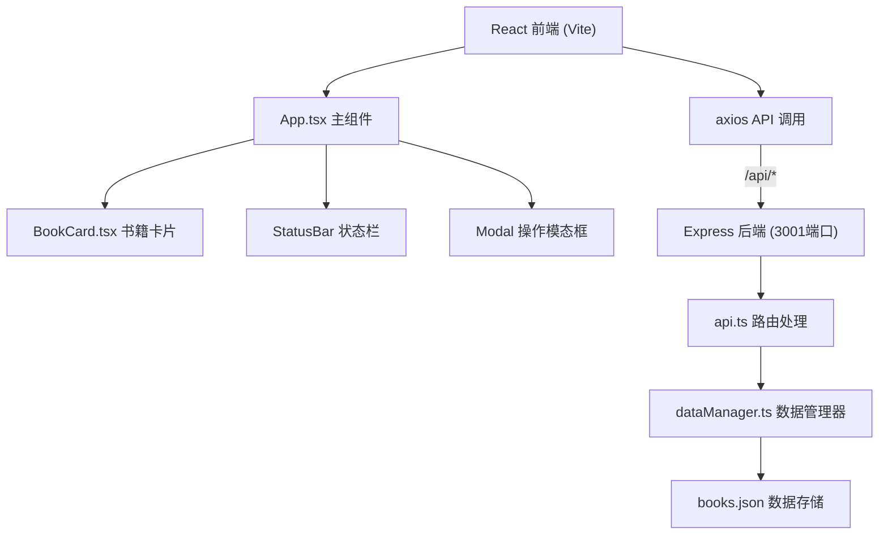
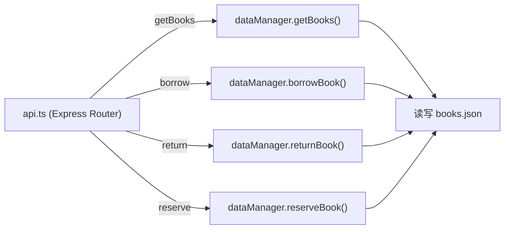
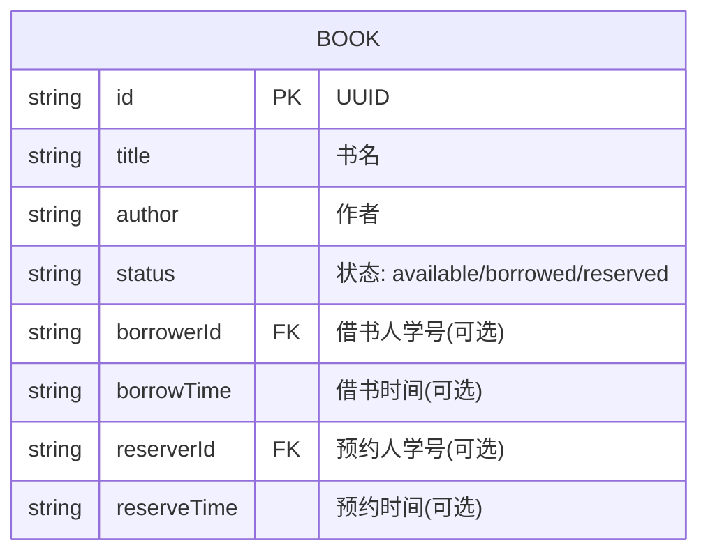

## 1. 架构设计



## 2. 技术描述

- **前端**：React@18.2.0 + ReactDOM@18.2.0 + TypeScript + Vite
- **后端**：Express@4.18.2 + TypeScript
- **构建工具**：Vite + @vitejs/plugin-react
- **数据存储**：JSON 文件 (src/server/books.json)
- **HTTP 客户端**：axios
- **辅助库**：uuid、cors
- **开发模式**：concurrently 同时启动前后端

## 3. 路由定义

| 路由 | 用途 |
|-----|------|
| / | 前端主页面 (Vite 开发服务器) |
| /api/books/getBooks | 获取所有书籍列表 |
| /api/books/borrow | 借书操作 |
| /api/books/return | 还书操作 |
| /api/books/reserve | 预约/取消预约操作 |

## 4. API 定义

### 类型定义
```typescript
type BookStatus = 'available' | 'borrowed' | 'reserved';

interface Book {
  id: string;
  title: string;
  author: string;
  status: BookStatus;
  borrowerId?: string;
  borrowTime?: string;
  reserverId?: string;
  reserveTime?: string;
}

interface ApiResponse<T = any> {
  success: boolean;
  data?: T;
  message?: string;
}
```

### 请求/响应 Schema

**GET /api/books/getBooks**
- 响应：`{ success: true, data: Book[] }`

**POST /api/books/borrow**
- 请求体：`{ bookId: string, studentId: string }`
- 响应成功：`{ success: true, data: Book, message: "借书成功" }`
- 响应失败：`{ success: false, message: "书籍不在馆/学号无效" }`

**POST /api/books/return**
- 请求体：`{ bookId: string, studentId: string }`
- 响应成功：`{ success: true, data: Book, message: "归还成功" }`
- 响应失败：`{ success: false, message: "学号不匹配/书籍未借出" }`

**POST /api/books/reserve**
- 请求体：`{ bookId: string, studentId: string, cancel?: boolean }`
- 响应成功：`{ success: true, data: Book, message: "预约成功/取消预约成功" }`
- 响应失败：`{ success: false, message: "书籍状态不允许预约" }`

## 5. 服务端架构图



## 6. 数据模型

### 6.1 数据模型定义



### 6.2 初始数据格式 (books.json)

```json
{
  "books": [
    {
      "id": "uuid-1",
      "title": "JavaScript高级程序设计",
      "author": "Nicholas C. Zakas",
      "status": "available"
    }
  ]
}
```

## 7. 文件结构

```
project-root/
├── package.json
├── index.html
├── tsconfig.json
├── vite.config.js
├── src/
│   ├── client/
│   │   ├── App.tsx
│   │   └── components/
│   │       └── BookCard.tsx
│   └── server/
│       ├── api.ts
│       ├── dataManager.ts
│       └── books.json
```
