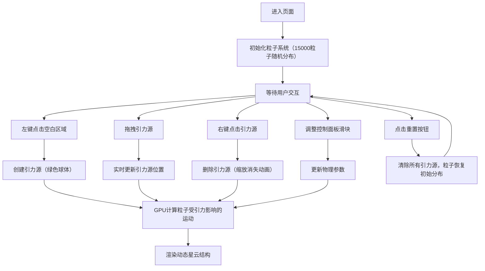

## 1. 产品概述
基于浏览器的3D星云粒子沙盒应用，用户通过鼠标在三维空间中创建和移动引力源，观察粒子系统受多重力场影响形成的动态星云状结构。
- 面向对物理模拟、粒子艺术、创意交互感兴趣的用户，提供沉浸式的3D粒子物理沙盒体验
- 产品价值：直观展示多体引力系统的动态美感，兼具教育意义和艺术创作潜力

## 2. 核心功能

### 2.1 功能模块
1. **主场景页**：3D粒子星云渲染、引力源交互、控制面板、操作提示

### 2.2 页面详情
| 页面名称 | 模块名称 | 功能描述 |
|-----------|-------------|---------------------|
| 主场景页 | 粒子系统 | 15000个粒子，球形随机分布，基于位置插值颜色，GPU并行物理计算 |
| 主场景页 | 引力源管理 | 左键创建、拖拽移动、右键删除，最多10个，绿色半透明球体表示 |
| 主场景页 | 物理模拟 | 牛顿引力公式F=GM/r²，速度上限限制，超边界重置循环 |
| 主场景页 | GUI控制面板 | 引力常数G、最大速度、粒子大小乘数滑块，重置按钮 |
| 主场景页 | 视角控制 | 右击拖拽轨道旋转、滚轮缩放、窗口自适应 |

## 3. 核心流程
用户进入页面后看到初始随机分布的粒子云。可通过左键点击空白区域创建引力源，粒子开始受引力影响形成动态结构。拖拽引力源可实时改变粒子运动轨迹，右键点击引力源可删除。通过右上角面板调整物理参数，观察不同参数下的粒子行为。点击重置按钮恢复初始状态。

## 4. 用户界面设计

### 4.1 设计风格
- **主色调**：深空蓝黑渐变背景 #000011，粒子调色板（深蓝#1a0033、紫罗兰#7b2d8e、粉红#ff66b2、蓝紫#4a4eff）
- **引力源**：绿色半透明球体，从中心到外缘渐变透明
- **控制面板**：半透明毛玻璃风格（rgba(255,255,255,0.08)，blur(12px)，圆角12px，宽240px）
- **按钮风格**：圆角按钮，按下时有0.1秒缩放反馈动画
- **布局**：全屏沉浸式3D场景，左上角操作提示，右上角控制面板，底部留白
- **粒子发光效果**：圆形Sprite带边缘羽化，两层光晕叠加（6px/0.5透明度、12px/0.2透明度）

### 4.2 页面设计概述
| 页面名称 | 模块名称 | UI元素 |
|-----------|-------------|-------------|
| 主场景页 | 3D场景 | 全屏黑色渐变背景，粒子云发光效果，引力源绿色渐变球体 |
| 主场景页 | 操作提示 | 左上角白色半透明文字，说明鼠标操作方式 |
| 主场景页 | 控制面板 | 右上角毛玻璃面板，3个滑块+1个重置按钮，标签+数值显示 |
| 主场景页 | 动画反馈 | 引力源删除缩放动画（0.2s），按钮按下缩放（0.1s），相机缩放插值（0.3s） |

### 4.3 响应式
桌面端优先设计，1024x768及以上分辨率保证正确显示，窗口尺寸变化时自动更新渲染器和相机比例。

### 4.4 3D场景指导
- **环境**：纯黑太空背景，无HDRI，营造深空氛围
- **光照**：粒子自发光，无场景光源，Additive Blending实现发光效果
- **相机**：初始位置(0,0,20)看向原点，PerspectiveCamera，轨道旋转范围水平±180°、垂直±60°，缩放范围5-50
- **构图**：粒子群居中，引力源在用户点击位置，控制面板和操作提示位于屏幕角落不遮挡主场景
- **交互**：射线拾取检测点击位置，拖拽时实时更新引力源位置，所有参数变化即时反馈到粒子运动
- **性能**：GPUComputationRenderer实现GPU并行粒子更新，目标45FPS以上（GTX 1060）
