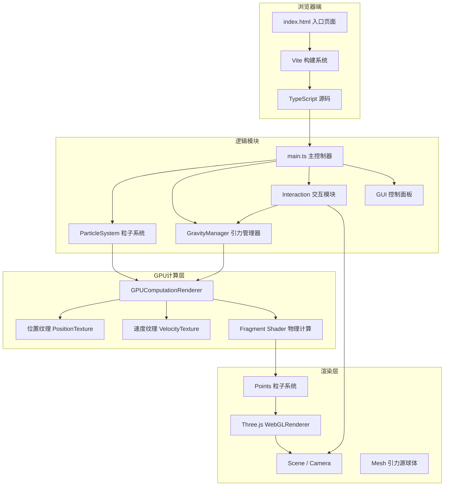

## 1. 架构设计



## 2. 技术说明
- **前端框架**：无UI框架，原生 TypeScript + Three.js 直接操作DOM和WebGL
- **构建工具**：Vite 5.x，提供快速冷启动和HMR
- **语言**：TypeScript 5.x，严格模式，ES2020目标
- **3D引擎**：three@0.160.0，包含GPUComputationRenderer扩展
- **类型定义**：@types/three
- **无后端**：纯前端项目，所有计算在浏览器端完成

## 3. 文件结构
| 文件路径 | 用途 |
|-------|---------|
| /package.json | 项目依赖配置（three@0.160.0, typescript, vite, @types/three） |
| /vite.config.js | Vite构建配置 |
| /tsconfig.json | TypeScript严格模式配置 |
| /index.html | 入口HTML，全屏canvas + DOM UI层 |
| /src/main.ts | 主入口：初始化场景、相机、渲染器、GUI、启动循环 |
| /src/particleSystem.ts | 粒子系统：GPU缓冲区、Shader定义、纹理读写 |
| /src/gravityManager.ts | 引力源管理：增删改查、uniform数据传递 |
| /src/interaction.ts | 交互处理：鼠标事件、射线拾取、轨道相机控制 |

## 4. 核心数据结构

### GravitySource
```typescript
interface GravitySource {
  id: number;
  position: THREE.Vector3;
  strength: number;
  mesh: THREE.Mesh;
  isRemoving?: boolean;
}
```

### SimParams
```typescript
interface SimParams {
  gravityConstant: number;   // G: 0.1 - 1.0, default 0.5
  maxVelocity: number;       // 1.0 - 5.0, default 2.0
  particleSizeMultiplier: number; // 0.5 - 2.0, default 1.0
}
```

## 5. Shader 设计（GPU粒子物理）

### 顶点着色器（粒子渲染）
- 从位置纹理读取粒子坐标
- 根据uniform大小乘数和粒子属性计算gl_PointSize
- 传递颜色和粒子ID到片元着色器

### 片元着色器（粒子渲染）
- 圆形软粒子：距离中心越远透明度越低，边缘羽化
- 两层径向渐变光晕叠加实现发光效果
- Additive Blending颜色混合

### 位置更新 Shader（GPUComputationRenderer）
- 读取当前位置和速度
- 遍历所有引力源（通过uniform数组传递）
- 累加计算引力加速度：a = G * M / r² * normalize(delta)
- 速度更新并钳制到maxVelocity
- 位置更新：pos += vel
- 边界检测：|pos| > 30时重置到边界内随机位置

### 速度更新 Shader
- 存储更新后的速度矢量供下一帧使用
