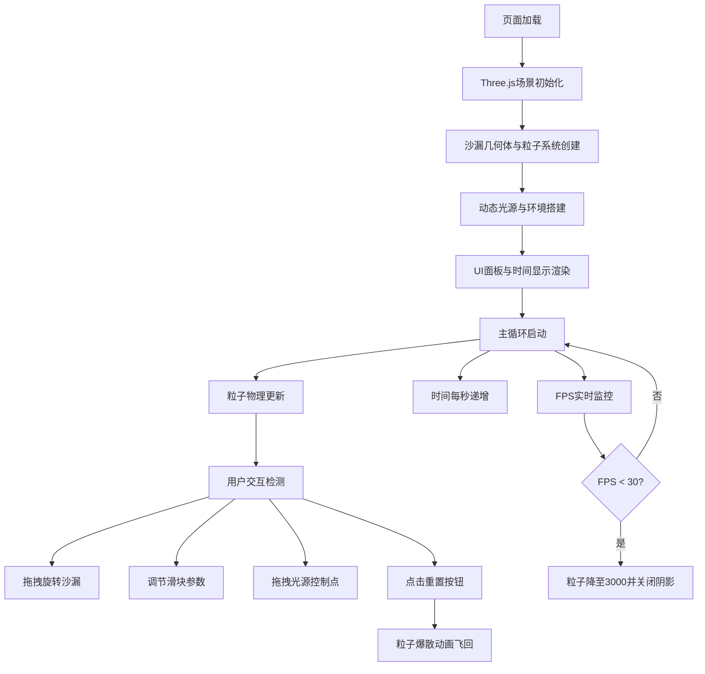

## 1. 产品概述
动态光影沙漏是一个沉浸式3D视觉体验项目，通过Three.js在浏览器中模拟真实沙漏的粒子流动效果与动态光影变化，让用户在办公桌前直观感受时间流逝的艺术化表达。
- 核心价值：将抽象的时间概念转化为可交互、可感知的3D视觉艺术装置
- 目标用户：设计爱好者、创意工作者、需要专注氛围的办公人群

## 2. 核心功能

### 2.1 功能模块
1. **沙漏3D渲染模块**：半透明玻璃沙漏几何体、粒子流动物理模拟、鼠标拖拽旋转交互
2. **动态光源系统**：三组可调节方向/强度的光源、实时阴影与反射、光源控制点拖拽
3. **时间动画模块**：模拟时间显示、粒子流速与时间同步、重置粒子爆散动画
4. **背景环境模块**：木纹桌面、渐变星空背景、装饰吊灯与散射光晕
5. **性能自适应模块**：FPS监控、自动降级粒子数量与阴影、响应式画布适配
6. **UI控制面板**：流速调节滑块、光源强度滑块、重置按钮、移动端抽屉菜单

### 2.2 页面详情
| 页面名称 | 模块名称 | 功能描述 |
|-----------|-------------|---------------------|
| 主页面 | 3D场景渲染 | 居中展示沙漏3D模型，支持鼠标拖拽Y轴旋转 |
| 主页面 | 时间显示 | 左上角显示HH:MM:SS格式时间，淡入动画 |
| 主页面 | 控制面板 | 右上角毛玻璃面板，包含流速/光源强度滑块和重置按钮 |
| 主页面 | 性能监控 | 右下角半透明面板显示FPS和粒子计算时间 |
| 主页面 | 响应式适配 | <768px时控制面板折叠为左侧抽屉，汉堡按钮展开 |

## 3. 核心流程
用户打开页面 → 沙漏粒子自动开始下落 → 时间同步流逝 → 用户可拖拽旋转沙漏/调节滑块/拖拽光源控制点 → 点击重置按钮粒子爆散飞回 → 性能自动降级保障流畅体验

## 4. 用户界面设计

### 4.1 设计风格
- **主色调**：深邃星空蓝 #0a0a20，配合金色粒子 #FFD700 作为视觉焦点
- **辅色调**：暖黄光源 #FFDD88，冷蓝光源 #88AAFF
- **材质质感**：毛玻璃半透明面板、Phong高光玻璃材质、Canvas生成木纹
- **字体**：monospace等宽字体用于时间显示，营造科技感
- **动效**：所有控件0.2s悬停缩放反馈，粒子0.3s easeInOutQuad缓动爆散

### 4.2 页面设计概述
| 页面名称 | 模块名称 | UI元素 |
|-----------|-------------|-------------|
| 主页面 | 3D场景 | 中央沙漏(高200px)、600x400px木纹桌面、渐变星空+闪烁星星、旋转吊灯 |
| 主页面 | 时间显示 | 左上角monospace 14px #aaa，向上淡入0.5s |
| 主页面 | 控制面板 | 右上角毛玻璃rgba(255,255,255,0.1) blur(8px)，圆形滑块 |
| 主页面 | 性能监控 | 右下角半透明背景，FPS+粒子计算时间 |
| 主页面 | 重置按钮 | 沙漏下方圆形30px #333，悬停#555 |

### 4.3 响应式设计
- 桌面端(≥768px)：控制面板固定右上角，画布16:9自适应窗口(300x169 ~ 1920x1080)
- 移动端(<768px)：控制面板折叠为左侧抽屉，左上角汉堡按钮(三条横线)控制展开

### 4.4 3D场景指导
- **环境氛围**：深空背景渐变(#000011→#001133)叠加100颗随机闪烁星星(周期3-5s)
- **光照设置**：主光源暖黄(左上45°强度1.5) + 辅助冷蓝(右下30°强度0.8) + 纯白背光(强度0.5) + 吊灯点光源(强度0.3范围200px)
- **相机设置**：PerspectiveCamera，视角聚焦沙漏中心，支持轨道式Y轴旋转
- **阴影配置**：ShadowMap 1024x1024，低FPS时自动关闭
- **粒子系统**：BufferGeometry + PointsMaterial，5000颗金色1px粒子，重力0.5单位/帧抛物线下落
