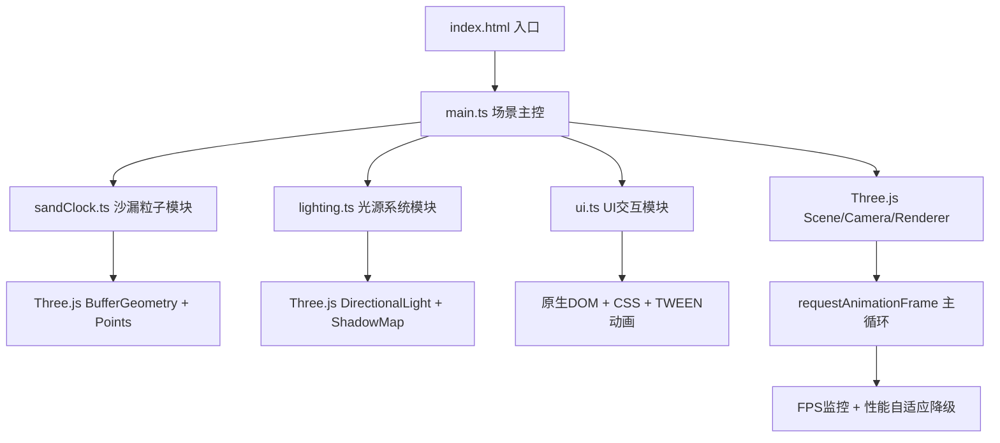

## 1. 架构设计

## 2. 技术描述
- **前端框架**：原生TypeScript + Three.js@0.160.0（无React/Vue，按用户要求）
- **构建工具**：Vite 5.x
- **动画库**：@tweenjs/tween.js（粒子爆散缓动动画）
- **样式方案**：原生CSS（毛玻璃、渐变、响应式媒体查询）
- **后端**：无（纯前端项目）
- **数据库**：无

## 3. 文件结构
| 文件路径 | 职责描述 |
|---------|---------|
| `package.json` | 依赖配置：three@0.160.0、@types/three、typescript、vite、@tweenjs/tween.js |
| `index.html` | 入口页面，全屏深色背景，性能面板容器 |
| `tsconfig.json` | 严格模式，ES2020目标，moduleResolution bundler |
| `vite.config.js` | Vite基础配置 |
| `src/main.ts` | Three.js场景初始化、相机渲染器、主循环、性能监控、模块协调 |
| `src/sandClock.ts` | 沙漏几何体创建(LatheGeometry)、粒子系统管理(BufferGeometry)、物理更新、重置动画 |
| `src/lighting.ts` | 三组光源创建、光源控制点小球、拖拽交互逻辑、阴影配置 |
| `src/ui.ts` | 时间显示更新、控制面板DOM创建、滑块事件、重置按钮、响应式抽屉菜单 |

## 4. 核心技术实现要点

### 4.1 沙漏几何体
- 使用 `THREE.LatheGeometry` 旋转生成上下双锥形+颈部的玻璃轮廓
- 材质：`THREE.MeshPhongMaterial` transparent=true opacity=0.35 shininess=100
- 尺寸：高度200px，腰部直径100px，颈部直径30px

### 4.2 粒子系统
- `THREE.BufferGeometry` 存储5000粒子position数组
- `THREE.PointsMaterial` size=1 color=#FFD700 sizeAttenuation=true
- 物理：每帧 velocity.y -= 0.5（重力），position += velocity
- 通过细颈速率：每秒50粒（默认），可通过滑块20-100调节

### 4.3 动态光源
- 3个DirectionalLight分别对应暖黄/冷蓝/白
- 每个光源附带SphereGeometry控制点(radius=10)可拖拽
- 光源.target跟随控制点位置，实现方向调节
- ShadowMap配置：renderer.shadowMap.enabled = true, size=1024

### 4.4 性能自适应
- `performance.now()` 测量每帧粒子计算耗时，目标<0.5ms
- FPS计算：滑动窗口平均，低于30时粒子数降至3000 + 关闭阴影
- 画布尺寸：Math.min/max 限制在 300x169 ~ 1920x1080，保持16:9

### 4.5 UI响应式
- CSS媒体查询 `@media (max-width: 768px)` 触发抽屉模式
- 桌面端：position:fixed 右上角面板
- 移动端：transform: translateX(-100%) 抽屉，汉堡按钮切换
