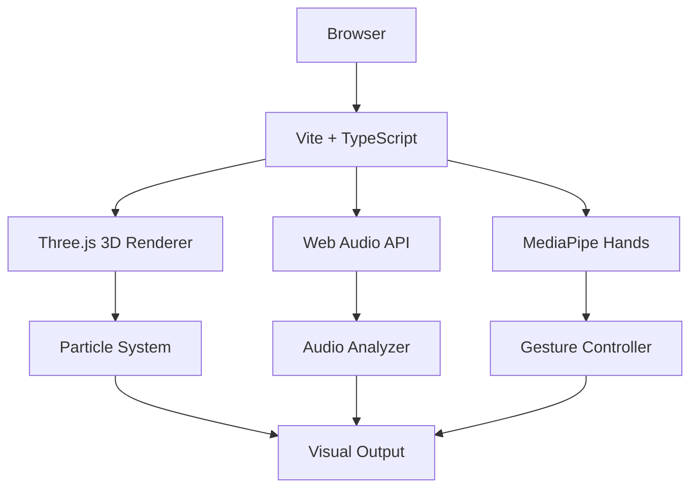

## 1. 架构设计



## 2. 技术说明
- **前端框架**：纯 TypeScript + Vite（无需React/Vue，用户明确指定）
- **3D渲染**：Three.js v0.160.0
- **音频解析**：Web Audio API (AnalyserNode)
- **手势识别**：MediaPipe Hands v0.4.1675469240 + Camera Utils v0.3.1675466862
- **构建工具**：Vite

## 3. 文件结构
| 路径 | 用途 |
|------|------|
| `/` | 项目根目录 |
| `package.json` | 项目依赖和脚本 |
| `index.html` | 入口HTML页面 |
| `tsconfig.json` | TypeScript配置（严格模式，ES2020） |
| `vite.config.js` | Vite构建配置 |
| `src/main.ts` | 主入口，协调各模块 |
| `src/audioAnalyzer.ts` | 音频解析模块 |
| `src/gestureController.ts` | 手势识别模块 |
| `src/particleSystem.ts` | 粒子系统模块 |

## 4. 模块接口定义

### 4.1 AudioAnalyzer
```typescript
interface AudioData {
  spectrum: number[];      // 归一化0-1频谱数组
  lowFrequency: number;    // 低频能量 0-1
  midFrequency: number;    // 中频能量 0-1
  highFrequency: number;   // 高频能量 0-1
}

class AudioAnalyzer {
  constructor(audioContext: AudioContext);
  connectSource(source: MediaStreamAudioSourceNode | MediaElementAudioSourceNode): void;
  update(): AudioData;
  getVolume(): number;      // 0-1
  setVolume(volume: number): void;
}
```

### 4.2 GestureController
```typescript
interface GestureData {
  isDetected: boolean;         // 是否检测到手
  palmX: number;               // 手掌中心X 0-1
  palmY: number;               // 手掌中心Y 0-1
  fingerOpenness: number;      // 手指张开度 0-1
  lastDetectedTime: number;    // 最后检测时间戳
}

class GestureController {
  constructor(videoElement: HTMLVideoElement);
  async init(): Promise<void>;
  update(): GestureData;
}
```

### 4.3 ParticleSystem
```typescript
interface ParticleSystemConfig {
  count: number;           // 粒子数量
  defaultRadius: number;   // 默认半径
  maxRadius: number;       // 最大半径
}

class ParticleSystem {
  constructor(scene: THREE.Scene, config: ParticleSystemConfig);
  update(
    audioData: AudioData,
    rotationX: number,
    rotationY: number,
    radiusMultiplier: number,
    gestureDetected: boolean
  ): void;
  setGlowEnabled(enabled: boolean): void;
}
```

## 5. 性能指标
- 渲染帧率：≥ 40 FPS（标准笔记本Chrome浏览器）
- 手势识别延迟：< 150ms
- 音频解析：与帧率同步更新
- 移动端优化：粒子数量降至1000
