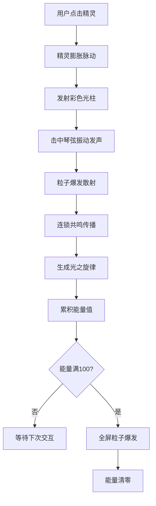

## 1. 产品概述

虚拟元素共振竖琴是一款基于 Three.js 的 3D 互动音乐体验游戏。用户通过点击漂浮的元素精灵触发神圣琴弦共振，产生连锁共鸣并谱写光之旋律。

- 核心价值：沉浸式奇幻音乐互动体验，将视觉、听觉与即时反馈完美融合
- 目标用户：喜欢音乐、艺术和奇幻视觉体验的浏览器端用户

## 2. 核心特性

### 2.1 功能模块
1. **3D 场景渲染**：幽暗大厅、星云背景、发光竖琴、漂浮元素精灵
2. **元素精灵交互**：4 种元素精灵（火/水/风/土），椭圆形轨迹飞行，点击触发膨胀反馈
3. **竖琴共鸣系统**：12 根彩虹琴弦，击弦振动，连锁共鸣概率传播
4. **音频播放系统**：Web Audio API 纯音合成，对应音符 C5/D5/E5/G5
5. **粒子特效系统**：击弦粒子爆发、光之旋律轨迹、全屏能量爆发
6. **能量进度系统**：共鸣链累积能量，满值触发全屏特效

### 2.2 页面详情

| 页面名称 | 模块名称 | 特征描述 |
|---------|---------|--------|
| 主场景 | 3D 大厅场景 | Three.js 渲染，星云背景旋转，地面深蓝渐变 |
| 主场景 | 发光竖琴 | 翠绿到深紫渐变藤蔓琴框，12 根半透明彩虹琴弦 |
| 主场景 | 元素精灵 | 4 种颜色半透明球体，脉动光环，椭圆飞行路径 |
| 主场景 | 粒子系统 | 击弦粒子爆发、光柱、光之旋律光带 |
| 主场景 | 能量 UI | 右下角圆形进度条，星环旋转，能量计数 |

## 3. 核心流程

用户点击元素精灵 → 精灵膨胀脉动反馈 → 彩色光柱射向琴弦 → 琴弦振动并发声 → 粒子爆发 → 连锁共鸣传播到相邻琴弦 → 光之旋律线条生成 → 累积能量 → 能量满值触发全屏爆发

## 4. 用户界面设计

### 4.1 设计风格
- 主色调：幽暗深蓝（#0a0a1a）到纯黑渐变背景
- 强调色：翠绿（#33cc66）→ 深紫（#6633cc）琴框渐变，彩虹色琴弦，四色元素精灵
- 发光风格：所有发光元素使用暗蓝（#1a1a3a）到亮蓝（#66ccff）统一点缀
- 字体：无衬线字体，UI 文字使用发光效果
- 布局：全屏沉浸式 3D 场景，竖琴居中，UI 悬浮右下角

### 4.2 页面设计概览

| 模块 | UI 元素 | 风格描述 |
|------|--------|---------|
| 3D 大厅 | 背景墙、地面 | 星云纹理旋转，深蓝到黑地面渐变 |
| 竖琴 | 琴框、琴弦 | 发光藤蔓渐变琴框，半透明彩虹弦 |
| 元素精灵 | 球体、光环 | 半透明彩色球，脉动光环效果 |
| 粒子特效 | 光柱、粒子、光带 | 发光彩色粒子，线性衰减消散 |
| 能量 UI | 进度条、数字 | 圆形发光进度条，旋转星环纹理 |

### 4.3 响应式适配
- 桌面：竖琴原始大小，全屏 3D 场景
- 移动端：竖琴缩放至 0.7 倍，自动适配视口

### 4.4 3D 场景指引
- **环境**：无光源环境，所有物体自发光（EmissiveMaterial），营造幽暗发光氛围
- **相机**：PerspectiveCamera，初始位置 (0, 2, 8)，看向原点
- **动画**：所有缓动使用 ease-out，振动使用指数衰减曲线
- **性能**：帧率稳定 45fps+，粒子上限 300，几何体复用
