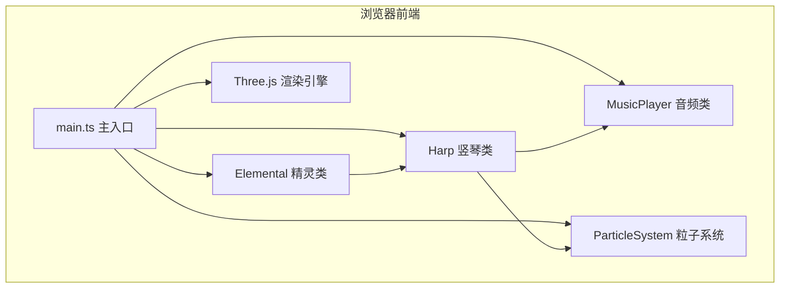

## 1. 架构设计



## 2. 技术说明

- **渲染引擎**：Three.js @ 0.160.0 — 3D 场景渲染
- **编程语言**：TypeScript @ 5.5.0 — 类型安全
- **构建工具**：Vite @ 5.4.0 — 开发服务器与构建
- **辅助库**：simplex-noise @ 3.0.0 — 星云纹理噪声生成
- **音频**：Web Audio API（原生） — 纯音合成
- **UI**：原生 HTML + CSS — 圆形进度条

## 3. 文件结构

| 文件 | 职责 |
|------|------|
| `package.json` | 项目依赖和启动脚本 |
| `index.html` | 入口页面，全屏 Canvas |
| `tsconfig.json` | TypeScript 配置（严格模式 ES2020） |
| `vite.config.js` | Vite 构建配置（端口 3000） |
| `src/main.ts` | 主入口：场景初始化、游戏循环、事件管理、UI |
| `src/Harp.ts` | 竖琴类：琴弦模型、振动动画、共鸣链逻辑 |
| `src/Elemental.ts` | 精灵类：模型、飞行路径、点击交互、光柱发射 |
| `src/MusicPlayer.ts` | 音频类：纯音生成、混合旋律播放 |
| `src/ParticleSystem.ts` | 粒子系统：粒子生命周期管理、击弦粒子、光带、全屏爆发 |

## 4. 类设计

### 4.1 Harp 类

```typescript
class Harp {
  constructor(scene: THREE.Scene)
  public update(delta: number): void
  public triggerString(index: number, elementalType: ElementalType): TriggerResult
  public getStringWorldPosition(index: number): THREE.Vector3
}
```

核心逻辑：
- 创建 12 根琴弦（半透明彩虹色渐变）
- 创建发光藤蔓琴框（翠绿 → 深紫渐变）
- 琴弦振动：基于正弦波 + 指数衰减
- 连锁共鸣：距离衰减概率传播（70% / 50% / 30%）

### 4.2 Elemental 类

```typescript
type ElementalType = 'fire' | 'water' | 'wind' | 'earth'

class Elemental {
  constructor(scene: THREE.Scene, type: ElementalType, orbitOffset: number)
  public update(delta: number): void
  public onClick(): { type: ElementalType; position: THREE.Vector3 }
  public getMesh(): THREE.Object3D
}
```

核心逻辑：
- 半透明球体 + 脉动光环
- 椭圆路径飞行（长轴 4，短轴 2）
- 点击膨胀 1.5 倍 + 快速脉动两次（0.3 秒）

### 4.3 MusicPlayer 类

```typescript
class MusicPlayer {
  constructor()
  public playNote(frequency: number, volume: number, duration: number): void
  public playChord(frequencies: number[], volume: number, duration: number): void
}
```

核心逻辑：
- Web Audio API OscillatorNode + GainNode
- 纯音正弦波
- 音量指数衰减包络

### 4.4 ParticleSystem 类

```typescript
interface Particle {
  position: THREE.Vector3
  velocity: THREE.Vector3
  color: THREE.Color
  life: number
  maxLife: number
  size: number
}

class ParticleSystem {
  constructor(scene: THREE.Scene)
  public update(delta: number): void
  public emitBurst(position: THREE.Vector3, color: THREE.Color, count: number): void
  public emitLightTrail(points: THREE.Vector3[], color: THREE.Color): void
  public emitFullscreenBurst(): void
  public emitBeam(from: THREE.Vector3, to: THREE.Vector3, color: THREE.Color): void
}
```

核心逻辑：
- Sprite / Points 渲染粒子
- 生命周期管理：透明度线性衰减
- 性能上限：300 颗同时存在

## 5. 核心参数

| 参数 | 值 | 说明 |
|------|-----|------|
| 琴弦数量 | 12 | 彩虹色排列 |
| 元素精灵数量 | 4 | 火/水/风/土 |
| 振动振幅衰减 | 0.2 → 0.01 | 持续 1.5 秒 |
| 共鸣振幅衰减 | 减半 | 持续 1 秒 |
| 共鸣传播概率 | 70% / 50% / 30% | 距离 1 / 2 / 3 根弦 |
| 能量增加值 | 15 / 共鸣链（≥3 根弦） | 满值 100 |
| 精灵脉动周期 | 1.5 秒 | 亮度 0.6 → 1.0 |
| 星环旋转周期 | 4 秒 | 进度条外围 |
