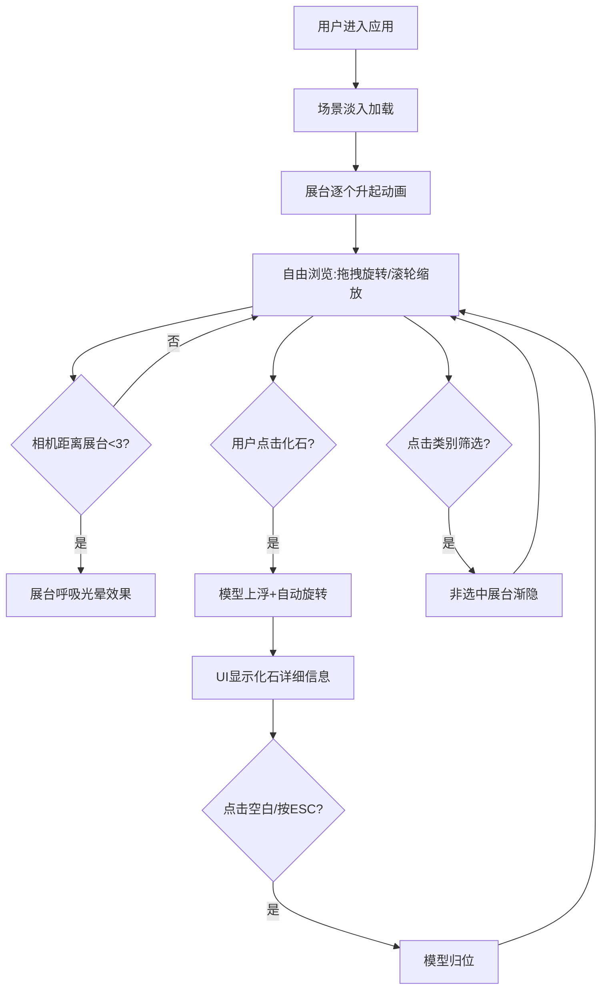

## 1. 产品概述

古生物化石3D交互式可视化应用，用户可在虚拟博物馆展厅中浏览、旋转、缩放各类化石3D模型，并查看详细科学信息。

- 面向古生物爱好者、学生和教育工作者，提供沉浸式的化石学习体验
- 结合3D可视化技术与科学数据，打造高质量的数字博物馆产品

## 2. 核心功能

### 2.1 功能模块

1. **虚拟展厅场景**：圆形展台布局、中央地球装饰、6个均匀排列的化石展台、博物馆风格光照
2. **化石模型交互**：点击上浮动画、自动旋转展示、ESC或点击空白处归位
3. **展品数据管理**：8+化石数据集、按三类别筛选、元数据查询
4. **视角控制**：拖拽旋转相机、滚轮缩放、近距离展台呼吸光晕反馈
5. **动画视觉增强**：Tween.js过渡动画、场景淡入、展台逐个升起、深色主题

### 2.2 页面详情

| 页面名称 | 模块名称 | 功能描述 |
|---------|---------|---------|
| 主展厅 | 3D场景 | 圆形展台布局、地球装饰、化石模型渲染、光照效果 |
| 主展厅 | 交互层 | 相机拖拽旋转、滚轮缩放、模型点击选中、ESC取消 |
| 主展厅 | 顶部筛选栏 | 三类别筛选按钮组、选中状态高亮 |
| 主展厅 | 信息卡片 | 化石名称、地质年代、发现地点、类别、描述 |
| 主展厅 | 左上标签 | 当前选中化石的名称和类别 |
| 主展厅 | 控制滑块 | 化石自动旋转速度调节 |

## 3. 核心流程

用户进入应用 → 场景淡入加载、展台逐个升起 → 鼠标拖拽环顾展厅、滚轮缩放 → 靠近展台触发呼吸光晕 → 点击化石模型 → 模型上浮并自动旋转 → UI显示详细信息 → 点击其他区域/按ESC → 模型归位 → 可使用顶部类别按钮筛选展台

## 4. 用户界面设计

### 4.1 设计风格

- 主色调：深蓝色 `#1a1a2e`，强调色：淡蓝色 `#4fc3f7`，文字色：浅灰 `#e0e0e0`
- 按钮风格：圆角矩形，毛玻璃半透明背景，hover时蓝色高亮加深
- 字体：Segoe UI 无衬线字体，标题加粗，正文常规
- 布局：全屏3D画布 + 浮层UI，顶部筛选栏居中、右下信息卡片、左上状态标签
- 视觉风格：博物馆深邃暖光、毛玻璃UI效果、微妙阴影和过渡动画

### 4.2 页面设计概述

| 页面名称 | 模块名称 | UI元素 |
|---------|---------|---------|
| 主展厅 | 3D场景 | 圆形展台、地球装饰、6个化石模型、暖光氛围、光晕粒子 |
| 主展厅 | 顶部筛选栏 | 三个半透明玻璃按钮、水平排列、选中高亮描边 |
| 主展厅 | 信息卡片 | 右下毛玻璃面板、化石名称大标题、元数据列表、描述文本 |
| 主展厅 | 左上标签 | 半透明标签、化石名+类别、圆角胶囊形状 |
| 主展厅 | 旋转控制 | 滑块控件、标签显示当前速度 |

### 4.3 响应式设计

- 桌面优先设计，适配 1920×1080 到 1366×768 分辨率
- UI元素使用 vw 和 rem 相对单位
- 按钮最小触控区域 44×44px
- 信息卡片在小屏自动缩小字号和间距

### 4.4 3D场景指南

- 环境：深邃博物馆暖光，HDRI风格环境贴图模拟，背景渐变
- 光照：多点暖色点光源 + 环境光，营造展厅氛围
- 相机：PerspectiveCamera，初始距离12，俯仰角15度，OrbitControls限制
- 构图：中央地球为视觉焦点，6展台环形围绕半径5
- 交互：点击射线检测、相机限制、距离检测光晕
- 性能：顶点总数<10万，使用简单几何体组合，GTX 1060 保持30fps+
