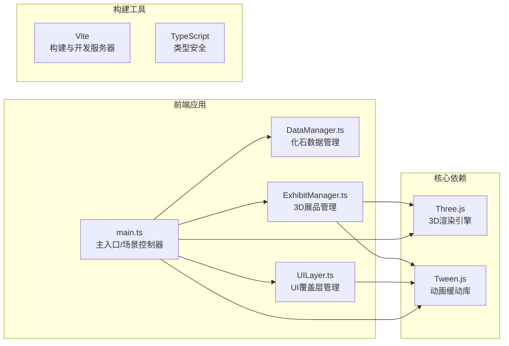
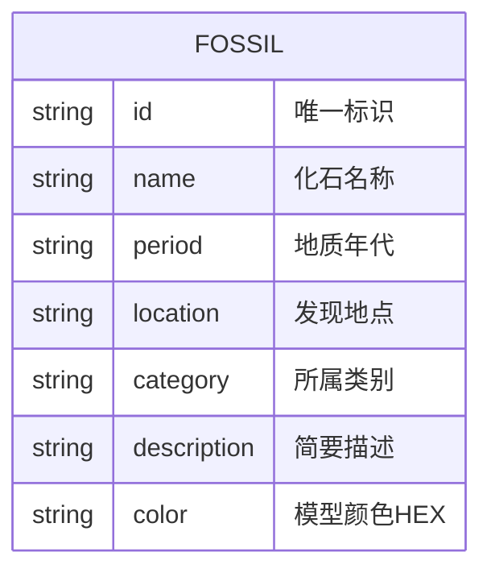

## 1. 架构设计



## 2. 技术描述

- 前端框架：原生 TypeScript（无React/Vue框架，用户指定）
- 3D引擎：three@0.160.0 + @types/three
- 动画库：@tweenjs/tween.js@18.6.4
- 构建工具：Vite（vite.config.js）
- 类型系统：TypeScript 严格模式
- 后端：无（纯前端应用，数据内置）
- 数据：内置 JSON 格式化石数据集

## 3. 项目文件结构

| 文件路径 | 用途 |
|---------|-----|
| /package.json | 依赖声明与启动脚本 |
| /tsconfig.json | TypeScript 严格模式配置 |
| /vite.config.js | Vite 构建配置 |
| /index.html | 入口页面，canvas容器与UI浮层 |
| /src/main.ts | 主入口：初始化Three.js场景、相机、渲染器、动画循环、事件总线 |
| /src/DataManager.ts | 数据层：化石数据集、分类筛选、查询接口 |
| /src/ExhibitManager.ts | 3D层：模型创建、展台布局、点击交互、Tween动画 |
| /src/UILayer.ts | UI层：HTML覆盖层、信息卡片、筛选按钮、滑块、CSS样式 |

## 4. 数据模型

### 4.1 数据模型定义



### 4.2 化石类别枚举

- `invertebrate` - 古无脊椎动物
- `vertebrate` - 古脊椎动物
- `plant` - 古植物

### 4.3 内置化石数据（8条）

| id | name | category |
|----|------|----------|
| trilobite | 三叶虫 | 古无脊椎动物 |
| ammonite | 菊石 | 古无脊椎动物 |
| archaeopteryx | 始祖鸟 | 古脊椎动物 |
| smilodon | 剑齿虎 | 古脊椎动物 |
| tyrannosaurus | 霸王龙 | 古脊椎动物 |
| mammoth | 猛犸象 | 古脊椎动物 |
| lepidodendron | 鳞木 | 古植物 |
| cycad | 苏铁 | 古植物 |

## 5. 核心类与接口

```typescript
// DataManager.ts
interface FossilData {
  id: string;
  name: string;
  period: string;
  location: string;
  category: 'invertebrate' | 'vertebrate' | 'plant';
  description: string;
  color: string;
}

class DataManager {
  getAll(): FossilData[];
  getById(id: string): FossilData | undefined;
  filterByCategory(category: string | null): FossilData[];
  getCategories(): { key: string; label: string }[];
}

// ExhibitManager.ts
interface Exhibit {
  id: string;
  data: FossilData;
  group: THREE.Group;
  pedestal: THREE.Mesh;
  fossil: THREE.Group;
  halo: THREE.Mesh;
  baseY: number;
  isSelected: boolean;
  isFiltered: boolean;
}

class ExhibitManager {
  exhibits: Exhibit[];
  init(scene: THREE.Scene, data: FossilData[]): void;
  handleClick(intersects: THREE.Intersection[]): string | null;
  selectExhibit(id: string): void;
  deselectAll(): void;
  filterCategory(category: string | null): void;
  update(delta: number, camera: THREE.Camera): void;
  dispose(): void;
}

// UILayer.ts
class UILayer {
  onCategoryChange: (category: string | null) => void;
  onSpeedChange: (speed: number) => void;
  onBackdropClick: () => void;
  showFossilInfo(data: FossilData | null): void;
  setSelectedLabel(name: string, category: string): void;
  clearSelectedLabel(): void;
  init(): void;
}
```
