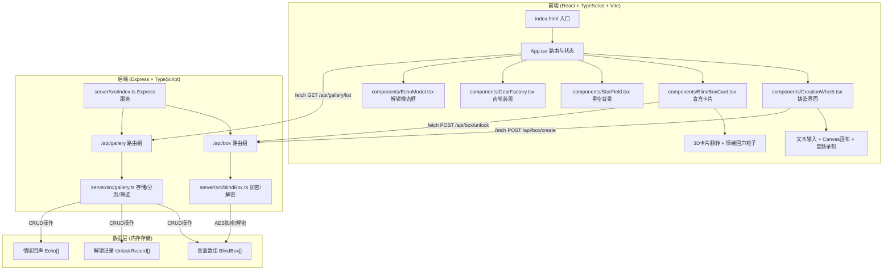
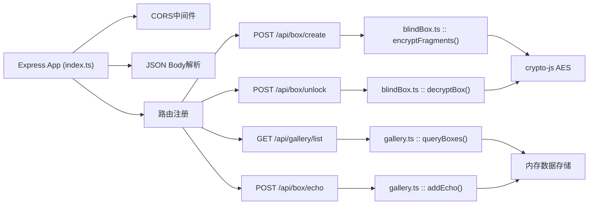
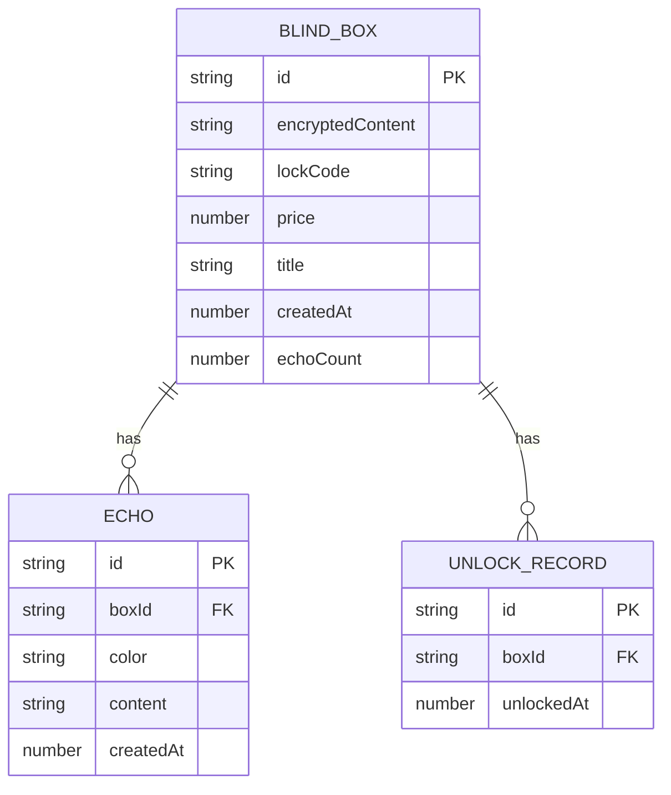

## 1. 架构设计



## 2. 技术说明
- **前端**：React@18.3.0 + React-DOM@18.3.0 + Three@0.160.0 + TypeScript@5.5.0 + Vite@5.4.0 + @vitejs/plugin-react@4.3.0
- **后端**：Express@4.18.0 + cors@2.8.5 + crypto-js@4.2.0 + TypeScript@5.5.0
- **状态管理**：React useState/useReducer（轻量级场景，无需额外状态库）
- **初始化工具**：vite-init react-express-ts 模板
- **数据存储**：服务端内存数组（演示用途，无需数据库）
- **启动命令**：`npm run dev` 并行启动前后端（前端Vite 5173端口，后端Express 3001端口）

## 3. 路由定义

| 前端路由 | 用途 |
|----------|------|
| / | 首页（星空+齿轮） |
| /create | 铸造界面 |
| /gallery | 画廊页面 |

| 后端API路由 | 方法 | 用途 |
|-------------|------|------|
| /api/box/create | POST | 加密并创建盲盒 |
| /api/box/unlock | POST | 解锁并解密盲盒内容 |
| /api/gallery/list | GET | 获取画廊盲盒列表（分页/筛选/搜索） |
| /api/box/echo | POST | 提交情绪回声 |

## 4. API定义

```typescript
// ============ 数据类型定义 ============
interface InspirationFragments {
  text: string;       // 灵感文本（最大200字）
  sketch: string;     // 草图base64数据
  audio: string;      // 音频base64数据
}

interface BlindBox {
  id: string;                    // UUID
  encryptedContent: string;      // AES加密后的JSON
  encryptionKey: string;         // 64位密钥（仅创建时返回前端一次）
  lockCode: string;              // 4位数字锁码
  price: number;                 // 1-10灵感币
  title: string;                 // 盲盒标题（文本前20字）
  createdAt: number;             // 时间戳
  echoCount: number;             // 情绪回声数量
}

interface Echo {
  id: string;
  boxId: string;
  color: string;                 // #ff6b6b / #ffd93d / #6bcb77 / #4d96ff
  content: string;               // 20字以内
  createdAt: number;
}

interface UnlockRecord {
  boxId: string;
  unlockedAt: number;
}

// ============ 请求/响应定义 ============
// POST /api/box/create
interface CreateBoxRequest {
  fragments: InspirationFragments;
}
interface CreateBoxResponse {
  success: boolean;
  box: BlindBox;
}

// POST /api/box/unlock
interface UnlockBoxRequest {
  boxId: string;
  lockCode: string;
}
interface UnlockBoxResponse {
  success: boolean;
  fragments: InspirationFragments;
}

// GET /api/gallery/list
interface GalleryListRequest {
  page: number;          // 页码，从1开始
  pageSize: number;      // 每页数量（默认10，最大50）
  minPrice?: number;     // 最低价格（默认0）
  maxPrice?: number;     // 最高价格（默认10）
  keyword?: string;      // 搜索关键词
}
interface GalleryListResponse {
  success: boolean;
  boxes: BlindBox[];
  total: number;
  hasMore: boolean;
}

// POST /api/box/echo
interface EchoRequest {
  boxId: string;
  color: string;
  content: string;
}
interface EchoResponse {
  success: boolean;
  echo: Echo;
  recentEchoes: Echo[];  // 最近5条
}
```

## 5. 服务器架构图



## 6. 数据模型

### 6.1 数据模型定义



### 6.2 数据初始化说明
- 系统启动时 gallery.ts 初始化空数组存储盲盒、回声、解锁记录
- 可选：注入 3-5 个示例盲盒数据便于前端展示测试
- 所有数据存储于内存，重启服务后清空（符合演示场景需求）
