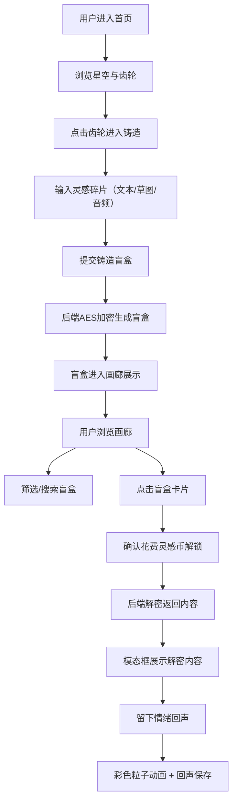

## 1. 产品概述

诗意盲盒工坊是一个基于浏览器的线上艺术社区应用，让创作者将灵感碎片（文本、音频、草图）加密铸造为可交互的"诗意盲盒"，其他用户通过支付虚拟"灵感币"解锁查看并留下情绪回响。

- 目标用户：艺术创作者、灵感爱好者、数字收藏者
- 核心价值：将碎片化灵感转化为有价值的数字资产，构建创作者与欣赏者之间的情感连接

## 2. 核心功能

### 2.1 用户角色
| 角色 | 注册方式 | 核心权限 |
|------|----------|----------|
| 访客用户 | 无需注册 | 浏览画廊、铸造盲盒、解锁盲盒、留下情绪回响 |

### 2.2 功能模块
1. **首页（铸造入口）**：Three.js动态星空背景、3D旋转齿轮装置、进入铸造按钮
2. **铸造界面**：文本输入、手绘画布、音频录制、盲盒生成
3. **画廊页面**：瀑布流展示盲盒卡片、价格筛选滑块、关键词搜索、滚动加载
4. **解锁模态框**：解密内容展示（打字机文本/自动播放音频/淡入草图）、情绪回声提交
5. **情绪回声系统**：彩色粒子动画、回声列表展示

### 2.3 页面详情
| 页面名称 | 模块名称 | 功能描述 |
|----------|----------|----------|
| 首页 | 星空背景 | Three.js渲染500颗随机大小星星，颜色#ccddee到#aabbcc渐变，缓慢闪烁漂移 |
| 首页 | 齿轮装置 | 3D旋转金属齿轮，六边形+圆形部件，橙色发光纹理，0.5-1.5转/秒，点击进入铸造 |
| 铸造页 | 文本输入 | 200字限制，提示文字"写下你的灵感碎片..." |
| 铸造页 | 草图画布 | 鼠标绘制黑白简笔画，线宽2-4px，颜色#ffffff |
| 铸造页 | 音频录制 | 最大10秒，录制时按钮红色闪烁 |
| 铸造页 | 提交生成 | AES加密、64位密钥、4位数字锁码、随机1-10灵感币价格 |
| 画廊页 | 瀑布流 | 桌面4列/移动2列，间距20px，滚动加载每次追加10个 |
| 画廊页 | 价格筛选 | 0-10灵感币滑块，实时无延迟过滤 |
| 画廊页 | 关键词搜索 | 模糊匹配（忽略大小写空格），结果高亮#ff8833 |
| 模态框 | 内容展示 | 文本打字机50ms/字、音频自动播放、草图1秒淡入 |
| 模态框 | 情绪回声 | 颜色选择（#ff6b6b/#ffd93d/#6bcb77/#4d96ff）+20字文字，3秒彩色粒子扩散动画 |

## 3. 核心流程

## 4. 用户界面设计

### 4.1 设计风格
- **主色调**：深紫色#0a0a1a → 墨蓝#0a0a2a渐变背景
- **卡片色**：半透明深灰#1a1a2e，边框发光橙色#ff8833（1px，阴影4px模糊）
- **强调色**：橙色#ff8833，情绪色#ff6b6b/#ffd93d/#6bcb77/#4d96ff
- **按钮效果**：悬停脉动（缩放1.05倍，0.2s过渡）+ 点击光晕（0.1s扩散圆环）
- **模态框**：毛玻璃效果（模糊14px，透明度0.3），关闭按钮淡入消失（0.3s）
- **字体**：主标题采用特殊展示字体，正文采用等宽/无衬线字体
- **布局**：卡片式布局，顶部极简导航

### 4.2 页面设计概览
| 页面名称 | 模块名称 | UI元素 |
|----------|----------|--------|
| 首页 | 星空齿轮 | 全屏Three.js画布、居中3D齿轮、发光进入按钮、渐变背景 |
| 铸造页 | 三栏布局 | 左文本输入框、中间画布、右音频录制、底部铸造按钮 |
| 画廊页 | 瀑布流 | 顶部筛选栏（滑块+搜索框）、卡片网格、滚动加载 |
| 模态框 | 内容展示 | 毛玻璃背景、打字机文本、音频播放器、草图淡入、回声输入区 |

### 4.3 响应式
- 桌面端（≥768px）：瀑布流4列，三栏铸造布局
- 移动端（<768px）：瀑布流2列，铸造布局垂直堆叠，按钮触摸友好

### 4.4 3D场景指导
- **环境**：纯深紫背景，无HDRI，营造深邃太空感
- **光照**：点光源橙色#ff8833 + 环境光弱蓝色
- **相机**：PerspectiveCamera，轻微自动旋转
- **构图**：齿轮居中，占屏幕中央30%区域
- **交互**：鼠标移动时齿轮轻微跟随，点击中间按钮触发波纹
- **性能**：500颗星星使用BufferGeometry，齿轮简化面数，帧率≥50fps
