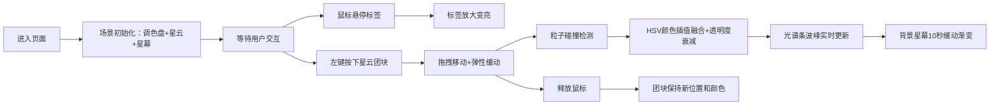

## 1. 产品概述

虚拟星云调色盘是一款基于WebGL的3D色彩炼金交互应用，让用户以沉浸式方式在三维空间中拖拽、混合不同颜色的星云团块，观察粒子渗透融合产生的流体渐变色效果，并将混合结果实时投射到背景星幕上。

- 目标用户：设计师、艺术创作者、色彩爱好者
- 核心价值：提供一种超越传统2D调色板的、富有沉浸感与仪式感的色彩探索体验

## 2. 核心功能

### 2.1 功能模块

1. **3D调色盘场景**：悬浮半透明低多边形调色盘、五组初始星云粒子团块、粒子间连线
2. **拖拽混合交互**：鼠标拖拽星云团块移动、粒子碰撞检测与HSV颜色插值融合、透明度衰减
3. **动态光谱条**：右侧垂直光谱条展示色相分布波峰、底部主色调圆形色块
4. **背景星幕系统**：300颗静态星点 + 20颗闪烁大星、随混合主色调缓慢渐变的背景
5. **氛围增强元素**：调色盘发光光晕、星形鼠标光标、团块中文标签、弹性缓动效果

### 2.2 页面详情

| 页面名称 | 模块名称 | 功能描述 |
|-----------|-------------|---------------------|
| 主场景 | 3D调色盘 | 直径10单位半透明低多边形圆盘，深灰到暗紫径向渐变 |
| 主场景 | 星云粒子系统 | 5组各3000颗粒子，半径0.02-0.05，半透明连线(0.3px/0.15透明度) |
| 主场景 | 拖拽混合 | 鼠标左键拖拽团块，碰撞区域HSV插值，透明度0.7→0.4 |
| 主场景 | 光谱条UI | 右侧60%高度/30px宽度渐变条，5个波峰+主色色块 |
| 主场景 | 背景星幕 | 静态星点+闪烁大星，背景色随主色10秒缓动渐变 |
| 主场景 | 氛围装饰 | 4秒脉动光晕、星形光标、6个中文标签悬停放大 |

## 3. 核心流程

用户进入页面 → 看到悬浮调色盘与5个彩色星云团块 → 鼠标悬停标签变亮放大 → 左键拖拽某个团块 → 团块粒子弹性跟随移动 → 与其他团块碰撞产生渐变色融合带 → 右侧光谱条实时更新波峰高度 → 背景星幕颜色缓慢过渡 → 松开鼠标团块保持新状态

## 4. 用户界面设计

### 4.1 设计风格
- **主题色彩**：深空梦幻星云风，主背景 #0a0a1a → #1a0a2a 径向渐变
- **五色星云**：赤焰红 #ff3366、琥珀橙 #ff8833、柠檬黄 #ffcc44、湖蓝青 #33ddff、紫晶紫 #aa66ff
- **标签文字**：#cccccc → #ffffff（悬停），字号 12px → 16px
- **视觉层次**：粒子(前景) → 调色盘(中景) → 星幕(远景)，全部带发光效果

### 4.2 页面设计概览

| 页面名称 | 模块名称 | UI元素 |
|-----------|-------------|-------------|
| 主场景 | 3D调色盘 | 低多边形网格、半透明、深灰→暗紫径向渐变、发光光晕脉动 |
| 主场景 | 星云粒子 | Points渲染、AdditiveBlending、连线LineSegments |
| 主场景 | 光谱条 | 右侧垂直DOM元素、Canvas绘制频谱波形、圆形主色块 |
| 主场景 | 星幕 | Points静态星点、着色器闪烁动画 |
| 主场景 | 交互光标 | CSS自定义星形光标、微光拖尾 |
| 主场景 | 中文标签 | CSS2DRenderer渲染、hover过渡动画 |

### 4.3 响应式
- Desktop-first全屏设计
- Canvas自适应窗口大小
- 光谱条固定右侧，保持30px宽度

### 4.4 3D场景指引
- **环境**：纯深空背景，无HDRI，自定义径向渐变CanvasTexture
- **光照**：AmbientLight(0.3) + 两盏PointLight分别对应冷暖色，营造星云发光氛围
- **相机**：PerspectiveCamera(fov=60)，位置(0, 5, 12)，lookAt(0,0,0)，允许OrbitControls环绕缩放
- **构图**：调色盘居正中，粒子分布在盘内半径4单位范围内，标签环绕边缘
- **交互**：Raycaster拾取团块中心，拖拽时通过lerp实现弹性缓动(阻尼0.85)
- **后期**：EffectComposer + UnrealBloomPass，实现整体辉光效果
- **性能预算**：总粒子数15000，目标30FPS以上，拖拽响应<50ms
