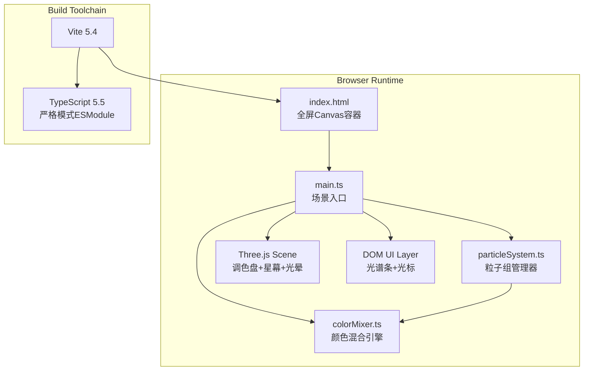

## 1. 架构设计



## 2. 技术说明

- **前端框架**：无UI框架，原生TypeScript + Three.js直接操作WebGL
- **3D引擎**：three@0.160.0（含OrbitControls、EffectComposer、UnrealBloomPass、CSS2DRenderer）
- **数学工具**：simplex-noise@3.0.0（粒子初始分布与轻微漂浮扰动）
- **构建工具**：vite@5.4.0，TypeScript 5.5严格模式
- **初始化方式**：手动创建项目文件（用户明确指定文件清单与版本）

## 3. 文件结构

```
.
├── package.json
├── index.html
├── tsconfig.json
├── vite.config.js
└── src/
    ├── main.ts           # 场景初始化、交互、渲染循环
    ├── colorMixer.ts     # HSV插值、光谱统计、主色调计算
    └── particleSystem.ts # 粒子组、拖拽、碰撞、连线
```

## 4. 核心模块与类型定义

### 4.1 colorMixer.ts

```typescript
export interface HSV { h: number; s: number; v: number }
export interface HSL { h: number; s: number; l: number }

// HSV插值（带最短色相环路径）
export function lerpHSV(a: HSV, b: HSV, t: number): HSV

// HSL ↔ RGB 互转
export function rgbToHsl(r: number, g: number, b: number): HSL
export function hslToRgb(h: number, s: number, l: number): [number, number, number]

// 从一组粒子颜色统计5个波峰高度 & 加权平均主色
export function computeSpectrum(colors: THREE.Color[]): { peaks: number[]; dominant: THREE.Color }

// 计算互补色并降低饱和度50%、亮度70%
export function computeBackgroundTint(dominant: THREE.Color): THREE.Color
```

### 4.2 particleSystem.ts

```typescript
export interface NebulaBlob {
  id: number
  name: string           // "赤焰"|"琥珀"|"柠檬"|"湖蓝"|"紫晶"
  baseColor: THREE.Color
  center: THREE.Vector3  // 团块中心，用于拖拽
  targetCenter: THREE.Vector3
  particleCount: 3000
  positions: Float32Array
  colors: Float32Array
  opacities: Float32Array
  velocities: Float32Array
  points: THREE.Points
  lines: THREE.LineSegments
  label: THREE.CSS2DObject
}

export class ParticleSystem {
  blobs: NebulaBlob[]
  constructor(scene: THREE.Scene, paletteDiameter: number)
  // 返回被命中的团块id
  pick(raycaster: THREE.Raycaster): number | null
  // 拖拽指定团块到目标位置（世界坐标）
  drag(id: number, target: THREE.Vector3): void
  // 每帧更新：弹性缓动、粒子漂浮、碰撞混合、颜色更新
  update(dt: number, mixer: ColorMixer): void
  // 获取所有粒子颜色用于光谱计算
  getAllColors(): THREE.Color[]
}
```

### 4.3 main.ts 渲染循环

```typescript
// init: Scene → Camera → Renderer → Bloom Composer → Lights
// createPalette() → createStarfield() → createParticleSystem() → createSpectrumBar()
// animate(): controls.update() → particleSystem.update(dt) → recomputeSpectrum()
//          → backgroundTint lerp → bloom.render()
```

## 5. 性能策略

- **粒子渲染**：使用单个BufferGeometry + PointsMaterial(AdditiveBlending, sizeAttenuation)，每团块独立Points对象
- **连线优化**：仅连接同一团块内距离<0.4的粒子对，预计算索引，使用LineSegments
- **碰撞检测**：仅在拖拽团块与其他团块之间做球形距离粗检，命中后逐粒子距离<0.1才触发混合
- **颜色混合**：碰撞后只更新局部粒子的颜色缓冲区，通过needsPartialUpdate=true提交GPU
- **光谱计算**：每5帧(100ms)采样一次全部15000粒子，避免每帧统计阻塞主线程
