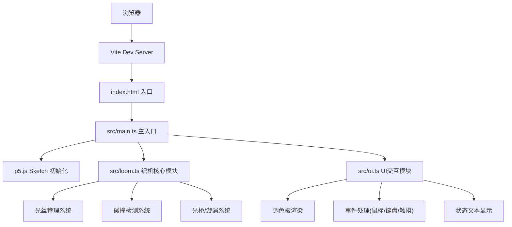

## 1. 架构设计



## 2. 技术描述
- 前端：TypeScript 5.5.0 + p5.js 1.9.0 + Vite 5.4.0
- 构建工具：Vite 5.4.0（启用TypeScript插件）
- 渲染方式：Canvas API + p5.js绘制系统 + 离屏Canvas分层优化
- 音频：Web Audio API生成纯音音效

## 3. 项目结构
```
├── package.json          # 项目依赖和脚本
├── tsconfig.json         # TypeScript配置（严格模式，ES2020）
├── vite.config.js        # Vite配置
├── index.html            # 入口HTML
└── src/
    ├── main.ts           # 主入口：p5.js sketch初始化、主循环
    ├── loom.ts           # 织机核心逻辑
    └── ui.ts             # UI交互模块
```

## 4. 核心数据模型

### 4.1 光丝对象 (Thread)
```typescript
interface Thread {
  id: number;
  color: string;         // 极光色值
  points: { x: number; y: number }[];  // 光丝路径点
  width: number;         // 当前宽度
  baseWidth: number;     // 初始宽度
  saturation: number;    // 饱和度 0-100
  age: number;           // 已存在时间(秒)
  pulsePhase: number;    // 脉动相位
  pulsePeriod: number;   // 脉动周期(1-3秒随机)
  reinforced: boolean;   // 是否被加固
}
```

### 4.2 连接光桥 (LightBridge)
```typescript
interface LightBridge {
  threadAId: number;
  threadBId: number;
  colorA: string;
  colorB: string;
  active: boolean;
}
```

### 4.3 粒子系统 (Particle)
```typescript
interface Particle {
  x: number;
  y: number;
  vx: number;
  vy: number;
  radius: number;
  color: string;
  alpha: number;
  life: number;
  type: 'spark' | 'fragment' | 'wave' | 'splash';
  rotation?: number;
}
```

### 4.4 极光漩涡 (Vortex)
```typescript
interface Vortex {
  active: boolean;
  centerX: number;
  centerY: number;
  radius: number;
  rotation: number;
  speed: number;
  threadCount: number;
}
```

## 5. 核心接口定义

### 5.1 Loom 模块接口
```typescript
class AuroraLoom {
  threads: Thread[];
  bridges: LightBridge[];
  particles: Particle[];
  vortex: Vortex;
  warpLines: { x: number }[];    // 经线位置
  beamY: { top: number; bottom: number };  // 木梁Y坐标

  addThread(x: number, y: number, color: string): Thread;
  updateThreadPath(threadId: number, x: number, y: number): void;
  reinforceThread(threadId: number): void;
  removeThread(threadId: number): void;
  releaseVortex(): void;
  update(deltaTime: number): void;
  render(p: p5): void;
  getThreadAt(x: number, y: number): Thread | null;
}
```

### 5.2 UI 模块接口
```typescript
class UIController {
  selectedColor: string;
  paletteColors: string[];
  loom: AuroraLoom;

  render(p: p5): void;
  handleMousePressed(x: number, y: number, shiftKey: boolean): void;
  handleMouseDragged(x: number, y: number): void;
  handleKeyPressed(key: string): void;
  handleColorSelect(index: number): void;
}
```

## 6. 性能优化策略

1. **离屏Canvas分层**：
   - 背景层：织机框架和经线（静态，低频率重绘）
   - 光丝层：所有纬线光丝（每帧重绘）
   - 粒子层：光晕、光点、漩涡效果（每帧重绘）

2. **粒子池管理**：
   - 最大粒子数 500
   - 超出上限时拒绝生成新粒子
   - 对象池复用，减少GC开销

3. **碰撞检测优化**：
   - 空间分区（网格划分）减少碰撞检测对数
   - 仅检测活动光丝之间的碰撞

4. **渲染优化**：
   - 光丝使用bezier曲线平滑路径
   - 透明度和颜色混合使用Canvas globalCompositeOperation
