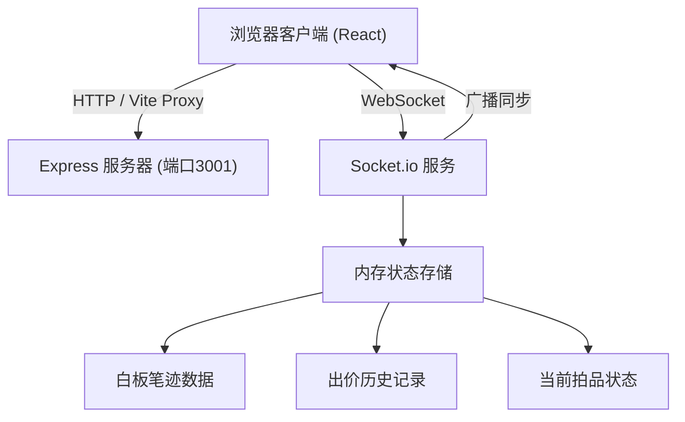
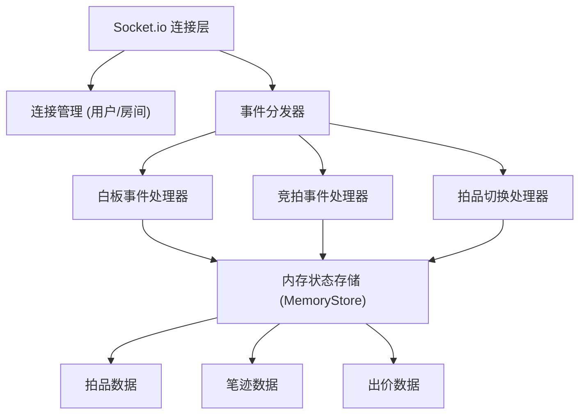
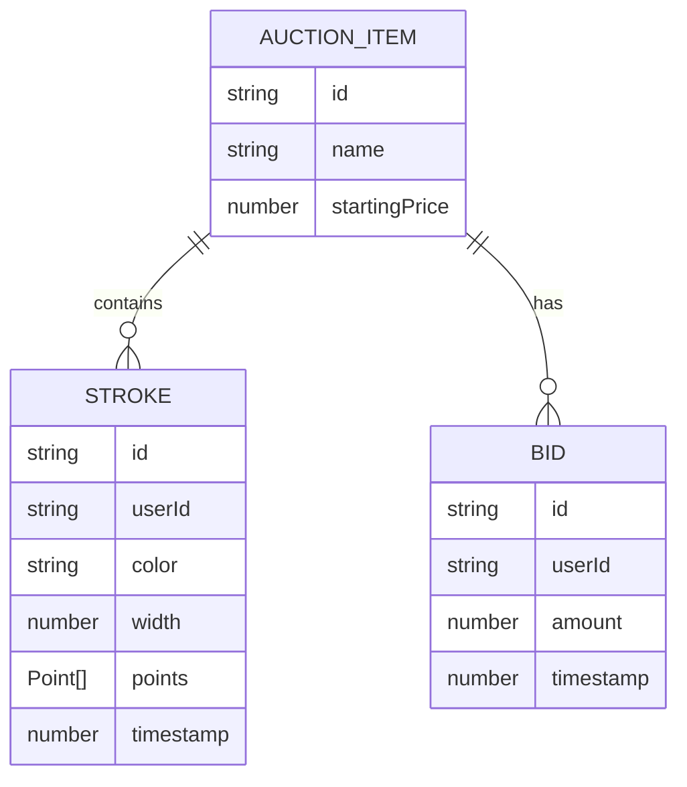

## 1. 架构设计



## 2. 技术描述
- 前端：React@18.2.0 + TypeScript + Vite
- 后端：Express@4.18.2 + Socket.io@4.6.2
- 实时通信：Socket.io-client@4.6.2
- 数据存储：内存存储（白板状态、出价历史、拍品信息）
- 构建工具：Vite，代理/api和/socket.io到后端3001端口

## 3. 路由定义
| 路由 | 用途 |
|------|------|
| / | 前端静态页面（Vite提供） |
| /socket.io | Socket.io WebSocket连接 |

## 4. API & Socket事件定义

### TypeScript 类型定义

```typescript
interface Point {
  x: number;
  y: number;
}

interface Stroke {
  id: string;
  points: Point[];
  color: string;
  width: number;
  timestamp: number;
  userId: string;
}

interface Bid {
  id: string;
  amount: number;
  userId: string;
  timestamp: number;
}

interface AuctionItem {
  id: string;
  name: string;
  startingPrice: number;
}

interface WhiteboardState {
  strokes: Stroke[];
  currentBid: number;
  bidHistory: Bid[];
  currentItem: AuctionItem;
}
```

### Socket.io 事件
| 事件名 | 方向 | 数据 | 描述 |
|--------|------|------|------|
| `join` | C→S | `{ itemId: string }` | 用户加入拍品房间 |
| `state` | S→C | `WhiteboardState` | 初始状态同步 |
| `stroke:new` | C→S | `Stroke` | 发送新笔迹 |
| `stroke:broadcast` | S→C | `Stroke` | 广播笔迹给其他用户 |
| `whiteboard:clear` | C→S | - | 请求清空白板 |
| `whiteboard:cleared` | S→C | - | 广播白板已清空 |
| `bid:new` | C→S | `{ amount: number }` | 提交新出价 |
| `bid:broadcast` | S→C | `Bid` | 广播出价成功 |
| `bid:error` | S→C | `{ message: string }` | 出价失败提示 |
| `item:change` | C→S | `{ itemId: string }` | 请求切换拍品 |
| `item:changed` | S→C | `{ item: AuctionItem, state: WhiteboardState }` | 广播拍品切换 |

## 5. 服务器架构图



## 6. 数据模型

### 6.1 数据模型定义



### 6.2 初始数据
预设三件拍品：
1. 青花瓷瓶（起拍价：10000元）
2. 翡翠观音（起拍价：50000元）
3. 金丝楠木佛珠（起拍价：8000元）
