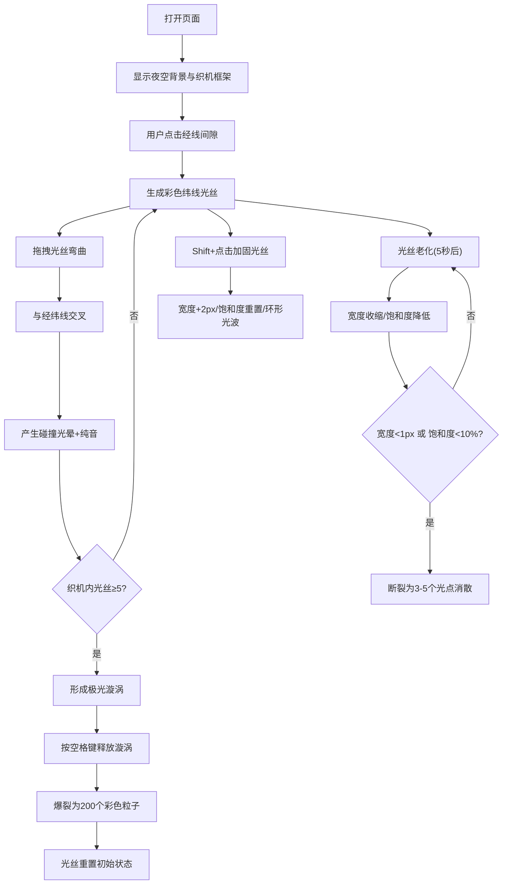

## 1. 产品概述

极光织机是一款在浏览器中模拟虚拟极光光丝交织与色彩碰撞的交互式Canvas应用。用户可以在静寂的寒夜场景中亲手编织由动态极光光丝构成的织物纹理，观察不同颜色的光丝在交织时产生碰撞火花和渐变融合效果。

- 目标用户：喜欢艺术创作、视觉体验、极光美学的用户
- 核心价值：提供沉浸式、交互性强的极光光丝编织体验，让用户亲手创造动态极光织物艺术

## 2. 核心功能

### 2.1 用户角色
| 角色 | 注册方式 | 核心权限 |
|------|----------|----------|
| 普通用户 | 无需注册，直接使用 | 完整的编织、调色、漩涡释放功能 |

### 2.2 功能模块
1. **极光织机主画布**：织机框架渲染、光丝编织、碰撞火花、光桥连接、极光漩涡
2. **交互控制系统**：鼠标点击拖拽、键盘快捷键、触摸事件兼容
3. **光丝生命周期管理**：脉动效果、老化下沉、加固修复、断裂消散
4. **UI信息展示**：极光调色板、光丝数量、漩涡状态

### 2.3 页面详情
| 页面名称 | 模块名称 | 功能描述 |
|----------|----------|----------|
| 主页面 | 夜空背景 | 深蓝色渐变背景（#0a0a2a到#1a2a4a） |
| 主页面 | 织机框架 | 两根水平木梁+六根垂直经线构成的虚拟织机 |
| 主页面 | 纬线光丝系统 | 点击生成、拖拽弯曲、脉动亮度、老化下沉、加固修复 |
| 主页面 | 碰撞效果系统 | 交叉点高亮光晕、纯音音效（C4到E5） |
| 主页面 | 连接光桥系统 | 不同颜色光丝近距离渐变光桥 |
| 主页面 | 极光漩涡系统 | 5+光丝汇聚螺旋、空格释放爆裂粒子 |
| 主页面 | 极光调色板 | 5色选择、白色发光边框、放大弹跳动画 |
| 主页面 | 状态信息显示 | 当前光丝数量、漩涡状态文本 |

## 3. 核心流程

用户打开页面后，看到深蓝色夜空背景和居中的织机框架。用户通过鼠标点击经线间隙生成彩色光丝，拖拽时光丝跟随弯曲。光丝交叉产生光晕和音效。当5根以上光丝存在时形成极光漩涡，用户可按空格释放。用户可通过数字键1-4或调色板切换颜色，Shift+点击加固光丝。

## 4. 用户界面设计

### 4.1 设计风格
- 主色调：深蓝夜空渐变 #0a0a2a → #1a2a4a
- 极光色板：绿#44ff88、蓝#66ccff、紫#aa66ff、粉#ff66cc、橙#ffaa44
- 木梁色：#4a3528 → #6b4423 渐变
- 文字色：淡蓝 #aaccff
- 字体：sans-serif，字号16px
- 交互风格：十字准星光标、平滑过渡动画(0.3s ease)

### 4.2 页面设计概述
| 页面名称 | 模块名称 | UI元素 |
|----------|----------|--------|
| 主页面 | 织机框架 | 居中显示，水平木梁渐变、垂直半透明白色经线(2px) |
| 主页面 | 光丝 | 初始3px宽度，正弦波脉动亮度(0.6-1.0)，独立相位 |
| 主页面 | 碰撞光晕 | 白色闪烁(透明度0.6-0.9)，持续0.5秒 |
| 主页面 | 连接光桥 | 半透明混色(透明度0.2-0.4) |
| 主页面 | 极光漩涡 | 彩虹色螺旋，旋转速度随光丝数量增加(0.01-0.15弧度/帧) |
| 主页面 | 加固光波 | 同色环形扩散(透明度0.2→0) |
| 主页面 | 极光调色板 | 5个圆形色块(30px)，选中白色发光边框(box-shadow 12px)，点击弹跳放大(1.0→1.2→1.0) |
| 主页面 | 状态文本 | 淡蓝色文字显示光丝数量和漩涡状态 |

### 4.3 响应式
- 桌面端优先，织机宽度自适应(最小800px，最大1200px)
- 移动端：触摸事件兼容，调色板自动垂直排列，色块缩小为24px
- 性能目标：60fps，粒子数量控制在500以内

## 4.4 性能优化
- 离屏Canvas分层绘制光丝和连接光桥
- 粒子数量上限500个，超出时不生成新粒子
- Canvas 60fps动画渲染
