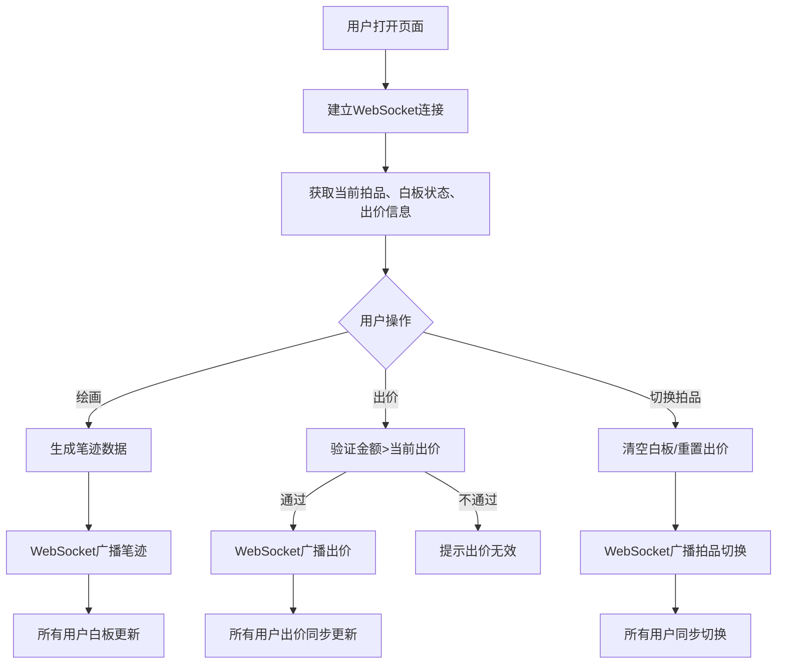

## 1. 产品概述
在线竞拍白板应用，为拍卖师和竞拍者提供实时协作白板与竞拍功能，支持多人同时绘画标注、同步出价信息。
- 解决拍卖场景中远程协作与实时互动的问题，目标用户为线上竞拍参与者
- 提供高效的视觉沟通工具，提升拍卖体验的互动性和信息透明度

## 2. 核心功能

### 2.1 用户角色
| 角色 | 注册方式 | 核心权限 |
|------|----------|----------|
| 普通用户 | 直接访问 | 白板绘画、出价竞拍、切换拍品 |

### 2.2 功能模块
1. **主页面**：顶部导航栏、共享白板区域、右侧竞拍面板
2. **白板模块**：绘画功能、颜色选择、清除功能、笔迹实时同步、拍品切换
3. **竞拍模块**：当前出价显示、出价历史列表、出价输入与提交

### 2.3 页面详情
| 页面名称 | 模块名称 | 功能描述 |
|----------|----------|----------|
| 主页面 | 顶部导航栏 | 显示当前拍品名称、起拍价；左侧拍品切换下拉菜单 |
| 主页面 | 共享白板 | 实时绘画、颜色选择（6色）、清除按钮、多用户笔迹显示 |
| 主页面 | 竞拍面板 | 当前出价显示、出价历史、出价输入框和按钮 |

## 3. 核心流程
用户打开页面建立WebSocket连接，加入当前拍品房间。可在白板上绘画（笔迹实时广播给所有用户），或在竞拍面板输入高于当前出价的金额提交。切换拍品时清空白板内容并重置出价。

## 4. 用户界面设计
### 4.1 设计风格
- 主色调：深色导航栏（#1a1a2e到#16213e渐变）、白色白板背景、深灰竞拍面板（#2a2a2a）
- 强调色：金色#ffcc00（出价显示）、6色绘画笔（红/绿/蓝/金/紫/青）
- 按钮风格：圆形颜色按钮（30px）、红色清除按钮（36px带垃圾桶图标）、0.1秒缩放点击反馈
- 字体：现代无衬线字体，出价数字24px金色
- 布局：桌面端左侧80%白板+右侧20%面板，移动端底部抽屉式面板

### 4.2 页面设计概述
| 页面名称 | 模块名称 | UI元素 |
|----------|----------|--------|
| 主页面 | 导航栏 | 深色渐变背景、白色文字、左侧拍品下拉菜单、中央拍品信息 |
| 主页面 | 白板 | 白色背景#ffffff、50x50px浅灰网格、6色圆形选择器、红色清除按钮、笔迹渐入动画（0.3s） |
| 主页面 | 竞拍面板 | 深灰背景#2a2a2a、金色出价数字、浅灰出价记录#333333、新记录滑入动画（0.3s ease-out） |

### 4.3 响应式
- 桌面优先设计，屏幕宽度<768px时：白板占全宽，竞拍面板变为底部固定抽屉（高度30%）
- 触摸设备优化绘画和点击操作
