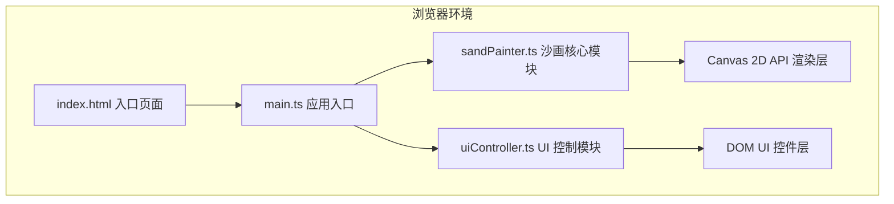

## 1. 架构设计



## 2. 技术说明

- **前端框架**：无框架，原生 TypeScript + Canvas 2D API
- **构建工具**：Vite 5.x
- **语言**：TypeScript 5.x（严格模式，ES2020 目标）
- **样式方案**：原生 CSS + CSS Variables
- **渲染方式**：Canvas 2D Context 直接绘制
- **动画引擎**：requestAnimationFrame（清空涟漪动画）+ setTimeout（沙线沉降）

## 3. 项目文件结构

```
auto85/
├── .trae/documents/
│   ├── prd.md              # 产品需求文档
│   └── architecture.md     # 技术架构文档
├── src/
│   ├── main.ts             # 应用入口：初始化 Canvas，绑定事件，加载模块
│   ├── sandPainter.ts      # 沙画核心：沙粒纹理、笔触粗细、路径绘制、羽化、清空动画
│   └── uiController.ts     # UI 控制：清空按钮、笔触预览的渲染与事件
├── index.html              # 入口页面：全屏背景 + 居中沙画容器
├── package.json            # 依赖与脚本配置
├── tsconfig.json           # TypeScript 编译配置（严格模式，ES2020）
└── vite.config.js          # Vite 构建配置
```

## 4. 模块设计

### 4.1 sandPainter.ts —— 沙画核心模块

**职责**：
- 管理 Canvas 上下文与画布尺寸
- 生成沙粒噪点纹理
- 根据鼠标速度计算笔触宽度（6-20px 动态范围）
- 在路径上绘制带羽化模糊的沙粒线条
- 沙线沉降变暗处理（setTimeout 0.5s）
- 涟漪扩散清空动画（requestAnimationFrame 0.8s）

**核心类型**：
```typescript
interface Point {
  x: number;
  y: number;
  timestamp: number;
}

interface SandPainterOptions {
  canvas: HTMLCanvasElement;
  minWidth: number;       // 6px
  maxWidth: number;       // 20px
  sandColor: string;      // #4a2c15
  blurRadius: number;     // 2px
  settleDuration: number; // 500ms
}

class SandPainter {
  constructor(options: SandPainterOptions) {}
  resize(): void;
  startStroke(x: number, y: number): void;
  moveStroke(x: number, y: number): void;
  endStroke(): void;
  clearWithRipple(onComplete?: () => void): void;
  getCurrentStrokeWidth(): number;
  destroy(): void;
}
```

**关键算法**：
1. **笔触宽度计算**：基于连续两点的移动距离 / 时间差得到速度，速度越快宽度越小，范围 clamp 在 6-20px
2. **路径插值**：相邻两点间按像素步长线性插值，避免快速移动时出现断点
3. **羽化模糊**：shadowBlur + shadowColor 实现边缘柔化，叠加随机沙粒圆点
4. **涟漪清空**：每帧绘制径向渐变遮罩，渐变内圈透明→外圈沙色，半径逐帧扩张至画布对角线

### 4.2 uiController.ts —— UI 控制模块

**职责**：
- 创建和管理清空按钮 DOM 元素
- 创建和管理笔触预览圆点 DOM 元素
- 响应笔触宽度变化更新预览
- 处理清空按钮点击事件并触发回调
- 响应式缩放处理

**核心类型**：
```typescript
interface UIControllerOptions {
  container: HTMLElement;
  onClear: () => void;
}

class UIController {
  constructor(options: UIControllerOptions) {}
  updateStrokePreview(width: number): void;
  destroy(): void;
}
```

### 4.3 main.ts —— 应用入口

**职责**：
- 获取 DOM 元素，创建 Canvas 并加入容器
- 实例化 SandPainter 和 UIController
- 绑定鼠标/触摸事件（mousedown/mousemove/mouseup，touchstart/touchmove/touchend）
- 监听窗口 resize 事件并重新计算画布尺寸
- 处理 DPR（设备像素比）适配，保证高清屏绘制清晰

## 5. 性能优化策略

| 策略 | 说明 |
|------|------|
| DPR 适配 | canvas.width/height 乘以 devicePixelRatio，context.scale 缩放，避免模糊 |
| 离屏缓冲 | 沙线沉降变暗通过备份像素数据或再次绘制实现，避免全量重绘 |
| 路径插值 | 使用 Bresenham/线性插值在两点间补点，保证快速移动时线条连续 |
| 节流防抖 | 鼠标事件直接绑定（非节流）以保证 <16ms 响应，但绘制使用 rAF 批量处理 |
| requestAnimationFrame | 涟漪动画使用 rAF 驱动，与浏览器刷新率同步 |
| 内存管理 | destroy 方法清理事件监听和引用，避免内存泄漏 |

## 6. 事件流

```
mousedown/touchstart
    ↓
SandPainter.startStroke() 记录起点、时间戳
    ↓
mousemove/touchmove
    ↓
计算速度 → 动态笔触宽度
    ↓
插值补点 → 逐点绘制沙粒 + 羽化
    ↓
UIController.updateStrokePreview() 更新预览圆点
    ↓
mouseup/touchend/mouseleave
    ↓
SandPainter.endStroke() → setTimeout 500ms 颜色加深 10%
```
