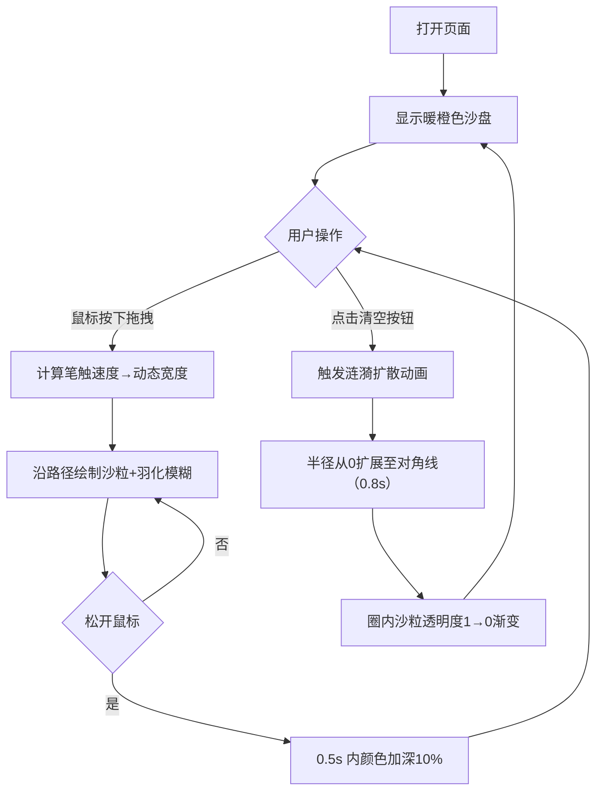

## 1. 产品概述

动态沙画表演模拟器 —— 一款在浏览器中还原街头沙画艺术体验的互动应用。用户通过鼠标拖拽在发光沙盘上创作流动沙画，感受沙粒自然堆积与光影效果，支持一键清空重新创作。

- 目标用户：艺术爱好者、创意工作者、休闲娱乐用户
- 产品价值：零成本体验沙画艺术，即时获得创作乐趣与视觉享受

## 2. 核心功能

### 2.1 功能模块

1. **沙画画布**：核心绘制区域，暖橙色发光渐变背景，支持笔触绘制
2. **笔触系统**：动态粗细沙粒笔触、速度感应宽度、边缘羽化、沉降变暗效果
3. **清空功能**：涟漪扩散动画清空画布
4. **笔触预览**：实时显示当前笔触粗细
5. **响应式适配**：桌面端与移动端自适应布局

### 2.2 页面详情

| 页面名称 | 模块名称 | 功能描述 |
|-----------|-------------|---------------------|
| 主界面 | 沙画画布 | 16:9 比例居中显示，最大宽 1200px，暖橙色渐变背景（#3a2010 → #1a0f05），支持鼠标拖拽绘制 |
| 主界面 | 笔触系统 | 深棕色（#4a2c15）沙粒质感，颗粒 3-5px 随机分布，叠加噪点纹理；速度感应宽度 6-20px；边缘 2px 羽化模糊；松开鼠标 0.5s 内颜色加深 10% |
| 主界面 | 清空按钮 | 右下角圆形按钮（直径 48px，底色 #d95440 半透明），悬停不透明+放大 1.1 倍（0.2s 过渡），点击触发涟漪清空动画 |
| 主界面 | 清空动画 | 从中心向外扩散圆圈，半径 0 → 画布对角线（0.8s），圈内沙粒透明度渐变 1→0 |
| 主界面 | 笔触预览 | 左上角浅灰色半透明圆角矩形（60×40px），内含当前宽度的沙粒色圆点 |
| 主界面 | 响应式 | 屏幕 < 768px：画布全宽 100%，高度按 16:9 缩放；按钮和预览点放大 1.2 倍 |

## 3. 核心流程

用户打开页面 → 看到暖橙色发光沙盘 → 鼠标按下并拖拽 → 沙粒沿路径堆积（速度越快线条越细）→ 松开鼠标 → 沙线 0.5 秒内沉降变暗 → 可继续绘制 / 点击清空按钮 → 涟漪扩散动画 → 画布恢复空白状态

## 4. 用户界面设计

### 4.1 设计风格

- **主色调**：暖橙色系背景（#3a2010 → #1a0f05 径向渐变），模拟底部打亮的发光沙盘
- **强调色**：深棕色沙粒（#4a2c15）、红色清空按钮（#d95440）
- **质感**：沙粒颗粒感（3-5px 随机圆点 + 噪点纹理叠加）、笔触边缘羽化模糊
- **字体**：简洁无衬线字体，不干扰艺术创作区域
- **动效**：笔触沉降（setTimeout 渐变加深）、清空涟漪（requestAnimationFrame 径向扩散）、按钮悬停微交互

### 4.2 页面设计概述

| 页面名称 | 模块名称 | UI 元素 |
|-----------|-------------|-------------|
| 主界面 | 整体布局 | 全屏深棕色渐变背景，画布居中，控件悬浮于画布四角 |
| 主界面 | 沙画画布 | 16:9 比例，max-width:1200px，居中，暖橙色径向渐变发光底，Canvas 2D 渲染 |
| 主界面 | 清空按钮 | 右下角固定定位，圆形 48px，#d95440 半透明 → 悬停不透明+scale(1.1)，transition:0.2s |
| 主界面 | 笔触预览 | 左上角固定定位，60×40px 浅灰半透明圆角矩形，内含动态直径圆点 |
| 主界面 | 响应式 | @media(max-width:768px)：画布 width:100%，按钮和预览 transform:scale(1.2) |

### 4.3 响应式

- **设计优先**：桌面端优先（Desktop-first）
- **移动端适配**：屏幕宽度 < 768px 时自动调整
- **触摸优化**：移动端按钮和预览区域放大 1.2 倍，便于触摸操作
- **画布适配**：移动端画布自动全宽，高度按 16:9 比例自适应

## 5. 性能指标

| 指标 | 目标值 |
|------|--------|
| 鼠标拖动响应延迟 | < 16ms（每帧流畅响应） |
| 画布重绘帧率 | ≥ 55fps |
| 清空动画时长 | 0.8s |
| 沙线沉降时长 | 0.5s |
| 按钮过渡时长 | 0.2s |
