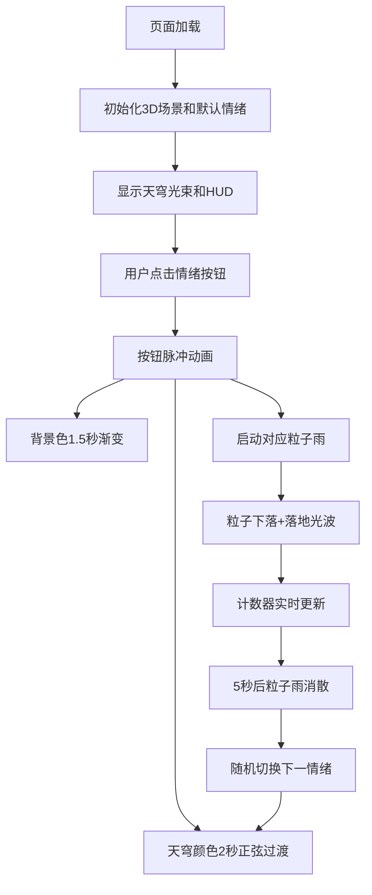

## 1. 产品概述
虚拟情绪气象站是一个基于Three.js的交互式3D情绪可视化项目。用户通过点击情绪按钮切换天穹光束颜色、粒子雨类型和背景氛围，沉浸式体验不同情绪的视觉表达。

- 主要目的：将抽象情绪转化为具象的3D视觉体验，提供沉浸式、富有艺术感的情绪交互界面
- 目标用户：对交互艺术、数据可视化、情绪表达感兴趣的用户
- 产品价值：探索情绪的可视化表达方式，创造具有疗愈感和艺术表现力的交互体验

## 2. 核心功能

### 2.1 功能模块
1. **天穹光束系统**：32根彩色光束构成半球形天穹，颜色随情绪标签平滑过渡，末端带光晕粒子
2. **情绪按钮面板**：左侧竖排4个情绪按钮（快乐、悲伤、愤怒、平静），点击触发脉冲动画
3. **粒子雨系统**：从天穹底部飘落的对应情绪粒子，落地产生扩散光波
4. **HUD信息面板**：左上角显示情绪名称和颜色值，右下角显示粒子计数器
5. **背景渐变系统**：背景色随情绪切换平滑渐变过渡

### 2.2 页面详情
| 页面名称 | 模块名称 | 功能描述 |
|-----------|-------------|---------------------|
| 主场景 | 天穹光束系统 | 32根半透明锥形光束构成半球，颜色随情绪正弦缓动过渡（2秒），末端80个光晕粒子 |
| 主场景 | 情绪按钮面板 | 左侧竖排4个48x48px圆角按钮，主色填充，点击脉冲光晕（1.2倍缩放，0.3秒） |
| 主场景 | 粒子雨系统 | 粒子从天穹顶点(y=4)飘落到底部(y=-2)，落地产生扩散光波（1秒），持续5秒后消散 |
| 主场景 | HUD信息面板 | 左上角情绪名称+HEX颜色值，右下角粒子计数器（60FPS更新） |
| 主场景 | 背景渐变系统 | 背景色从互补色向新情绪主色线性渐变（1.5秒） |

## 3. 核心流程
用户进入页面后，默认显示初始情绪状态。用户点击左侧情绪按钮→天穹光束颜色开始2秒正弦缓动过渡→背景色1.5秒线性渐变→对应类型粒子雨启动（持续5秒）→粒子计数器实时累加→粒子雨消散后自动随机切换到下一情绪。

## 4. 用户界面设计

### 4.1 设计风格
- **主色调**：深色半透明HUD风格，背景纯黑#000005
- **情绪色彩体系**：
  - 快乐：暖橙#ffaa33 → 金黄#ffdd55
  - 悲伤：深蓝#3355aa → 淡蓝#88aaff
  - 愤怒：鲜红#ff3333 → 深红#cc0000
  - 平静：翠绿#33cc66 → 淡绿#88ffaa
- **按钮样式**：圆角矩形48x48px，主色填充，点击脉冲放大1.2倍（0.3秒）
- **字体**：#ddd颜色，14px字号
- **布局风格**：沉浸式全屏3D场景，左侧竖排按钮，左上角HUD信息，右下角计数器
- **整体氛围**：赛博朋克风格的沉浸式情绪可视化空间，深色背景配合彩色光束和粒子效果

### 4.2 页面设计概述
| 页面名称 | 模块名称 | UI元素 |
|-----------|-------------|-------------|
| 主场景 | 天穹光束系统 | 32根锥形光束半球分布，末端光晕粒子，颜色平滑过渡动画 |
| 主场景 | 情绪按钮面板 | 左侧竖排4个按钮，圆角48px，脉冲点击反馈 |
| 主场景 | 粒子雨系统 | 4种情绪对应粒子（金色星屑/蓝色泪滴/红色火星/绿色柔光），落地扩散光波 |
| 主场景 | HUD信息面板 | 半透明深色背景，情绪名称+HEX色值，粒子计数器 |

### 4.3 响应式
- 桌面端优先设计，全屏Canvas自适应
- 按钮和HUD元素固定定位，不受窗口尺寸影响
- 3D场景自动适配窗口大小变化

### 4.4 3D场景指引
- **环境**：纯黑背景#000005，无HDRI，营造深空氛围
- **光照**：基础环境光配合情绪色点光源，突出光束效果
- **相机**：PerspectiveCamera，固定视角稍带仰视，完整呈现半球天穹
- **构图**：天穹位于场景中心偏上，粒子雨从顶部下落，视觉重心居中
- **交互**：鼠标点击按钮触发状态切换，无自由相机控制
- **性能**：目标50FPS以上，粒子系统使用BufferGeometry优化
