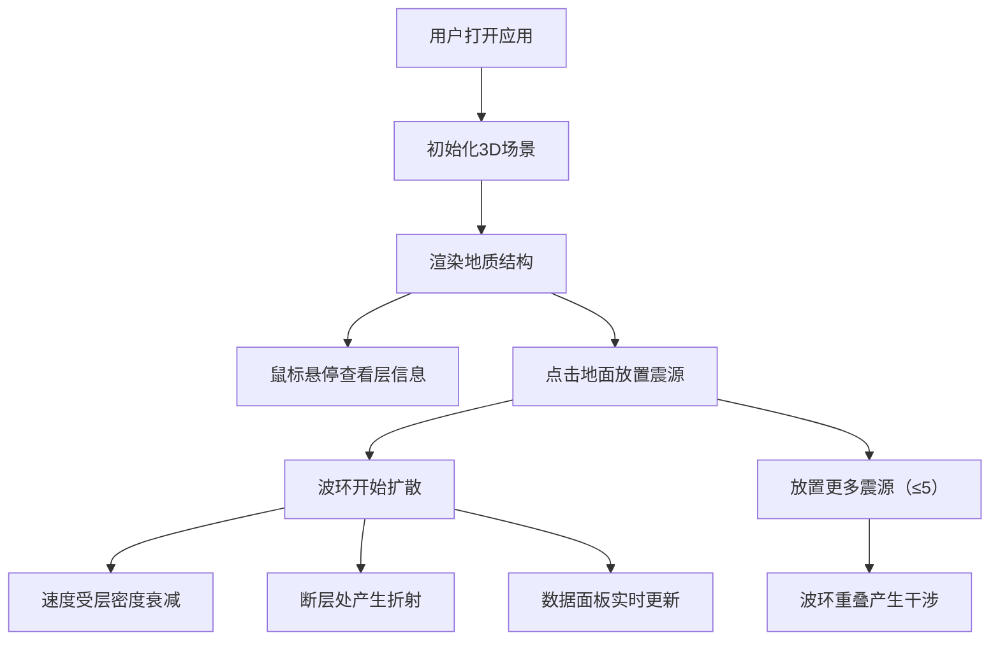

## 1. 产品概述

3D地震波传播模拟应用是一款基于浏览器的交互式科学可视化工具，专为地质学家、教师和学生设计，用于直观观察和模拟地震波在不同地质结构（断层、沉积层、岩体）中的传播路径与衰减模式。

- 目标用户：地质学家、教育工作者、地球科学专业学生
- 核心价值：将抽象的地震波传播理论转化为可视化的3D交互体验，辅助教学演示与初步研究

## 2. 核心功能

### 2.1 用户角色
| 角色 | 注册方式 | 核心权限 |
|------|----------|----------|
| 访客用户 | 无需注册 | 完整使用所有模拟功能 |

### 2.2 功能模块
1. **3D地质结构可视化模块**：沉积层、断层、岩体的三维展示
2. **震源与波传播模块**：多点震源放置、波环扩散、地质层速度衰减
3. **交互与数据面板模块**：tooltip信息展示、实时数据监控
4. **波形叠加模块**：多震源波干涉效果

### 2.3 页面详情
| 页面名称 | 模块名称 | 功能描述 |
|-----------|-------------|---------------------|
| 主页面 | 3D地质场景 | 200x200地面网格、3层半透明地质层（砂岩/页岩/花岗岩）、45度倾斜红色断层 |
| 主页面 | 震源控制系统 | 鼠标点击放置震源（最多5个，不同颜色），震源脉动动画 |
| 主页面 | 波传播模拟 | 球面同心环扩散、速度受层密度影响、断层折射效果、多波干涉 |
| 主页面 | 数据交互面板 | 悬停tooltip、右下角实时数据面板（可折叠）、操作提示 |

## 3. 核心流程

用户打开应用 → 查看3D地质结构 → 鼠标悬停查看地质层信息 → 点击地面放置震源 → 观察地震波在各层中的传播与衰减 → 放置多个震源观察干涉效果 → 通过数据面板实时监测传播参数

## 4. 用户界面设计

### 4.1 设计风格
- **主色调**：深空蓝黑渐变（顶部#0a0a2a → 底部#1a1a2a）
- **地质层颜色**：砂岩#c2a66e、页岩#6b5b4c、花岗岩#5c5c5c、断层#ff4444半透明
- **震源颜色**：红、橙、黄、绿、蓝（五色循环）
- **字体**：现代无衬线字体，浅灰色#cccccc文字
- **材质风格**：MeshPhongMaterial半透明着色，shininess=30微弱光泽
- **动效**：所有过渡采用0.2-0.3秒ease动画

### 4.2 页面设计概述
| 页面名称 | 模块名称 | UI元素 |
|-----------|-------------|-------------|
| 主页面 | 3D画布 | 全屏Three.js渲染、正交相机、OrbitControls拖拽旋转/滚轮缩放 |
| 主页面 | 操作提示 | 右上角半透明黑框、14px浅灰文字、圆角背景 |
| 主页面 | Tooltip | 跟随鼠标、半透明黑框圆角、白色文字、偏移10px |
| 主页面 | 数据面板 | 右下角200px宽、深色半透明背景、可折叠（小三角按钮）、滑入滑出0.3秒过渡 |

### 4.3 响应式
- Desktop-first设计
- 最小宽度800px，最大宽度1920px
- 3D画布自动填充可用区域
- 控制面板位置固定，不受窗口尺寸影响

### 4.4 3D场景指导
- **环境与氛围**：深空蓝黑渐变背景，冷色调科幻科学风
- **光照设置**：AmbientLight环境光 + DirectionalLight方向光，营造立体感
- **相机设置**：OrthographicCamera正交相机，俯瞰45度角，支持OrbitControls
- **焦点元素**：地质层剖面 + 扩散中的波环
- **交互动画**：震源scale脉动（1.0-1.2，周期0.5秒）、波环透明度线性衰减、面板滑入滑出
- **性能预算**：三角形总数≤5000，波环同时存在≤10个，帧率≥45fps
