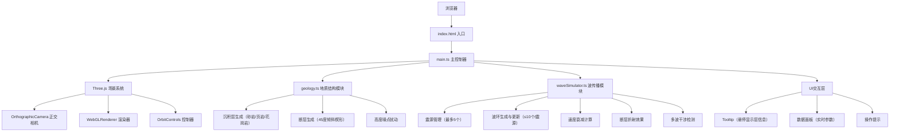

## 1. 架构设计



## 2. 技术描述

- **前端框架**：无（原生TypeScript + Three.js，用户明确指定不使用React/Vue）
- **3D引擎**：three@0.160.0
- **类型定义**：@types/three
- **构建工具**：Vite 5.x
- **语言**：TypeScript 5.x（严格模式，ES2022目标）
- **初始化方式**：手动创建项目结构（用户指定精确文件列表）

## 3. 文件结构与职责

| 文件路径 | 职责 | 调用关系 |
|-----------|------|----------|
| `package.json` | 项目依赖与启动脚本 | 被Vite读取 |
| `vite.config.js` | Vite构建配置，@types/three路径解析 | 被Vite CLI读取 |
| `tsconfig.json` | TypeScript编译配置（严格模式、ES2022） | 被tsc/Vite读取 |
| `index.html` | 入口页面，全屏布局、渐变背景、UI容器 | 加载main.ts |
| `src/main.ts` | 主入口：初始化Three.js场景/相机/渲染器，协调各模块 | 导入geology.ts、waveSimulator.ts |
| `src/geology.ts` | 地质结构生成器：创建沉积层、断层、带噪点扰动，返回Group | 导出createGeology() |
| `src/waveSimulator.ts` | 波传播模拟器：震源管理、波环更新、速度衰减、折射、干涉 | 导出createWaveSimulator()，返回{addSource(), update(), getRings(), getSources()} |

### 数据流

```
用户鼠标点击 → main.ts(raycaster) → 坐标点 → waveSimulator.addSource()
                                                        ↓
requestAnimationFrame → main.ts → waveSimulator.update(deltaTime) → 更新波环半径/透明度/速度
                                                        ↓
                                            waveSimulator.getRings() → 渲染到场景
                                                        ↓
地质层悬停 → main.ts(raycaster) → 层信息 → UI Tooltip更新
                                                        ↓
震源数据 → main.ts → UI数据面板（坐标、波环数、到达时间戳）
```

## 4. 核心数据结构

### 4.1 地质层定义
```typescript
interface GeologyLayer {
  name: string;           // 层名称（砂岩/页岩/花岗岩）
  color: number;          // 十六进制颜色
  thickness: number;      // 厚度（单位）
  yStart: number;         // Y轴起始位置
  densityFactor: number;  // 密度减速因子（0.1=10%，0.3=30%，0.5=50%）
}
```

### 4.2 震源定义
```typescript
interface EarthquakeSource {
  id: number;
  position: THREE.Vector3;  // 世界坐标
  color: number;             // 震源颜色（红/橙/黄/绿/蓝）
  mesh: THREE.Mesh;          // 球体网格
  createdAt: number;         // 创建时间戳
  rings: WaveRing[];         // 该震源的波环列表
  pulsePhase: number;        // 脉动动画相位
}
```

### 4.3 波环定义
```typescript
interface WaveRing {
  id: number;
  sourceId: number;
  radius: number;            // 当前半径
  maxRadius: number;         // 最大半径（生命周期终点）
  baseSpeed: number;         // 基础速度（20单位/秒）
  currentSpeed: number;      // 当前速度（受层密度影响）
  opacity: number;           // 当前透明度（0.6→0.1线性衰减）
  thickness: number;         // 环厚度（1单位）
  mesh: THREE.Mesh;          // 圆环网格
  createdAt: number;         // 创建时间
  layerTimestamps: { layerName: string; time: number }[];  // 到达各层时间
  refracted: boolean;        // 是否已被断层折射
  refractedOffsetAngle?: number;  // 折射偏移角度
}
```

### 4.4 干涉条纹
```typescript
interface InterferenceStripe {
  id: number;
  position: THREE.Vector3;
  mesh: THREE.Mesh;
  createdAt: number;
  lifetime: number;          // 1000毫秒
}
```

## 5. 性能优化策略

1. **波环池化**：最多10个同时存在的波环，超出后回收最旧的环
2. **几何体复用**：使用THREE.RingGeometry基类实例化，共享几何体
3. **增量更新**：requestAnimationFrame每帧只更新ring.radius和material.opacity
4. **多边形控制**：地质层使用低分段BoxGeometry（宽高1分段），总三角形数<5000
5. **Raycaster优化**：仅在鼠标移动时触发检测，不对每帧所有对象做射线检测
6. **材质共享**：同色地质层共享MeshPhongMaterial实例
