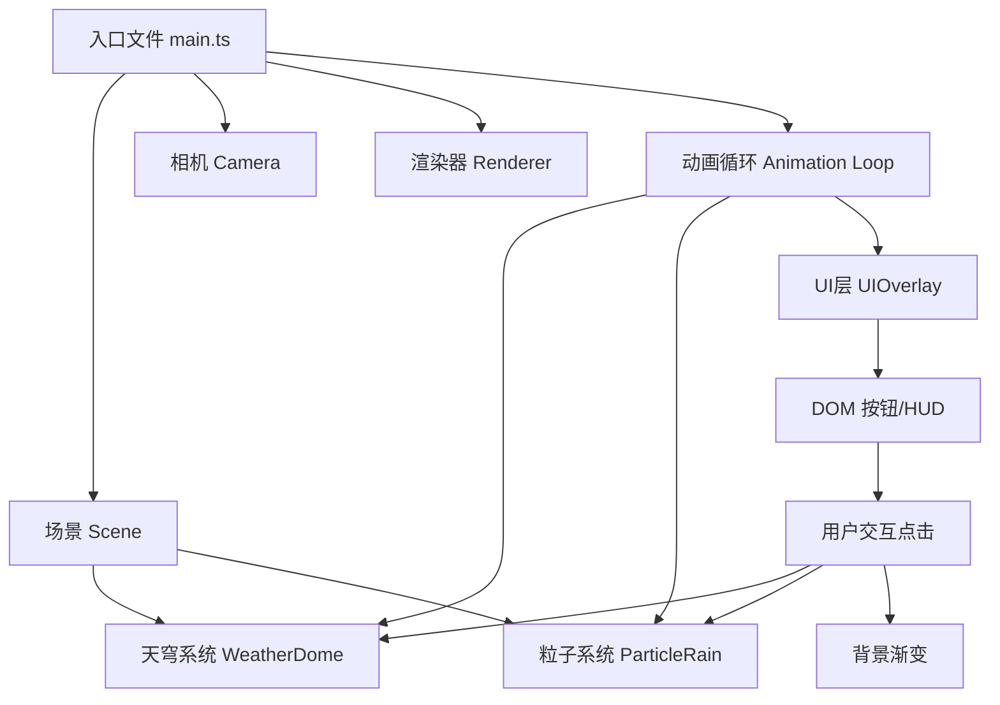

## 1. 架构设计


## 2. 技术描述
- **前端框架**: TypeScript 5.5.0（原生，无React/Vue框架）
- **3D引擎**: Three.js 0.160.0
- **构建工具**: Vite 5.4.0
- **噪声库**: simplex-noise 3.0.0（用于光晕粒子波动）
- **初始化方式**: 手动配置Vite + TypeScript项目
- **后端**: 无后端，纯前端项目
- **数据库**: 无

## 3. 文件结构
```
project-root/
├── package.json              # 依赖配置和启动脚本
├── tsconfig.json             # TypeScript严格模式配置
├── vite.config.js            # Vite构建配置
├── index.html                # 入口HTML页面
└── src/
    ├── main.ts               # 入口文件，场景/相机/渲染器初始化，动画循环
    ├── WeatherDome.ts        # 天穹光束系统：32根锥形光束+80个光晕粒子
    ├── ParticleRain.ts       # 粒子雨系统：粒子下落+落地光波+计数器
    └── UIOverlay.ts          # HUD界面：情绪按钮+标签+粒子计数器
```

## 4. 核心模块设计

### 4.1 WeatherDome 类
- **属性**:
  - `beams: Mesh[]` - 32根锥形光束网格
  - `haloParticles: Points` - 末端80个光晕粒子（BufferGeometry）
  - `currentEmotion: Emotion` - 当前情绪
  - `targetEmotion: Emotion` - 目标情绪
  - `transitionProgress: number` - 过渡进度 0-1
  - `transitionDuration: number` - 过渡时长（2000ms）
- **方法**:
  - `constructor(scene: Scene)` - 创建光束和光晕粒子
  - `setEmotion(emotion: Emotion)` - 触发情绪切换
  - `update(delta: number)` - 每帧更新颜色过渡和光晕波动
  - `getCurrentColor(): string` - 获取当前情绪主色HEX值

### 4.2 ParticleRain 类
- **属性**:
  - `particles: Points` - 雨滴粒子（BufferGeometry）
  - `ripples: Mesh[]` - 落地光波圆形网格池
  - `particleCount: number` - 当前激活粒子数
  - `targetCount: number` - 目标粒子总数（按情绪）
  - `isRunning: boolean` - 粒子雨是否运行中
  - `duration: number` - 粒子雨持续时间（5000ms）
  - `landedCount: number` - 已落地粒子数（计数器）
- **方法**:
  - `constructor(scene: Scene)` - 初始化粒子系统和光波池
  - `start(emotion: Emotion)` - 启动对应情绪粒子雨
  - `stop()` - 停止粒子雨，渐隐消散
  - `update(delta: number)` - 每帧更新粒子位置、光波扩散

### 4.3 UIOverlay 类
- **属性**:
  - `buttons: HTMLButtonElement[]` - 4个情绪按钮
  - `emotionLabel: HTMLElement` - 情绪名称显示
  - `colorLabel: HTMLElement` - 颜色HEX值显示
  - `counterLabel: HTMLElement` - 粒子计数器显示
  - `container: HTMLElement` - UI容器
- **方法**:
  - `constructor(onEmotionSelect: (e: Emotion) => void)` - 创建所有UI元素
  - `updateEmotion(name: string, hexColor: string)` - 更新情绪和颜色标签
  - `updateCounter(count: number, target: number)` - 更新计数器数字
  - `pulseButton(index: number)` - 触发按钮脉冲动画

### 4.4 main.ts 入口
- 创建 THREE.Scene、PerspectiveCamera、WebGLRenderer
- 初始化 WeatherDome、ParticleRain、UIOverlay 实例
- 处理窗口 resize 事件
- 启动 requestAnimationFrame 动画循环（flow）
- 管理背景色渐变过渡
- 协调情绪切换：随机自动切换 + 用户手动切换

## 5. 情绪数据模型
```typescript
enum Emotion {
  HAPPY = 'happy',
  SAD = 'sad',
  ANGRY = 'angry',
  CALM = 'calm'
}

interface EmotionConfig {
  name: string;
  nameCN: string;
  primaryColor: number;    // 起始色
  secondaryColor: number;  // 渐变终点色
  particleCount: number;   // 粒子数量
  buttonColor: string;     // 按钮主色
  bgComplementColor: number; // 背景互补色
}

const EMOTION_CONFIGS: Record<Emotion, EmotionConfig> = {
  [Emotion.HAPPY]: {
    name: 'Happy',
    nameCN: '快乐',
    primaryColor: 0xffaa33,
    secondaryColor: 0xffdd55,
    particleCount: 450,
    buttonColor: '#ffaa33',
    bgComplementColor: 0x0055cc
  },
  // ...其他情绪
};
```

## 6. 动画与缓动函数
- **颜色过渡**: 正弦缓动 `easeInOutSine(t) = -(cos(π*t) - 1) / 2`，时长2000ms
- **背景渐变**: 线性插值 `lerp(a, b, t)`，时长1500ms
- **按钮脉冲**: CSS transform `scale(1.2) → scale(1)`，时长300ms
- **粒子下落**: 速度 0.3-0.8 单位/秒，随机初速度
- **落地光波**: 半径 0.1→0.5，透明度 0.8→0，时长1000ms
- **粒子雨消散**: 透明度渐变至0

## 7. 性能优化策略
- 粒子使用 `BufferGeometry` + `PointsMaterial`，单Draw Call
- 光波使用对象池模式，避免频繁创建销毁Mesh
- 颜色插值在CPU端计算后直接写入material.color，不创建新Color对象
- 光晕粒子透明度波动使用预计算正弦表
- 目标帧率：50FPS以上，每帧更新控制在16ms以内
