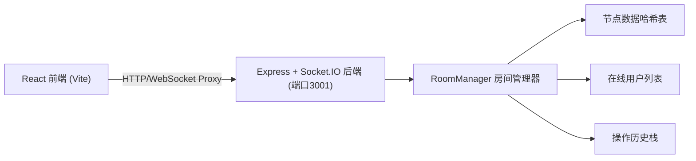
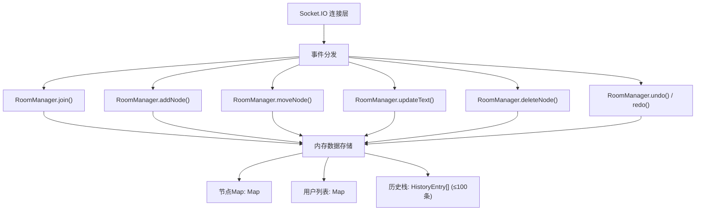

## 1. 架构设计



## 2. 技术描述

- **前端框架**：React 18.2.0 + TypeScript
- **构建工具**：Vite，使用 @vitejs/plugin-react
- **状态管理**：React useState + useEffect + useRef（局部状态，无额外状态管理库）
- **实时通信**：socket.io-client 4.7.2
- **图片导出**：html2canvas 1.4.1
- **后端框架**：Express 4.18.2 + Socket.IO 4.7.2
- **后端语言**：TypeScript（Node.js环境）
- **初始化方式**：Vite react-ts 模板 + 手动添加后端目录

## 3. 目录结构

```
auto88/
├── package.json
├── index.html
├── tsconfig.json
├── vite.config.js
├── client/
│   ├── App.tsx              # React主组件：画布渲染、节点交互、光标同步、工具栏UI
│   └── MindMapCanvas.tsx    # 画布核心组件：节点创建、移动、贝塞尔曲线、缩放平移、虚拟滚动、撤销栈
└── server/
    ├── server.ts            # Express服务器：Socket.IO实例、房间管理、消息广播
    └── roomManager.ts       # 房间管理器：节点哈希表、用户列表、历史栈、操作方法
```

## 4. 路由定义

前端为单页面应用，无额外路由。Vite开发服务器代理：
- `/socket.io/*` → `http://localhost:3001/socket.io/*`（WebSocket）

## 5. API / Socket 事件定义

### Socket.IO 事件

| 事件名 | 方向 | 参数 | 说明 |
|--------|------|------|------|
| `join-room` | Client→Server | `{ roomId: string, username: string }` | 用户加入协作房间 |
| `room-state` | Server→Client | `{ nodes: NodeData[], users: User[] }` | 加入后同步当前房间状态 |
| `user-joined` | Server→Client | `{ user: User }` | 通知其他用户有新用户加入 |
| `user-left` | Server→Client | `{ userId: string }` | 通知其他用户有用户离开 |
| `cursor-move` | Client→Server | `{ x: number, y: number }` | 广播光标位置 |
| `cursor-update` | Server→Client | `{ userId: string, x: number, y: number }` | 转发其他用户光标 |
| `node-add` | Client→Server | `{ node: NodeData }` | 新增节点 |
| `node-added` | Server→Client | `{ node: NodeData }` | 广播节点新增 |
| `node-move` | Client→Server | `{ nodeId: string, x: number, y: number }` | 移动节点 |
| `node-moved` | Server→Client | `{ nodeId: string, x: number, y: number }` | 广播节点移动 |
| `node-update-text` | Client→Server | `{ nodeId: string, text: string }` | 更新节点文本 |
| `node-text-updated` | Server→Client | `{ nodeId: string, text: string }` | 广播节点文本更新 |
| `node-delete` | Client→Server | `{ nodeId: string }` | 删除节点 |
| `node-deleted` | Server→Client | `{ nodeId: string }` | 广播节点删除 |
| `undo` | Client→Server | - | 请求撤销 |
| `undone` | Server→Client | `{ nodes: NodeData[] }` | 撤销后的完整状态 |
| `redo` | Client→Server | - | 请求重做 |
| `redone` | Server→Client | `{ nodes: NodeData[] }` | 重做后的完整状态 |

### TypeScript 类型定义

```typescript
// 节点数据
interface NodeData {
  id: string;
  parentId: string | null;
  text: string;
  x: number;
  y: number;
  color: string;
  type: 'root' | 'child';
  width: number;
  height: number;
}

// 用户信息
interface User {
  id: string;
  username: string;
  color: string;
  x: number;
  y: number;
}

// 操作历史条目
interface HistoryEntry {
  type: 'add' | 'move' | 'update-text' | 'delete';
  before: any;
  after: any;
}
```

## 6. 服务器架构



## 7. 性能优化方案

- **虚拟滚动**：仅渲染视口范围内的节点（屏幕宽度 < 768px 时启用）
- **requestAnimationFrame**：节点拖拽和连接线重绘使用 rAF 保证 60fps
- **节流光标同步**：光标位置更新节流至 16ms（约60fps）
- **贝塞尔曲线缓存**：节点未移动时复用已计算的曲线路径
- **WebSocket 消息最小化**：仅传输变更字段而非完整节点数据
