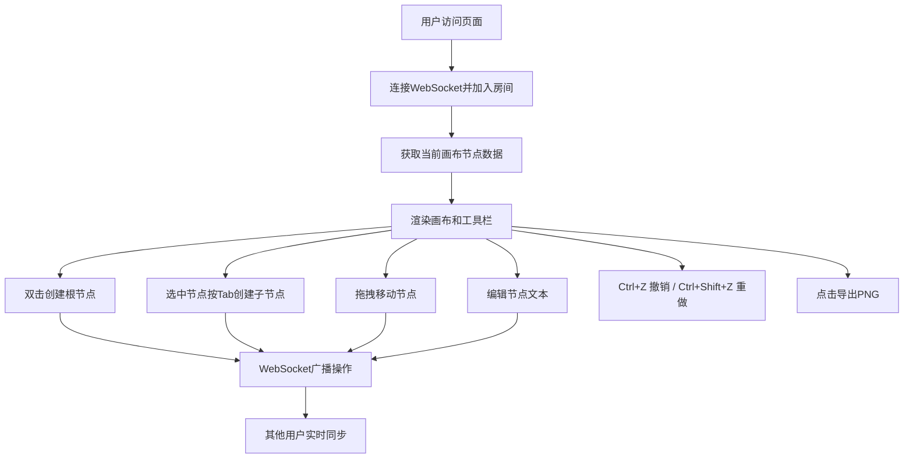

## 1. 产品概述

团队头脑风暴虚拟思维导图协作平台，解决远程团队在创意讨论时缺乏实时协作和视觉化记录工具的问题。

- 主要用途：在线多人协作创建思维导图，支持节点编辑、实时同步、历史回溯和导出分享
- 目标用户：远程工作团队、产品经理、设计师、教育工作者
- 产品价值：提供流畅的实时协作体验，让创意讨论不再受空间限制，所有想法都能被视觉化记录和追踪

## 2. 核心功能

### 2.1 用户角色

| 角色 | 注册方式 | 核心权限 |
|------|----------|----------|
| 协作用户 | 直接访问（匿名协作） | 创建/编辑/删除节点、移动节点、撤销重做、导出图片、查看其他用户光标 |

### 2.2 功能模块

1. **思维导图画布**：无限画布、网格背景、节点创建编辑、贝塞尔曲线连接、拖拽平移、缩放、虚拟滚动
2. **实时协作系统**：WebSocket实时同步、多人光标显示、冲突避免机制
3. **历史操作栈**：撤销/重做（最多100步）、步数显示
4. **工具栏与导出**：新建画布、撤销、重做、导出PNG、在线人数、主题切换
5. **节点交互**：双击创建根节点、Tab创建子节点、拖拽移动、选中文本编辑、选中动画效果

### 2.3 页面详情

| 页面名称 | 模块名称 | 功能描述 |
|----------|----------|----------|
| 主画布页面 | 顶部工具栏 | 新建按钮、撤销按钮、重做按钮、历史步数显示、导出按钮、协作人数、主题切换器 |
| 主画布页面 | 无限画布 | 浅灰/深色网格背景、鼠标拖拽平移、节点渲染、贝塞尔连接线、虚拟滚动优化 |
| 主画布页面 | 节点组件 | 圆形根节点（#4A90D9，80px）、圆角矩子节点（深色系配色）、文本编辑（≤50字）、脉冲选中动画、缩放弹性动画 |
| 主画布页面 | 协作光标 | 半透明彩色圆点（12px）、用户名悬浮提示、实时位置同步 |

## 3. 核心流程

用户打开页面后进入默认协作房间，自动获得匿名用户身份。在画布上双击创建根节点，选中节点后按Tab创建子节点。所有操作通过WebSocket实时广播给其他在线用户。用户可随时撤销/重做操作或导出画布为PNG图片。

## 4. 用户界面设计

### 4.1 设计风格

- **主色调**：#4A90D9（品牌蓝），悬停态 #357ABD
- **子节点配色方案**（深色系预设）：#2C3E50、#8E44AD、#16A085、#C0392B、#D35400、#2980B9、#7F8C8D
- **背景色**：浅色模式 #F5F5F5，深色模式 #1E1E1E
- **连接线**：#CCCCCC，线宽2px，贝塞尔曲线
- **按钮风格**：圆角8px，蓝色主按钮，悬停变色过渡0.2s
- **字体**：系统默认无衬线字体，节点文字白色（深色节点）或白色（蓝色根节点）
- **布局风格**：全屏画布，顶部固定50px高工具栏，底部浅灰分隔线
- **图标风格**：简洁线条图标

### 4.2 页面设计概述

| 页面名称 | 模块名称 | UI元素 |
|----------|----------|--------|
| 主画布页面 | 工具栏 | 固定顶部、白色背景、50px高度、浅灰底部分隔线、水平排列操作按钮 |
| 主画布页面 | 画布 | 网格背景（间距40px、线宽1px、透明度0.2）、可无限滚动、鼠标平移 |
| 主画布页面 | 根节点 | 圆形（80px）、#4A90D9填充、白色文字居中、脉冲光晕选中动画 |
| 主画布页面 | 子节点 | 圆角矩形（圆角10px）、深色系随机配色、白色文字、长宽自适应文字 |
| 主画布页面 | 连接线 | 贝塞尔曲线、#CCCCCC、2px线宽、随节点移动实时更新 |
| 主画布页面 | 协作光标 | 12px半透明彩色圆点、用户名悬浮tooltip、跟随移动 |

### 4.3 响应式

- 桌面优先设计，画布最小宽度1024px，高度100vh
- 屏幕宽度 < 768px 时，节点和工具栏整体缩小至80%
- 移动端启用虚拟滚动，只渲染视口内节点以优化性能

### 4.4 动画效果

- **节点新增**：缩放弹性动画 scale(0) → scale(1)，时长0.3s，ease-out
- **节点选中**：脉冲光晕动画 box-shadow 0→8px，颜色同节点色，透明度0.6，周期1s无限循环
- **按钮悬停**：颜色平滑过渡0.2s
