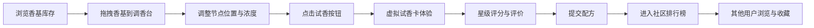

## 1. 产品概述

虚拟调香师实验室是一款基于浏览器的全栈香水调配应用，让用户化身专业调香师，通过混合不同香基创建独特香水配方，进行虚拟试香评价，并在社区分享配方。

- 面向对香水文化感兴趣的用户，提供沉浸式的调香体验
- 通过游戏化的配方创建和社区互动机制，提升用户粘性和创作热情

## 2. 核心功能

### 2.1 用户角色
| 角色 | 注册方式 | 核心权限 |
|------|---------|---------|
| 普通用户 | 无需注册，匿名使用 | 浏览香基库、创建配方、试香评价、查看排行榜、收藏/投票 |

### 2.2 功能模块
1. **香基库存面板**：12种预设香基展示，支持浓度调节和拖拽操作
2. **配方创建工作区**：六边形网格调香台，拖拽放置香基节点，曲线显示混合关系
3. **虚拟试香卡**：模拟香气分子动画，支持星级评分和文字评价
4. **社区排行榜**：展示公开配方的评分、收藏数，支持实时刷新和收藏操作

### 2.3 页面详情
| 页面名称 | 模块名称 | 功能描述 |
|---------|---------|----------|
| 主页面 | 香基库存面板 | 左侧可滚动面板，展示12种香基（圆形色块+名称+浓度滑块），悬停放大并显示香气说明 |
| 主页面 | 配方创建工作区 | 中央六边形网格调香台，拖拽放置香基节点，节点间曲线连线显示混合关系，点击节点弹出详情面板 |
| 主页面 | 虚拟试香卡 | 模态框形式，模拟香气分子浮动动画，底部星级评分（1-5星）和评价输入框（50字限） |
| 主页面 | 社区排行榜 | 右侧表格展示配方名称、作者、平均评分、收藏数，每5秒自动刷新，支持爱心收藏切换 |

## 3. 核心流程

用户从左侧香基库存选择香基，拖拽到中央调香台放置节点，调整浓度后点击"试香"按钮，在试香卡中体验模拟香气并评分评价，提交后配方进入社区排行榜供其他用户浏览和收藏。

## 4. 用户界面设计

### 4.1 设计风格
- 主背景色：#1a1a2e（深色主题）
- 卡片/面板色：#2d2d44
- 文字主色：#e0e0e0
- 强调色：#ffb74d（重要按钮、标题）
- 收藏色：#ff4080（爱心图标）
- 评分色：#ffd700（金色五角星）
- 按钮风格：圆角、平滑过渡动画
- 字体：现代无衬线字体，标题使用强调色
- 布局：CSS Grid三栏布局（库存:工作区:排行榜 = 1:2:1），最小宽度1200px
- 交互过渡：transition: all 0.2s ease，拖拽时box-shadow: 0 4px 8px rgba(0,0,0,0.3)

### 4.2 页面设计概览
| 页面名称 | 模块名称 | UI元素 |
|---------|---------|--------|
| 主页面 | 香基库存面板 | 可滚动列表、50px圆形色块、浓度滑块（0-100%）、悬停放大1.2倍、浮动标签淡入 |
| 主页面 | 配方创建工作区 | 六边形网格（边长300px，渐变背景#f5f0e1→#e8dcc8）、25px香基节点、混合曲线（颜色取中间色，粗细反映比例）、节点详情面板（删除+浓度微调） |
| 主页面 | 虚拟试香卡 | 宽400px高300px、圆角12px、深灰背景#2a2a2a、边框#5a5a5a、50个随机浮动圆点（4-8px，余弦波幅度3px，周期2-4秒）、5星评分、50字评价输入 |
| 主页面 | 社区排行榜 | 表格布局、每5秒刷新、新行淡入动画（0→1透明度，0.3秒）、爱心收藏图标点击切换 |

### 4.3 响应式设计
- 桌面优先设计，最小宽度1200px
- 低于1200px时，三栏折叠为顶部导航栏，主区域显示工作区
- 触摸屏优化拖拽和点击操作

## 5. 性能约束
- 配方创建与试香评价响应时间：≤300ms（网络延迟除外）
- 榜单刷新不阻塞用户交互（节流：每秒最多1次）
- 评分提交后1秒内显示更新结果
- 拖拽与节点更新帧率：60fps
- 试香卡圆点动画流畅无卡顿
