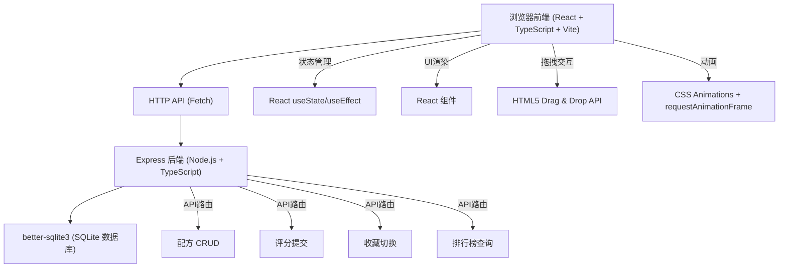
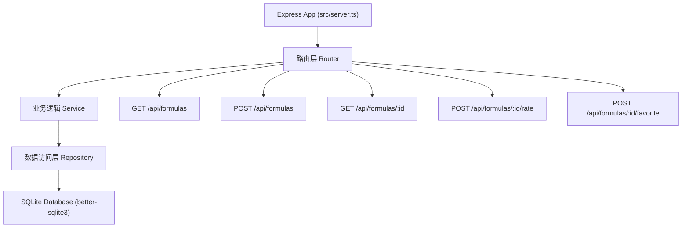
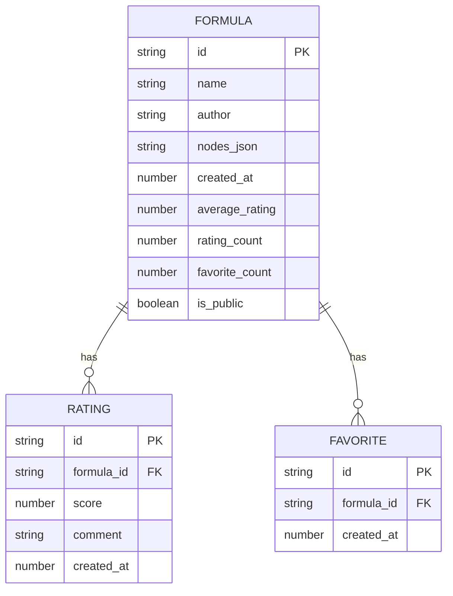

## 1. 架构设计



## 2. 技术描述
- 前端：React@18.2.0 + react-dom@18.2.0 + TypeScript@5.5.0 + Vite@5.4.0 + @vitejs/plugin-react@4.2.0
- 后端：Express@4.18.2 + TypeScript@5.5.0
- 数据库：better-sqlite3@9.0.0（嵌入式SQLite，低延迟）
- 构建工具：Vite@5.4.0（前端）+ ts-node/tsc（后端）
- 端口：前端Vite默认端口，后端Express监听3001

## 3. 路由定义
| 路由 | 方法 | 用途 |
|-----|------|------|
| /api/formulas | GET | 获取所有公开配方列表（排行榜） |
| /api/formulas | POST | 创建新配方 |
| /api/formulas/:id | GET | 获取单个配方详情 |
| /api/formulas/:id | PUT | 更新配方 |
| /api/formulas/:id | DELETE | 删除配方 |
| /api/formulas/:id/rate | POST | 提交配方评分和评价 |
| /api/formulas/:id/favorite | POST | 切换配方收藏状态 |

## 4. API 定义

### 4.1 类型定义

```typescript
// 香基类型
enum FragranceType {
  FLORAL = 'floral',      // 花香
  WOODY = 'woody',        // 木质
  FRUITY = 'fruity',      // 果香
  SPICY = 'spicy',        // 辛香
}

interface FragranceBase {
  id: string;
  name: string;
  type: FragranceType;
  color: string;
  description: string;
}

// 配方中的香基节点
interface FormulaNode {
  id: string;
  fragranceId: string;
  concentration: number;   // 0-100
  gridX: number;           // 六边形网格坐标
  gridY: number;
}

// 配方结构
interface Formula {
  id: string;
  name: string;
  author: string;
  nodes: FormulaNode[];
  createdAt: number;
  averageRating: number;   // 平均分（四舍五入一位小数）
  ratingCount: number;
  favoriteCount: number;
  isPublic: boolean;
}

// 评分记录
interface Rating {
  id: string;
  formulaId: string;
  score: number;           // 1-5
  comment: string;         // 最多50字
  createdAt: number;
}
```

### 4.2 请求/响应结构

**GET /api/formulas 响应：**
```json
{
  "success": true,
  "data": [
    {
      "id": "uuid",
      "name": "春日花园",
      "author": "匿名调香师",
      "averageRating": 4.5,
      "ratingCount": 12,
      "favoriteCount": 28,
      "createdAt": 1717891200000
    }
  ]
}
```

**POST /api/formulas 请求：**
```json
{
  "name": "春日花园",
  "author": "匿名调香师",
  "nodes": [
    {
      "fragranceId": "rose",
      "concentration": 60,
      "gridX": 0,
      "gridY": 0
    }
  ],
  "isPublic": true
}
```

**POST /api/formulas/:id/rate 请求：**
```json
{
  "score": 5,
  "comment": "花香层次丰富，非常喜欢"
}
```

## 5. 服务端架构



## 6. 数据模型

### 6.1 ER 图



### 6.2 DDL 语句

```sql
-- 配方表
CREATE TABLE IF NOT EXISTS formulas (
  id TEXT PRIMARY KEY,
  name TEXT NOT NULL,
  author TEXT NOT NULL DEFAULT '匿名调香师',
  nodes_json TEXT NOT NULL,
  created_at INTEGER NOT NULL,
  average_rating REAL NOT NULL DEFAULT 0,
  rating_count INTEGER NOT NULL DEFAULT 0,
  favorite_count INTEGER NOT NULL DEFAULT 0,
  is_public INTEGER NOT NULL DEFAULT 1
);

-- 评分表
CREATE TABLE IF NOT EXISTS ratings (
  id TEXT PRIMARY KEY,
  formula_id TEXT NOT NULL,
  score INTEGER NOT NULL CHECK(score >= 1 AND score <= 5),
  comment TEXT NOT NULL DEFAULT '',
  created_at INTEGER NOT NULL,
  FOREIGN KEY (formula_id) REFERENCES formulas(id)
);

-- 收藏表
CREATE TABLE IF NOT EXISTS favorites (
  id TEXT PRIMARY KEY,
  formula_id TEXT NOT NULL,
  created_at INTEGER NOT NULL,
  FOREIGN KEY (formula_id) REFERENCES formulas(id)
);

-- 索引
CREATE INDEX IF NOT EXISTS idx_formulas_rating ON formulas(average_rating DESC, created_at DESC);
CREATE INDEX IF NOT EXISTS idx_ratings_formula ON ratings(formula_id);
CREATE INDEX IF NOT EXISTS idx_favorites_formula ON favorites(formula_id);
```

### 6.3 初始数据 - 12种预设香基

```typescript
const PRESET_FRAGRANCES: FragranceBase[] = [
  // 花香
  { id: 'rose', name: '玫瑰', type: FragranceType.FLORAL, color: '#ff6b9d', description: '经典浪漫的花香调，甜美优雅' },
  { id: 'jasmine', name: '茉莉', type: FragranceType.FLORAL, color: '#f8b4d9', description: '浓郁洁白的花香，神秘诱人' },
  { id: 'lavender', name: '薰衣草', type: FragranceType.FLORAL, color: '#9b7ed7', description: '清新舒缓的草本花香' },
  { id: 'ylang', name: '依兰', type: FragranceType.FLORAL, color: '#f9d56e', description: '异域热情的花香，浓郁饱满' },
  
  // 木质
  { id: 'sandalwood', name: '檀香', type: FragranceType.WOODY, color: '#8b5e3c', description: '温润醇厚的东方木香' },
  { id: 'cedar', name: '雪松', type: FragranceType.WOODY, color: '#a0826d', description: '干燥挺拔的松木香' },
  { id: 'vetiver', name: '香根草', type: FragranceType.WOODY, color: '#6b8e23', description: '深沉泥土的草根香' },
  { id: 'oud', name: '沉香', type: FragranceType.WOODY, color: '#4a3728', description: '珍贵浓郁的木质琥珀香' },
  
  // 果香
  { id: 'lemon', name: '柠檬', type: FragranceType.FRUITY, color: '#ffd93d', description: '明亮清爽的柑橘果香' },
  { id: 'peach', name: '蜜桃', type: FragranceType.FRUITY, color: '#ffb6a3', description: '饱满多汁的甜美果香' },
  { id: 'berry', name: '浆果', type: FragranceType.FRUITY, color: '#c71585', description: '酸甜诱人的野生浆果香' },
  
  // 辛香
  { id: 'cinnamon', name: '肉桂', type: FragranceType.SPICY, color: '#d2691e', description: '温暖热情的东方辛香' },
];
```
