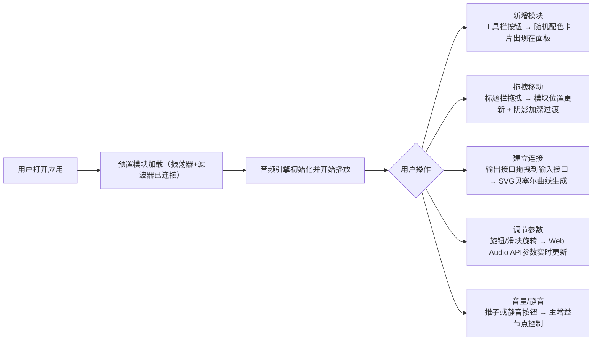

## 1. 产品概述

模块化合成器面板是一款面向 DIY 电子音乐爱好者的浏览器端应用，用户可以像搭建硬件合成器一样，通过拖拽连接不同音效模块（振荡器、滤波器、包络）来生成和调整电子音效。

- 核心价值：提供直观、可视化的模块化音频合成体验，无需物理硬件即可在浏览器中完成声音设计
- 目标用户：电子音乐制作人、DIY 合成器爱好者、音频编程学习者

## 2. 核心功能

### 2.1 用户角色
| 角色 | 注册方式 | 核心权限 |
|------|---------|---------|
| 普通用户 | 无需注册，直接使用 | 添加/删除模块、拖拽连接、调节参数、播放音频 |

### 2.2 功能模块
1. **合成器面板**：主交互区域，承载所有模块和连接线
2. **工具栏**：左侧固定工具栏，提供新增模块按钮
3. **音频控制区**：右上角主音量和全局静音控制
4. **模块组件**：振荡器/滤波器等单个音效模块
5. **连接线系统**：SVG 贝塞尔曲线连接，可视化信号路由

### 2.3 页面详情
| 页面名称 | 模块名称 | 功能描述 |
|---------|---------|---------|
| 合成器面板 | 工具栏 | 新增振荡器按钮、新增滤波器按钮 |
| 合成器面板 | 中央面板 | 可滚动区域，承载模块卡片，支持自由拖拽排列 |
| 合成器面板 | 音频控制 | 垂直主音量推子(0-100%)、全局静音按钮 |
| 合成器面板 | 振荡器模块 | 频率旋钮(20-20000Hz)、波形选择、音量旋钮、输入/输出接口 |
| 合成器面板 | 滤波器模块 | 截止频率滑块、Q值滑块、输入/输出接口 |
| 合成器面板 | 连接线 | 贝塞尔曲线渐变连接线、悬停删除、实时预览 |

## 3. 核心流程

用户打开应用后预置一个已连接的振荡器和滤波器模块。用户可以：
1. 从左侧工具栏点击按钮新增模块到中央面板
2. 拖拽模块标题栏自由移动位置
3. 从一个模块的输出接口拖拽到另一个模块的输入接口建立连接
4. 调节模块上的旋钮/滑块实时改变音频参数
5. 通过右上角推子控制整体音量，或点击静音按钮

## 4. 用户界面设计

### 4.1 设计风格
- **主色调**：深色科技主题，背景 #1a1a2e，模块卡片 #16213e
- **强调色**：霓虹蓝 #0f3460（边框发光）、淡蓝 #66B3FF → 淡紫 #9966FF（连接线渐变）
- **接口颜色**：输入接口绿色空心、输出接口红色实心
- **字体**：使用现代无衬线字体，科技感
- **布局**：Flex 横向排列，左侧工具栏(180px)固定 + 中央可滚动面板
- **视觉效果**：毛玻璃标题栏(backdrop-filter: blur(4px))、霓虹边框发光、金属质感旋钮渐变
- **动画**：所有过渡 0.15s ease-out，拖拽响应 <100ms

### 4.2 页面设计概览
| 页面名称 | 模块名称 | UI 元素 |
|---------|---------|---------|
| 合成器面板 | 工具栏 | 180px 深色侧边栏，按钮霓虹边框，悬停发光 |
| 合成器面板 | 模块卡片 | 160px 宽卡片，毛玻璃标题栏，霓虹蓝边框，随机顶部配色条 |
| 合成器面板 | 振荡器旋钮 | 40px 直径圆形旋钮，金属渐变，白色指针标记，数值实时显示 |
| 合成器面板 | 滤波器滑块 | 水平滑块，高亮渐变轨道，圆形把手 |
| 合成器面板 | 连接线 | 3px SVG 贝塞尔曲线，输出蓝#66B3FF到输入紫#9966FF渐变，悬停变亮+删除按钮 |
| 合成器面板 | 音频控制 | 垂直主音量推子 + 静音按钮(红色斜杠圆圈图标) |

### 4.3 响应式
桌面端优先设计，支持面板区域滚动，模块卡片固定宽度布局。

### 4.4 性能约束
- 8 个模块以内帧率稳定 60fps
- 拖拽/滑块调节延迟 ≤ 50ms
- 所有视觉响应 ≤ 100ms
