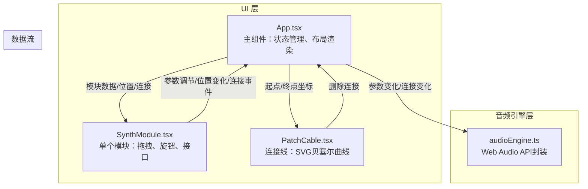

## 1. 架构设计



## 2. 技术说明

- **前端框架**：React@18.2.0 + TypeScript@5.3.3
- **构建工具**：Vite@5.0.0 + @vitejs/plugin-react
- **音频处理**：Web Audio API（原生浏览器 API，无额外依赖）
- **状态管理**：React useState/useReducer（轻量场景，无需 zustand）
- **样式方案**：内联 CSS + CSS 变量（深色科技主题定制化程度高）
- **图标**：lucide-react

## 3. 路由定义

单页应用，无路由。

## 4. API 定义

纯前端应用，无后端 API。

## 5. 数据模型

### 5.1 模块数据类型

```typescript
type ModuleType = 'oscillator' | 'filter' | 'envelope';
type WaveformType = 'sine' | 'sawtooth' | 'square' | 'triangle';

interface ModulePosition {
  x: number;
  y: number;
}

interface OscillatorParams {
  frequency: number;      // 20-20000 Hz
  waveform: WaveformType;
  volume: number;         // 0-100 %
}

interface FilterParams {
  cutoff: number;         // 截止频率 Hz
  q: number;              // Q值 0.1-20
}

interface SynthModuleData {
  id: string;
  type: ModuleType;
  position: ModulePosition;
  color: string;          // 随机配色
  params: OscillatorParams | FilterParams;
}

interface Connection {
  id: string;
  fromModuleId: string;   // 输出模块ID
  toModuleId: string;     // 输入模块ID
}
```

### 5.2 音频节点映射

```
AudioNode 关系图：
  [OscillatorNode] → [GainNode(volume)] → [BiquadFilterNode] → [GainNode(master)] → [AudioDestination]
```

## 6. 文件结构与调用关系

```
e:\solo\VersionFast\tasks\auto90\
├── package.json              # 依赖与脚本配置
├── index.html                # HTML 入口，挂载点
├── vite.config.js            # Vite + React 插件配置
├── tsconfig.json             # TypeScript 严格模式配置
└── src/
    ├── App.tsx               # 主组件（调用 audioEngine，渲染 SynthModule/PatchCable）
    ├── components/
    │   ├── SynthModule.tsx   # 模块卡片（接收 App 传入 props，回调 App 更新）
    │   └── PatchCable.tsx    # 连接线（接收 App 传入坐标，渲染 SVG）
    └── utils/
        └── audioEngine.ts    # Web Audio API 封装（被 App.tsx 调用）
```

### 调用关系
1. **App.tsx → audioEngine.ts**：初始化音频上下文、创建/更新/连接音频节点
2. **App.tsx → SynthModule.tsx**：传入模块数据(id/type/position/params) + 事件回调
3. **App.tsx → PatchCable.tsx**：传入连接起点/终点坐标、颜色渐变
4. **SynthModule.tsx → App.tsx**：onPositionChange、onParamChange、onPortMouseDown 等回调
5. **PatchCable.tsx → App.tsx**：onDelete 回调
