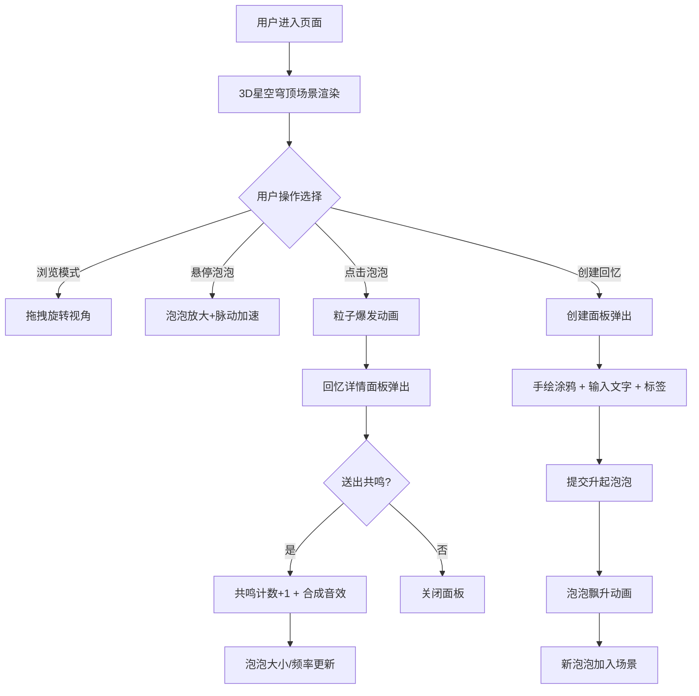

## 1. 产品概述

回忆泡泡市集是一个基于浏览器的虚拟记忆共享平台，用户可以将自己的难忘记忆封装进会呼吸的"回忆泡泡"中，悬挂在市集上空的透明穹顶下，与其他用户共同构建一个充满情感温度的虚拟记忆空间。

- **核心目标**：打造一个沉浸式、梦幻感的3D记忆共享体验，让用户在星空穹顶下浏览、创建和共鸣他人的珍贵回忆
- **目标用户**：喜欢记录生活、分享情感、追求独特数字体验的年轻用户群体
- **产品价值**：将记忆可视化、情感化，通过3D交互和社交共鸣机制，创造独特的数字情感载体

---

## 2. 核心功能

### 2.1 用户角色

| 角色 | 注册方式 | 核心权限 |
|------|----------|----------|
| 访客用户 | 无需注册，直接访问 | 浏览所有泡泡、查看回忆详情、送出共鸣光波 |
| 记忆创建者 | 无需注册，直接创建 | 创建并上传自己的回忆泡泡 |

### 2.2 功能模块

1. **3D星空穹顶场景**：沉浸式3D场景渲染，包含星空背景、半透明穹顶、悬浮泡泡群
2. **回忆泡泡创建模块**：手绘涂鸦、文字输入、地名标签输入、泡泡生成动画
3. **泡泡浏览与交互模块**：视角拖拽旋转、悬停放大效果、点击粒子爆发动画
4. **回忆详情展示模块**：手绘图展示、回忆文字、地名标签、共鸣计数显示
5. **共鸣反馈模块**：送出共鸣按钮、声波动画、Web Audio合成音效、泡泡属性更新

### 2.3 页面详情

| 页面名称 | 模块名称 | 功能描述 |
|----------|----------|----------|
| 主场景页面 | 3D星空穹顶 | 渲染渐变星空背景（深蓝#0a0a2a到紫黑#2a0a3a），半透明穹顶结构 |
| 主场景页面 | 泡泡悬浮群 | 渲染30-50个半透明彩色泡泡，带呼吸脉动效果，内部显示手绘图缩略图 |
| 主场景页面 | 视角控制 | 鼠标拖拽旋转场景（Y轴0-360度，倾斜-30到30度） |
| 主场景页面 | 悬停交互 | 鼠标悬停时泡泡脉动频率翻倍、放大1.1倍 |
| 主场景页面 | 点击交互 | 点击泡泡触发收缩消失动画+50粒子光晕爆发+详情面板弹出 |
| 创建面板 | 手绘涂鸦区 | Canvas涂鸦板，5种颜色画笔（#ff3333、#33cc33、#3388ff、#ffcc00、#ffffff），橡皮擦，3-8px动态笔画 |
| 创建面板 | 文字输入 | 回忆文字输入框，最多80字 |
| 创建面板 | 标签输入 | 地名/场景标签输入框，最多20字 |
| 创建面板 | 提交按钮 | "升起泡泡"渐变按钮，提交后泡泡从底部飘升动画 |
| 详情面板 | 回忆展示 | 手绘图、回忆文字、地名标签展示 |
| 详情面板 | 共鸣计数 | 显示当前共鸣次数，随共鸣数变化大小 |
| 详情面板 | 共鸣按钮 | 圆形声波纹按钮，点击触发声波扩散动画和合成音效 |

---

## 3. 核心流程

### 3.1 浏览与共鸣流程
用户进入页面 → 3D场景加载完成 → 拖拽视角浏览泡泡群 → 悬停泡泡查看放大效果 → 点击泡泡查看详情 → 送出共鸣 → 泡泡属性更新+合成音效

### 3.2 创建回忆流程
用户点击"创建回忆"按钮 → 创建面板弹出（淡入动画）→ 手绘涂鸦 → 输入回忆文字 → 输入地名标签 → 点击"升起泡泡" → 泡泡从底部飘升至穹顶 → 创建面板关闭

### 3.3 Mermaid 流程图

---

## 4. 用户界面设计

### 4.1 设计风格

- **主色调组合**：深蓝(#0a0a2a)、紫黑(#2a0a3a)、暖橙(#ffaa55)、柔粉(#ff88aa)
- **泡泡色库**：暖橙#ffaa55、冷蓝#66ccff、柔粉#ff88aa、翠绿#88dd66、淡紫#cc88ff
- **UI毛玻璃效果**：背景rgba(255,255,255,0.1)，模糊10px，边缘内发光白色0.2透明度
- **创建面板背景**：深灰半透明rgba(20,20,40,0.8)
- **涂鸦区边框**：淡蓝色#66ccff，1px，脉动发光效果
- **动画缓动**：所有过渡0.2-0.5秒，ease-in-out缓动
- **按钮风格**：
  - "创建回忆"：圆形#ffdd88，点击放大光晕
  - "升起泡泡"：渐变#88dd66到#66aa44，悬停亮度+10%
  - "送出共鸣"：圆形带声波纹图标，点击声波扩散

### 4.2 页面设计概览

| 页面/模块 | 设计元素 | UI细节 |
|-----------|----------|--------|
| 主场景 | 渐变星空穹顶 | 从#0a0a2a到#2a0a3a径向渐变，粒子星点闪烁 |
| 泡泡 | 半透明球体 | 直径0.5-1.8随机，呼吸动画透明度0.6-0.8，缩放1.0-1.08，正弦波控制 |
| 点击反馈 | 径向光晕 | 彩色粒子50个，颜色与泡泡一致，半径扩散1.5单位，0.6秒淡出 |
| 创建按钮 | 浮动圆形 | 右下角固定，#ffdd88色，悬停放大1.05倍 |
| 创建面板 | 毛玻璃卡片 | 深灰半透明背景，淡蓝涂鸦边框脉动发光，输入框极简风格 |
| 详情面板 | 居中弹窗 | 淡入0.3秒，毛玻璃效果，手绘图圆角展示，共鸣按钮声波动画 |

### 4.3 响应式设计

- **桌面端（>1000px）**：完整3D场景，浮动创建按钮在右下角，详情面板居中
- **平板端（800-1000px）**：场景适当缩放，UI元素按比例调整
- **移动端（<800px）**：场景缩小至60%，控制按钮变为底部固定条，创建面板全屏覆盖

### 4.4 3D场景指导

- **环境与氛围**：深邃星空穹顶，深蓝到紫黑渐变，营造梦幻夜空感
- **光照设置**：环境光0.4强度，半球光天空色#6688cc/地面色#332244，点光源增强泡泡质感
- **相机设置**：PerspectiveCamera，初始距离15单位，可拖拽OrbitControls旋转，限制倾斜-30到30度
- **构图焦点**：泡泡群在穹顶内均匀分布，中心区域略密集，形成视觉焦点
- **交互与动画**：
  - 泡泡呼吸动画：正弦波控制不透明度(0.6-0.8)和缩放(1.0-1.08)
  - 悬停效果：脉动频率x2，缩放x1.1
  - 点击效果：收缩至消失+50粒子光晕爆发(半径1.5，0.6秒淡出)
  - 新泡泡：从底部(0,-8,0)飘升至随机位置
- **性能预算**：场景渲染60FPS，50泡泡交互响应≤150ms
