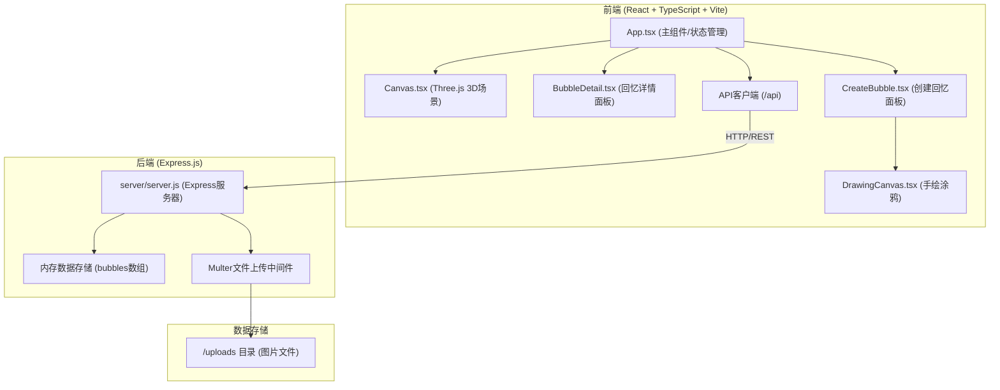
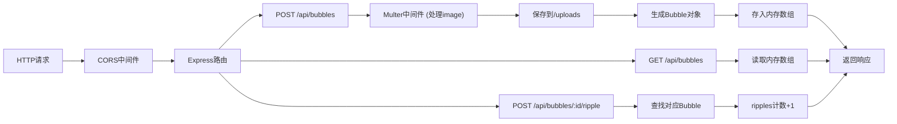
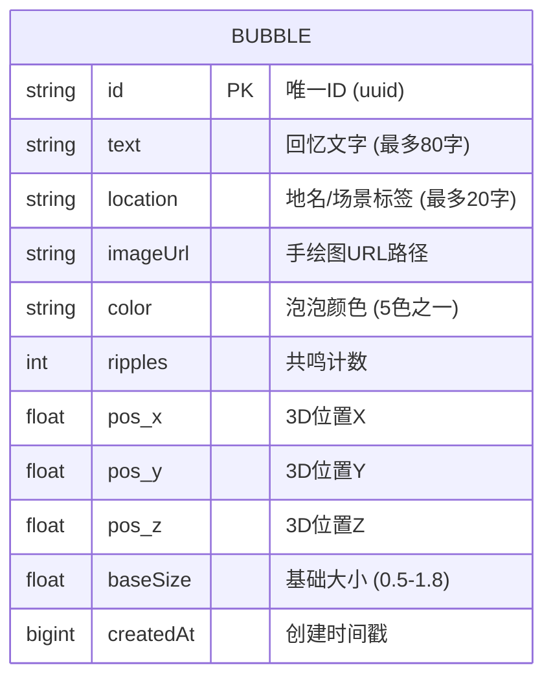

## 1. 架构设计



**数据流向说明：**
1. 用户交互 → Canvas.tsx (raycaster检测) → App.tsx (状态更新)
2. 创建回忆 → CreateBubble.tsx (收集数据) → App.tsx → API客户端 → Express后端
3. Express后端 → 内存存储 + /uploads → 返回响应 → App.tsx更新状态 → Canvas.tsx重新渲染
4. 送出共鸣 → BubbleDetail.tsx → API客户端 → Express后端 → 更新计数 → App.tsx → Canvas.tsx更新泡泡属性

---

## 2. 技术描述

- **前端框架**：React@18.2.0 + TypeScript@5.5.0
- **构建工具**：Vite@5.4.0 + @vitejs/plugin-react@4.0.0
- **3D渲染**：Three.js (直接使用，非R3F)
- **后端框架**：Express@4.18.0
- **文件上传**：Multer@1.4.5-lts.1
- **跨域处理**：CORS@2.8.5
- **唯一ID**：uuid@9.0.0
- **状态管理**：React useState/useReducer (内置，轻量场景无需额外库)
- **数据存储**：内存数组（开发/演示用）+ 本地文件系统/uploads

**技术选型理由：**
- Three.js直接使用而非R3F：用户明确要求原生Canvas组件，更精细的性能控制
- 内存存储：用户需求明确"数据暂存于内存数组"，简化部署
- 内置状态管理：应用状态简单，避免过度工程化

---

## 3. 路由定义

| 路由 | 方法 | 用途 |
|------|------|------|
| /api/bubbles | GET | 获取所有回忆泡泡列表 |
| /api/bubbles | POST | 创建新回忆泡泡（formData: text, location, image） |
| /api/bubbles/:id/ripple | POST | 为指定泡泡增加共鸣计数 |
| /uploads/* | GET | 静态文件服务，访问上传的手绘图 |

---

## 4. API定义

### 4.1 TypeScript类型定义

```typescript
interface Bubble {
  id: string;
  text: string;
  location: string;
  imageUrl: string;
  color: string;
  ripples: number;
  position: { x: number; y: number; z: number };
  baseSize: number;
  createdAt: number;
}

interface CreateBubbleRequest {
  text: string;
  location: string;
  image: File;
}

interface ApiResponse<T> {
  success: boolean;
  data?: T;
  error?: string;
}
```

### 4.2 请求/响应示例

**GET /api/bubbles**
```
Response:
{
  success: true,
  data: [
    {
      id: "uuid-123",
      text: "那年夏天的海边日落...",
      location: "青岛栈桥",
      imageUrl: "/uploads/uuid-123.png",
      color: "#ffaa55",
      ripples: 8,
      position: { x: 2.3, y: 1.5, z: -3.1 },
      baseSize: 1.2,
      createdAt: 1717939200000
    }
  ]
}
```

**POST /api/bubbles**
```
Request (multipart/form-data):
  text: "难忘的回忆文字"
  location: "北京故宫"
  image: (binary file)

Response:
{
  success: true,
  data: { id: "uuid-456", ...bubbleData }
}
```

**POST /api/bubbles/:id/ripple**
```
Response:
{
  success: true,
  data: { id: "uuid-123", ripples: 9 }
}
```

---

## 5. 服务器架构图



**模块职责：**
- **server.js**：单文件Express应用，包含路由、中间件、数据操作
- **Multer配置**：dest设为'./uploads'，fileFilter限制图片类型
- **内存存储**：使用const bubbles: Bubble[] = []，配合uuid生成ID

---

## 6. 数据模型

### 6.1 数据模型定义



### 6.2 内存数据初始化

```javascript
// 初始化示例数据（30-50个泡泡）
function generateInitialBubbles() {
  const colors = ['#ffaa55', '#66ccff', '#ff88aa', '#88dd66', '#cc88ff'];
  const samples = [
    { text: '童年外婆家的院子，葡萄架下的夏天', location: '江南小镇' },
    { text: '第一次独自旅行，在山顶看到的日出', location: '黄山' },
    { text: '毕业典礼那天和朋友们的合影', location: '大学校园' },
    // ... 更多示例数据
  ];
  
  return samples.map((s, i) => ({
    id: uuidv4(),
    text: s.text,
    location: s.location,
    imageUrl: `/uploads/sample-${i % 5}.png`,
    color: colors[i % colors.length],
    ripples: Math.floor(Math.random() * 15),
    position: {
      x: (Math.random() - 0.5) * 12,
      y: Math.random() * 6 - 1,
      z: (Math.random() - 0.5) * 12
    },
    baseSize: 0.5 + Math.random() * 1.3,
    createdAt: Date.now() - Math.random() * 86400000 * 30
  }));
}
```

---

## 7. 文件结构与调用关系

```
项目根目录/
├── package.json                 # 前后端统一依赖管理
├── vite.config.js               # Vite构建配置 + API代理
├── tsconfig.json                # TypeScript严格模式配置
├── index.html                   # 入口HTML (渐变星空背景)
├── server/
│   └── server.js                # Express后端 (REST API + Multer)
├── uploads/                     # 上传图片存储目录 (自动创建)
└── src/
    ├── main.tsx                 # React应用入口
    ├── App.tsx                  # 主组件 (状态管理、UI协调)
    ├── App.css                  # 全局样式 (毛玻璃、动画)
    ├── Canvas.tsx               # Three.js 3D场景渲染
    ├── BubbleDetail.tsx         # 回忆详情面板组件
    ├── CreateBubble.tsx         # 创建回忆面板组件
    ├── DrawingCanvas.tsx        # 手绘涂鸦Canvas组件
    └── types.ts                 # 共享TypeScript类型定义
```

**调用关系链：**
1. `main.tsx` → 渲染 `App.tsx`
2. `App.tsx` → 渲染 `Canvas.tsx`、`CreateBubble.tsx`、`BubbleDetail.tsx`
3. `App.tsx` → `fetch('/api/bubbles')` → `server/server.js` GET路由
4. `CreateBubble.tsx` → 内嵌 `DrawingCanvas.tsx` → 收集数据 → `App.tsx` → `POST /api/bubbles`
5. `BubbleDetail.tsx` → `POST /api/bubbles/:id/ripple` → 更新 `App.tsx` 状态 → `Canvas.tsx` 重渲染
6. `Canvas.tsx` → Raycaster检测 → 回调 `App.tsx` 的 `onBubbleClick` → 打开 `BubbleDetail.tsx`
