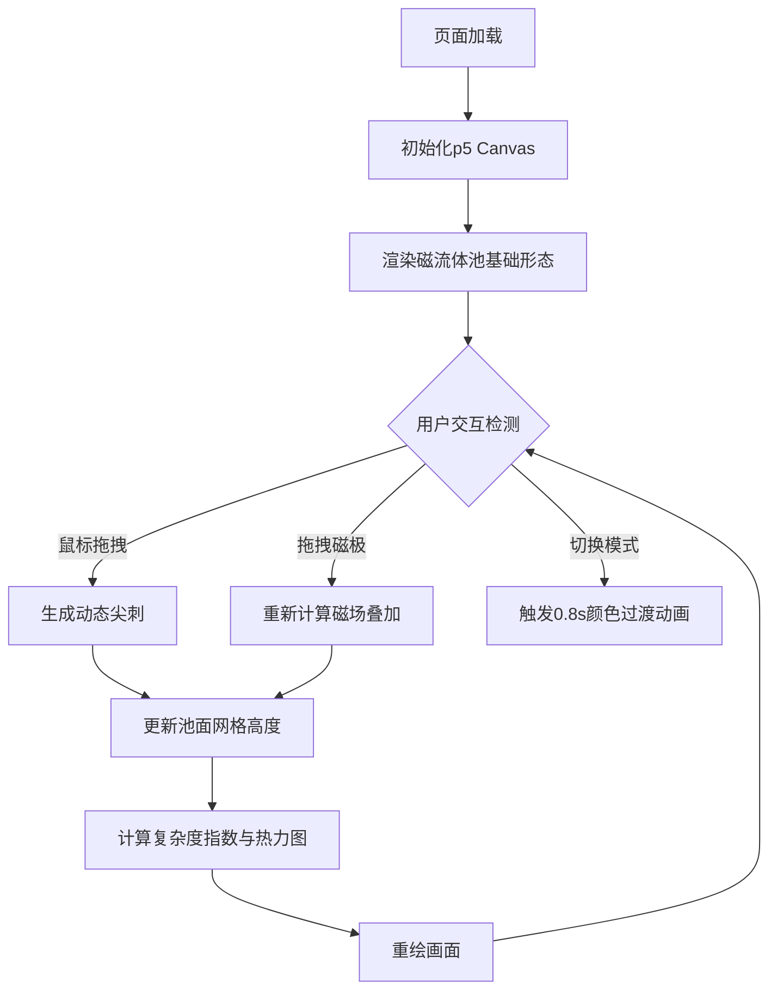

## 1. 产品概述

虚拟磁流体雕塑模拟器，用户可在浏览器中通过鼠标交互和磁极控制模拟磁流体在磁场作用下的复杂形态变化，实时观察颜色、纹理与动态演化效果。

- 目标用户：艺术创作者、科学教育者、交互设计爱好者
- 产品价值：将难以亲手实验的磁流体物理现象转化为可实时交互的数字艺术体验

## 2. 核心功能

### 2.1 功能模块

1. **磁流体池渲染模块**：30x30网格的圆形磁流体池，带动态波纹、黏滞流动效果
2. **鼠标交互模块**：拖拽生成动态尖刺，尖刺回落与流动痕迹
3. **磁极控制模块**：4个可拖拽磁极（2N/2S），实时吸引/排斥流体形态
4. **视觉模式模块**：金属光泽、荧光渐变、水墨扩散三种模式，平滑过渡动画
5. **数据可视化模块**：形态复杂度指数、磁场强度热力图

### 2.2 页面详情

| 页面名称 | 模块名称 | 功能描述 |
|----------|----------|----------|
| 主界面 | 磁流体池 | 半径250px圆形池，银灰到暗紫渐变，持续缓慢波纹 |
| 主界面 | 鼠标交互 | 按住左键拖拽生成30-80px高度尖刺，1.5秒回落 |
| 主界面 | 磁极控制器 | 4个20px圆形磁极（红N蓝S各2），拖拽实时影响流体 |
| 主界面 | 视觉切换按钮 | 3个40px圆形按钮，内嵌缩略色块，脉冲光晕动画 |
| 主界面 | 控制面板 | 底部毛玻璃半透明面板，复杂度指数+热力图缩略 |

## 3. 核心流程

## 4. 用户界面设计

### 4.1 设计风格
- **主色调**：深空蓝 #0a0a1a，银蓝高光 #88aaff
- **按钮样式**：圆形40px，内嵌缩略色块，点击脉冲光晕，悬停0.3px抬升阴影+0.2s亮度过渡
- **字体**：Fira Code 14px（复杂度指数）
- **布局**：中央全屏Canvas（95vh高度，宽度自适应），底部固定半透明控制面板
- **视觉特效**：毛玻璃效果（rgba(10,10,30,0.7)背景，1px rgba(100,100,200,0.3)边框）

### 4.2 页面设计概览

| 页面名称 | 模块名称 | UI元素 |
|----------|----------|--------|
| 主界面 | Canvas区域 | 深色背景，居中圆形磁流体池，动态波纹，磁极分布四周 |
| 主界面 | 控制面板 | 底部固定，左侧复杂度数值，中间3个模式切换按钮，右侧热力图缩略 |

### 4.3 响应式
- Desktop-first设计，Canvas宽度自适应，高度95vh
- 控制面板始终固定底部，全宽显示

## 5. 性能要求
- 1080p分辨率下鼠标拖拽和磁极移动时尖刺更新频率不低于30FPS
- 页面加载后2秒内可交互
