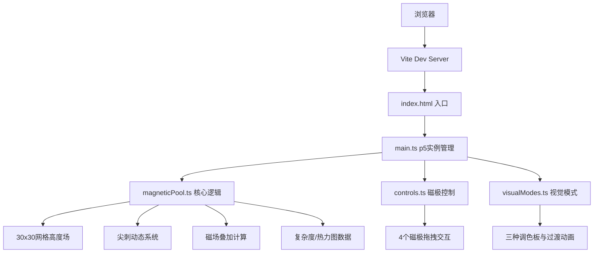

## 1. 架构设计



## 2. 技术描述
- **前端框架**：p5.js@1.9.0 + TypeScript@5.5.0
- **构建工具**：Vite@5.4.0
- **后端**：无（纯前端应用）
- **数据库**：无

## 3. 文件结构

| 文件路径 | 用途 |
|----------|------|
| package.json | 依赖管理与启动脚本 |
| index.html | 入口页面，全屏Canvas |
| tsconfig.json | TypeScript严格模式配置（target ES2020） |
| vite.config.js | Vite配置，TypeScript支持 |
| src/main.ts | 应用入口，p5实例创建，Canvas尺寸与帧率设置，交互循环 |
| src/magneticPool.ts | 磁流体池核心：30x30网格、尖刺生成/衰减、磁极场强叠加、复杂度指数、热力图数据 |
| src/controls.ts | 4个可拖拽磁极（红N蓝S各2），鼠标事件处理，位置更新通知 |
| src/visualModes.ts | 三种视觉模式调色板、材质参数、0.8s平滑过渡动画 |

## 4. 核心数据模型

### 4.1 MagneticPool
```typescript
interface GridPoint { x: number; y: number; height: number; baseHeight: number }
interface Spike { x: number; y: number; height: number; width: number; life: number; maxLife: number }
interface Pole { id: string; type: 'N' | 'S'; x: number; y: number }
```

### 4.2 VisualMode
```typescript
interface VisualMode {
  id: string;
  name: string;
  palette: { primary: string; secondary: string; highlight: string; background: string };
  material: { glossiness: number; opacity: number; diffusion: number };
  transitionDuration: number; // 0.8s
}
```

## 5. 性能优化策略
- 30x30网格：平衡细节与性能
- 尖刺生命周期管理：自动回收过期尖刺
- 磁场场强缓存：磁极位置不变时复用计算结果
- requestAnimationFrame（p5 draw循环）：保证60FPS渲染
- 热力图降采样：缩略图60x60px，避免全分辨率计算
