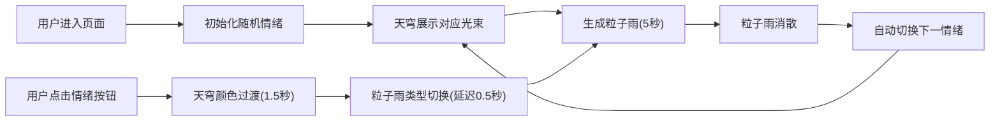

## 1. 产品概述
虚拟情绪气象站是一个沉浸式3D交互体验应用，用户通过选择情绪标签来操控由彩色光束构成的半球形天穹，同时触发对应主题的粒子雨效果。
- 主要目的：通过可视化方式将抽象情绪转化为可感知的3D视觉体验，提供情感表达和放松的交互场景
- 目标用户：对视觉艺术、情感交互、3D体验感兴趣的普通用户

## 2. 核心功能

### 2.1 功能模块
1. **3D天穹系统**：32根半透明锥形光束从中心向外散射，颜色随情绪变化，带有脉动呼吸动画
2. **粒子雨系统**：5000+个粒子从天穹底部下落，不同情绪对应不同颜色和形状的粒子
3. **情绪交互界面**：右下角四个情绪标签按钮，点击触发情绪切换
4. **信息展示面板**：左侧半透明信息栏，显示当前情绪和粒子雨类型

### 2.2 页面详情
| 页面名称 | 模块名称 | 功能描述 |
|-----------|-------------|---------------------|
| 主场景 | 3D天穹系统 | 32根光束构成半球形，颜色渐变，呼吸脉动动画 |
| 主场景 | 粒子雨系统 | 5000+个情绪粒子自由落体，风力扰动，消散效果 |
| 主场景 | 情绪按钮 | 快乐/悲伤/愤怒/平静四个标签，弹性动画，发光选中态 |
| 主场景 | 信息面板 | 显示当前情绪名称和粒子雨类型，滑入动画 |
| 主场景 | 背景与地面 | 深空渐变背景，半透明圆形平台，闪烁星光粒子 |

## 3. 核心流程
用户进入页面后默认显示一种随机情绪，天穹展示对应颜色光束，底部生成粒子雨。用户点击右下角情绪按钮切换情绪，天穹颜色在1.5秒内平滑过渡，0.5秒后粒子雨切换为新类型，粒子雨持续5秒后消散，之后系统自动随机切换到下一个情绪。

## 4. 用户界面设计

### 4.1 设计风格
- **主色调**：深空蓝紫渐变背景(#0a0a2a到#1a2a4a)，低饱和度主色辅以高饱和点缀
- **情绪配色**：
  - 快乐：暖橙#ffaa33 → 金黄#ffdd55
  - 悲伤：深蓝#3355aa → 灰蓝#7788cc
  - 愤怒：炽红#ff4422 → 暗红#aa2222
  - 平静：翠绿#44cc88 → 薄荷#88ffaa
- **按钮样式**：宽80px高30px，圆角8px，对应情绪主色，弹性缩放动画
- **整体风格**：科幻扁平、半透明玻璃质感、柔和发光效果

### 4.2 页面设计概述
| 页面名称 | 模块名称 | UI元素 |
|-----------|-------------|-------------|
| 主场景 | 天穹光束 | 32根锥形光束，渐变颜色，呼吸脉动(0.3-0.5Hz) |
| 主场景 | 粒子雨 | 5000+粒子，快乐星形/悲伤泪滴/愤怒火星/平静圆形 |
| 主场景 | 情绪按钮 | 右下角排列，弹性动画(scale 1→1.2→1，0.3秒)，选中发光光晕(4px，0.6透明度) |
| 主场景 | 信息面板 | 左侧220×180px半透明面板，圆角12px，边框1px #4455aa，滑入动画(0.4秒 ease-out) |
| 主场景 | 地面平台 | 半径6单位半透明圆，颜色#1a1a3a到#2a2a5a，透明度0.4 |
| 主场景 | 星光粒子 | 200个微小闪烁粒子，白色0.2-0.6透明度，0.2-0.8Hz闪烁 |

### 4.3 响应性
- 全屏自适应Canvas，场景居中显示
- 桌面端鼠标交互，移动端触摸交互(延迟≤100ms)
- 性能目标：60fps稳定帧率，粒子切换无明显卡顿

### 4.4 3D场景指导
- **环境**：深空渐变背景(#0a0a2a→#1a2a4a)，营造宇宙氛围
- **光照**：柔和环境光配合情绪色彩的自发光效果
- **相机**：透视相机，适当距离观察完整天穹，轻微视角
- **构图**：天穹位于视觉中心，地面平台承载粒子效果，UI分布在边缘不遮挡主体
- **交互**：按钮点击触发情绪切换，颜色平滑过渡，粒子系统无缝切换
- **后期效果**：光束半透明叠加，粒子发光质感
