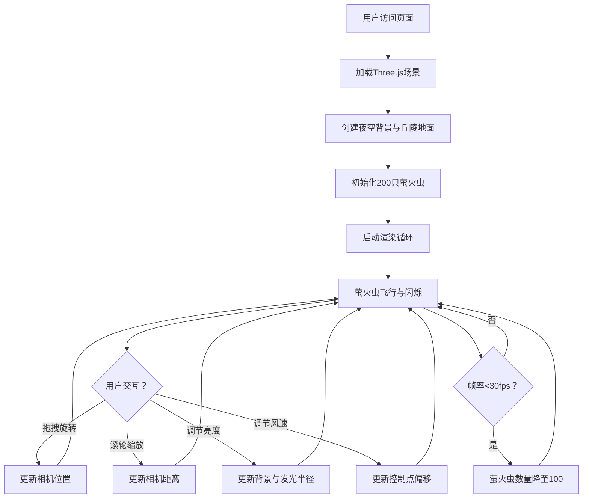

## 1. 产品概述

基于浏览器的三维虚拟萤火虫夜空魔法场景，用户作为夜间森林的观察者，可以自由调节环境参数，观察萤火虫群的动态飞行与闪烁效果，形成梦幻的夜间生态可视化画面。

- 主要目的：提供沉浸式的萤火虫夜空观赏体验，支持交互式调节环境参数
- 目标用户：对自然生态可视化、3D交互体验感兴趣的普通用户和艺术爱好者
- 市场价值：作为创意交互演示项目，展示WebGL/Three.js在自然生态可视化方面的表现力

## 2. 核心特性

### 2.1 用户角色

| 角色 | 注册方式 | 核心权限 |
|------|----------|----------|
| 观察者 | 无需注册，直接访问 | 自由观赏、调节环境亮度与风速、旋转缩放视角 |

### 2.2 功能模块

1. **三维夜空场景**：渐变深蓝色夜空背景、弧形丘陵地面、可交互相机控制
2. **萤火虫群系统**：200只多色萤火虫、贝塞尔曲线飞行路径、正弦闪烁效果、聚散引力规则
3. **环境参数控制**：左侧垂直滑块调节亮度、底部水平滑块调节风速
4. **实时数据统计**：右上角显示萤火虫总数、平均飞行速度、活跃闪烁数量
5. **性能自适应**：帧率检测与萤火虫数量动态降级

### 2.3 页面详情

| 页面名称 | 模块名称 | 功能描述 |
|----------|----------|----------|
| 主页（单页应用） | 3D场景渲染 | 全屏Canvas渲染夜空、地面、萤火虫群 |
| 主页（单页应用） | 相机控制 | 鼠标拖拽旋转（半径20）、滚轮缩放（范围10-40） |
| 主页（单页应用） | 亮度控制 | 左侧垂直滑块（0-100，默认50），影响背景色与发光半径 |
| 主页（单页应用） | 风速控制 | 底部水平滑块（0-5，默认1），影响飞行路径横向偏移 |
| 主页（单页应用） | 统计面板 | 右上角实时数据，每秒刷新 |
| 主页（单页应用） | 操作提示 | 左下角固定提示文字 |

## 3. 核心流程

用户进入页面后立即加载3D场景，萤火虫自动开始飞行与闪烁。用户可通过鼠标拖拽和滚轮调整视角，通过左侧滑块调节环境亮度，通过底部滑块调节风速，观察萤火虫群的动态变化效果。

## 4. 用户界面设计

### 4.1 设计风格

- **主色调**：深蓝色渐变夜空（顶部#0a0a2e → 底部#1a1a4e），地面淡绿色（#2a4a2a）
- **萤火虫颜色**：柠檬黄#fff44f、淡绿#aaff55、淡蓝#55aaff、淡橙#ffaa55、淡粉#ff55aa、淡紫#cc55ff
- **UI强调色**：淡蓝色# aaddff（统计数据）、白色半透明#ffffff80（提示文字）
- **字体**：等宽字体用于统计数据，系统无衬线字体用于提示
- **整体风格**：梦幻、神秘、自然有机，强调发光粒子与深色背景的对比
- **圆角与透明度**：UI面板采用半透明黑色背景rgba(0,0,0,0.4) + 圆角8px
- **动画**：四角UI元素淡入动画（0→1，0.5秒）

### 4.2 页面设计概览

| 页面名称 | 模块名称 | UI元素 |
|----------|----------|--------|
| 主页 | 3D场景 | 全屏Canvas、渐变背景、弧形地面、发光粒子萤火虫 |
| 主页 | 亮度滑块 | 左侧垂直滑块，高度约60vh，滑块样式半透明蓝色光晕 |
| 主页 | 风速滑块 | 底部水平滑块，宽度约50vw，居中显示 |
| 主页 | 统计面板 | 右上角，3行等宽字体数字，半透明黑色圆角背景 |
| 主页 | 操作提示 | 左下角，白色半透明小号文字 |

### 4.3 响应式设计

- 桌面端优先设计，Canvas自适应窗口大小
- UI滑块在移动端可正常触控操作
- 统计面板与提示文字在小屏幕上自动调整字号

### 4.4 3D场景指导

- **环境与氛围**：深蓝色夜空渐变背景，营造神秘的夜间森林氛围
- **光照设置**：萤火虫自身发光（使用Points + 自定义Shader实现发光效果），场景环境光极弱
- **相机设置**：PerspectiveCamera，初始位置半径20围绕原点，OrbitControls限制距离10-40
- **构图与焦点**：萤火虫群在场景中心区域活动，地面提供参照系
- **交互与动画**：贝塞尔曲线平滑飞行、正弦闪烁、引力/斥力集群效果
- **后期效果**：通过自定义Shader实现萤火虫发光光晕效果
- **性能预算**：目标60fps，200只萤火虫每帧更新位置与闪烁
