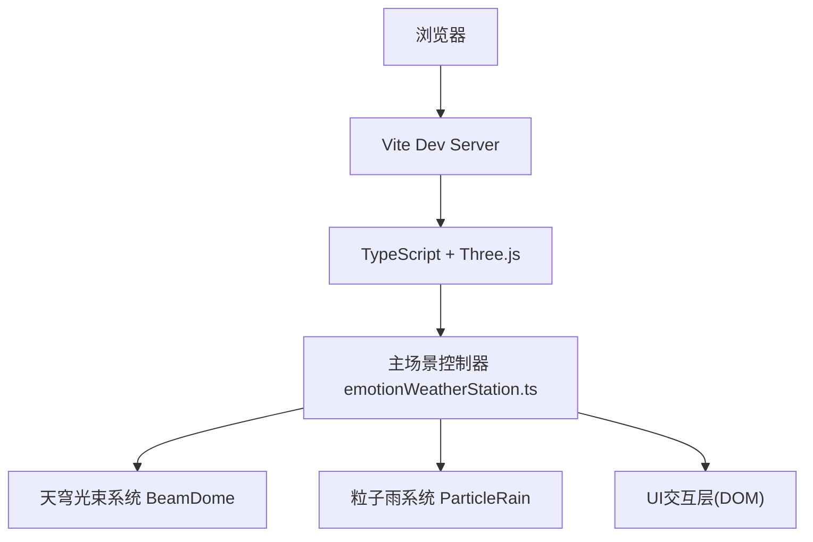

## 1. 架构设计



## 2. 技术说明
- **前端框架**：原生 TypeScript 5.5.0 (无UI框架，轻量级3D应用)
- **3D引擎**：Three.js 0.160.0
- **构建工具**：Vite 5.4.0
- **后端**：无（纯前端3D交互应用）
- **数据库**：无

## 3. 文件结构
```
e:\solo\VersionFast\tasks\auto93\
├── package.json              # 项目依赖和脚本
├── vite.config.js            # Vite构建配置
├── tsconfig.json             # TypeScript配置
├── index.html                # 入口HTML页面
└── src/
    ├── emotionWeatherStation.ts   # 主场景入口，状态管理，UI协调
    ├── beamDome.ts                 # 天穹光束系统类
    └── particleRain.ts             # 粒子雨系统类
```

## 4. 模块职责

### 4.1 emotionWeatherStation.ts（主控制器）
- 初始化Three.js场景、相机、渲染器
- 管理情绪状态机（快乐/悲伤/愤怒/平静）
- 协调BeamDome和ParticleRain的情绪切换
- 创建和管理DOM UI元素（情绪按钮、信息面板）
- 处理自动情绪切换逻辑（粒子雨后5秒随机切换）
- 响应窗口resize事件

### 4.2 beamDome.ts（天穹光束系统）
- 生成32根半透明锥形光束几何体
- 实现情绪颜色渐变映射
- 实现光束呼吸脉动动画（0.3-0.5Hz，幅度0.1）
- 提供update(deltaTime)和setEmotion(emotion, transitionTime)方法
- 颜色平滑过渡插值

### 4.3 particleRain.ts（粒子雨系统）
- 使用BufferGeometry管理5000+粒子高效渲染
- 支持4种粒子形状（星形/泪滴/火星/圆形）通过纹理或Shader实现
- 实现自由落体物理（0.8-1.5单位/秒）
- 模拟随机风力（每2秒方向变化）
- 粒子生命周期管理（生成、下落、消散）
- 提供update(deltaTime)和setEmotion(emotion)方法

## 5. 性能优化策略
- 使用BufferGeometry和PointsMaterial批量渲染粒子，减少Draw Call
- 颜色过渡使用ShaderMaterial或在JS端逐帧插值，避免重建材质
- 粒子复用对象池，避免频繁GC
- 限制粒子更新逻辑的计算量，风力方向变化使用缓存
- 使用requestAnimationFrame配合deltaTime确保动画流畅
