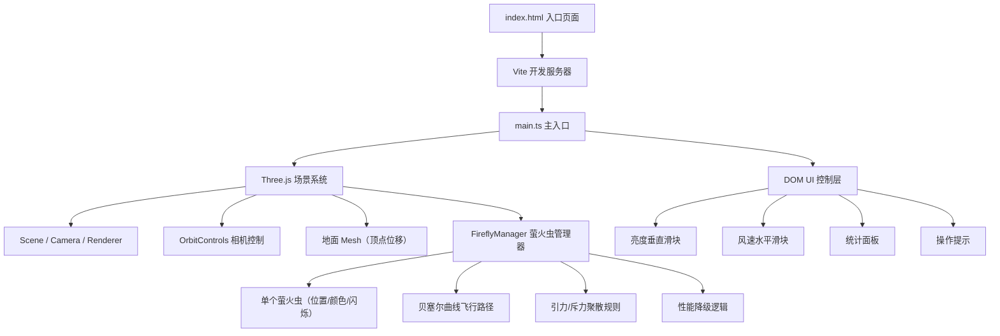

## 1. 架构设计



## 2. 技术栈说明

- **前端框架**：TypeScript 5.3.3 + 原生Three.js 0.160.0（无React框架，用户明确要求TS+Three.js原生实现）
- **构建工具**：Vite 5.0.0
- **模块系统**：ES2022 模块
- **3D渲染**：Three.js WebGLRenderer + PerspectiveCamera
- **相机控制**：Three.js OrbitControls
- **样式方案**：原生CSS（内联于index.html的style标签）
- **萤火虫渲染**：Three.js Points + PointsMaterial / ShaderMaterial 实现发光效果

## 3. 文件结构

| 文件路径 | 用途 |
|----------|------|
| package.json | 项目依赖与npm脚本（npm run dev） |
| index.html | 入口页面：全屏canvas、滑块UI、统计面板、操作提示 |
| tsconfig.json | TypeScript严格模式配置，ES2022目标 |
| vite.config.js | Vite构建配置 |
| src/main.ts | 主入口：初始化场景/相机/渲染器、创建地面与背景、滑块事件监听、动画循环 |
| src/FireflyManager.ts | 萤火虫管理器：创建萤火虫、位置更新、闪烁效果、聚散规则、性能降级 |

## 4. 核心数据模型

### 4.1 Firefly 萤火虫个体数据

```typescript
interface Firefly {
  position: THREE.Vector3;       // 当前位置
  color: THREE.Color;            // 基础颜色（六种暖色之一）
  size: number;                  // 像素大小（1-3px）
  speed: number;                 // 飞行速度（0.5-1.5单位/秒）
  flickerPhase: number;          // 闪烁相位
  flickerFrequency: number;      // 闪烁频率（0.3-0.8Hz）
  brightness: number;            // 当前亮度（0.1-1.0）
  bezierStart: THREE.Vector3;    // 贝塞尔起点
  bezierCtrl1: THREE.Vector3;    // 贝塞尔控制点1
  bezierCtrl2: THREE.Vector3;    // 贝塞尔控制点2
  bezierEnd: THREE.Vector3;      // 贝塞尔终点
  bezierProgress: number;        // 当前贝塞尔曲线进度（0-1）
  bezierDuration: number;        // 当前曲线持续时间（秒）
  nextCtrlRefresh: number;       // 下次控制点刷新时间（秒）
}
```

### 4.2 环境参数

```typescript
interface Environment {
  brightness: number;   // 环境亮度（0-100，默认50）
  windSpeed: number;    // 风速（0-5，默认1）
}
```

### 4.3 性能监控

```typescript
interface PerformanceMonitor {
  lastFrameTime: number;
  fps: number;
  degraded: boolean;     // 是否已降级（100只）
}
```

## 5. 核心算法说明

### 5.1 三阶贝塞尔曲线飞行

每只萤火虫在贝塞尔曲线上插值移动，控制点每3-5秒随机刷新：

```
P(t) = (1-t)³·P0 + 3(1-t)²·t·P1 + 3(1-t)·t²·P2 + t³·P3
```

其中P1/P2在当前位置周围半径10单位内随机生成，风速影响P1/P2的x轴偏移量（风速×0.5单位）。

### 5.2 闪烁效果

使用正弦函数计算亮度：

```
brightness = 0.55 + 0.45 × sin(2π × flickerFrequency × t + flickerPhase)
```

亮度范围映射到0.1-1.0区间。

### 5.3 引力/斥力聚散规则

对每对萤火虫计算距离d：
- d < 2单位：产生斥力，方向相反，强度随距离减小而增大
- 2 ≤ d ≤ 5单位：产生引力，方向相向，强度随距离增大而减小
- d > 5单位：无作用力

将合力叠加到位置偏移量上，限制最大速度。

### 5.4 性能降级

在渲染循环中检测每帧间隔时间，若连续多帧FPS<30，则将萤火虫数量从200降至100（隐藏后半部分萤火虫或减少可见点数量）。

### 5.5 地面顶点位移

使用PlaneGeometry细分网格，对每个顶点y坐标施加随机高度偏移（0.3-0.8），生成弧形丘陵效果。

## 6. UI交互定义

| 交互元素 | 类型 | 位置 | 取值范围 | 默认值 | 回调效果 |
|----------|------|------|----------|--------|----------|
| 亮度滑块 | input[type=range] vertical | 左侧，top:20%, height:60vh | 0-100 | 50 | 更新背景色渐变 + 更新萤火虫发光半径（3px→6px线性映射） |
| 风速滑块 | input[type=range] horizontal | 底部居中，width:50vw | 0-5 | 1 | 更新所有萤火虫贝塞尔控制点x轴偏移 |
| 统计面板 | div | 右上角固定 | - | - | 每秒刷新totalCount、avgSpeed、activeCount（brightness>0.7） |
| 操作提示 | div | 左下角固定 | - | - | 静态文字显示 |

## 7. 性能优化策略

1. 使用单个Points对象渲染所有萤火虫（而非200个独立Mesh），减少Draw Call
2. 萤火虫位置/颜色通过BufferGeometry的attribute统一更新
3. 引力计算使用空间分区（简单网格）减少O(n²)复杂度（可选优化，若200只时性能足够可跳过）
4. 聚散规则计算使用固定时间步长，与渲染帧率解耦
5. 窗口Resize事件使用防抖处理
