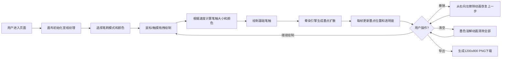

## 1. 产品概述

墨韵（Ink Rhythm）是一款浏览器端的动态水墨画绘制应用，模拟中国传统水墨画在宣纸上的自然晕染与扩散效果。解决传统数字绘画工具无法实时展现水墨渗透感、墨色变化自然过渡的问题。

- 目标用户：水墨画爱好者、数字艺术家、教育工作者
- 核心价值：在浏览器中还原真实水墨绘画体验，无需专业硬件即可创作水墨作品

## 2. 核心功能

### 2.1 功能模块

1. **主画布**：宣纸纹理画布、鼠标/触摸绘制、动态笔触
2. **水墨晕染引擎**：Perlin噪声驱动的墨点扩散、透明度衰减
3. **调色盘**：5种预设水墨色选择、高亮过渡动画
4. **笔刷模式**：5种笔刷（普通/枯笔/泼墨/点苔/皴擦）、动态纹理
5. **画布操作**：撤销（10步）、清空、动画过渡
6. **导出功能**：PNG导出（1200x800，含宣纸背景）

### 2.2 页面详情

| 页面名称 | 模块名称 | 功能描述 |
|-----------|-------------|---------------------|
| 主页面 | 宣纸画布 | 900x600px，#f5f0e0背景+纤维纹理，支持鼠标拖拽绘制，笔触大小随速度变化(5-25px)，墨色渐变(#1a1a1a→#3a3a3a) |
| 主页面 | 水墨晕染 | 笔触后随机扩散半透明墨点，半径10-30px，透明度0.3→0，1.5秒持续，Perlin噪声模拟不规则形状 |
| 主页面 | 垂直调色盘 | 画布左侧40x400px，5色(纯黑/淡墨/花青/赭石/藤黄)，点击切换，0.3秒高亮渐变 |
| 主页面 | 笔刷选择栏 | 画布上方5个圆形按钮(φ45px)，SVG图标，选中外发光box-shadow:0 0 12px rgba(0,0,0,0.5) |
| 主页面 | 操作栏 | 画布右上角撤销/清空按钮，撤销0.4秒从右向左擦除动画，清空0.6秒墨色溶解动画 |
| 主页面 | 导出按钮 | 画布右上角，导出1200x800 PNG，提示"作品已保存" |

## 3. 核心流程

## 4. 用户界面设计

### 4.1 设计风格
- **主题色**：浅米色 #faf5e8（页面背景）、宣纸色 #f5f0e0（画布背景）、深木色 #5a3a1a（边框）、墨色 #3a2a1a（标题）
- **按钮风格**：磨砂玻璃效果（半透明白底+backdrop-filter: blur(4px) + 1px rgba(255,255,255,0.3)边框），悬停透明度降低
- **字体**：标题使用楷体 28px，正文使用系统无衬线字体
- **布局风格**：画布居中，左侧调色盘，上方笔刷栏，右上角操作按钮，左上角竖排标题"墨韵"

### 4.2 页面设计概览

| 模块 | UI元素 |
|-----------|-------------|
| 页面容器 | 背景#faf5e8，居中布局，响应式适配 |
| 标题"墨韵" | 楷体28px，颜色#3a2a1a，纵向排列阴影 |
| 宣纸画布 | 900x600px，2px #5a3a1a边框，居中显示 |
| 调色盘 | 垂直40x400px，5色方块，选中高亮0.3s过渡 |
| 笔刷按钮 | 5个φ45px圆形，SVG图标，选中外发光 |
| 操作按钮 | 撤销/清空/导出，磨砂玻璃风格 |

### 4.3 响应式适配
- **桌面端（≥1000px）**：画布900x600px，调色盘垂直位于画布左侧
- **移动端（<1000px）**：画布宽度为屏幕85%，高度等比缩放；调色盘水平置于画布下方
- 所有触摸事件已支持

## 5. 性能要求
- 绘制帧率 ≥ 30fps
- 单次晕染扩散计算 ≤ 10ms
- 撤销历史最多10步
