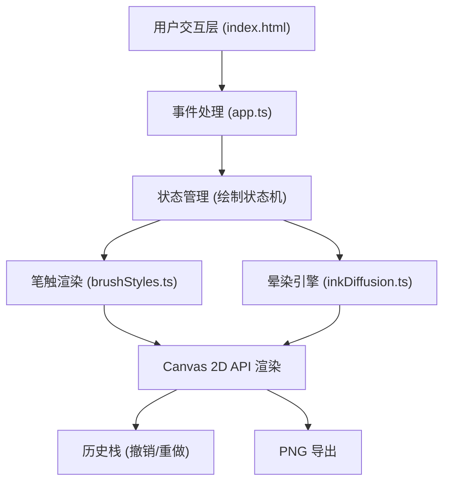

## 1. 架构设计



## 2. 技术描述

- **前端框架**：原生 TypeScript + HTML5 Canvas API（无React/Vue，按用户需求）
- **构建工具**：Vite 5.0.0
- **语言**：TypeScript 5.3.3（严格模式，ES2020模块目标）
- **渲染技术**：Canvas 2D Context
- **算法**：Perlin噪声（用于墨点不规则形状生成）

## 3. 文件结构

```
├── package.json          # 依赖: typescript@5.3.3, vite@5.0.0
├── index.html            # 入口页面，包含所有UI元素
├── tsconfig.json         # TS配置，严格模式，ES2020
├── vite.config.js        # Vite构建配置
└── src/
    ├── app.ts            # 主逻辑：初始化、事件绑定、状态管理
    ├── inkDiffusion.ts   # 晕染引擎：Perlin噪声、墨点扩散
    └── brushStyles.ts    # 笔刷样式：5种笔刷纹理生成
```

## 4. 模块接口定义

### 4.1 inkDiffusion.ts

```typescript
export interface InkParticle {
  x: number;
  y: number;
  baseRadius: number;
  maxRadius: number;
  opacity: number;
  maxOpacity: number;
  createdAt: number;
  duration: number;
  color: string;
  seed: number;
}

export class InkDiffusionEngine {
  constructor(canvasWidth: number, canvasHeight: number);
  addParticles(x: number, y: number, color: string, count?: number): void;
  update(now: number): InkParticle[];
  render(ctx: CanvasRenderingContext2D, particles: InkParticle[]): void;
}
```

### 4.2 brushStyles.ts

```typescript
export type BrushMode = 'normal' | 'dry' | 'splash' | 'dot' | 'texture';

export interface BrushConfig {
  baseSize: number;
  sizeVariance: number;
  opacity: number;
  textureDensity: number;
  colorMix: number;
}

export interface BrushStroke {
  render: (ctx: CanvasRenderingContext2D, x: number, y: number, size: number, color: string, speed: number) => void;
}

export class BrushStyleManager {
  constructor();
  setMode(mode: BrushMode): void;
  getCurrentMode(): BrushMode;
  getConfig(): BrushConfig;
  renderStroke(ctx: CanvasRenderingContext2D, x: number, y: number, size: number, color: string, speed: number): void;
}
```

### 4.3 app.ts

```typescript
export interface DrawState {
  isDrawing: boolean;
  lastX: number;
  lastY: number;
  lastTime: number;
  currentColor: string;
  currentBrush: BrushMode;
  history: ImageData[];
  historyIndex: number;
}
```

## 5. 关键算法

### 5.1 Perlin噪声实现
用于生成墨点的不规则形状边界，避免完美圆形，模拟真实水墨扩散的自然形态。

### 5.2 速度映射算法
- 记录上一帧鼠标位置和时间
- 计算像素/毫秒速度
- 映射：速度慢 → 笔触大(25px)、颜色深(#1a1a1a)；速度快 → 笔触小(5px)、颜色浅(#3a3a3a)

### 5.3 历史栈（撤销机制）
- 最多保存10份ImageData快照
- 每次笔触结束（mouseup）时push快照
- 撤销时pop并以从右向左的wipe动画渲染

## 6. 性能优化策略
1. **分层Canvas**：主画布+晕染图层分离，减少重绘区域
2. **对象池**：墨点粒子复用，避免频繁GC
3. **requestAnimationFrame**：统一帧率控制
4. **增量渲染**：只重绘变化区域而非全画布
