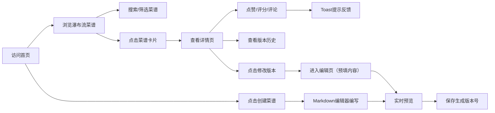

## 1. 产品概述

虚拟厨房烹饪日志是一个面向烹饪爱好者的在线社区平台，用户可以创建个人虚拟厨房，记录每道菜的详细烹饪过程，并与其他美食爱好者交流分享。通过菜谱进化树功能，让每道菜在社区协作中不断迭代改进。

- 核心目标：打造一个温馨、有温度的烹饪分享社区，降低菜谱记录门槛，促进厨艺交流与传承
- 目标用户：家庭主妇/煮夫、美食博主、烹饪初学者、专业厨师
- 市场价值：连接美食爱好者，形成独特的菜谱进化生态，沉淀高质量UGC内容

## 2. 核心功能

### 2.1 用户角色
| 角色 | 注册方式 | 核心权限 |
|------|----------|----------|
| 普通用户 | 无需注册（访客模式） | 浏览菜谱、点赞、评分、评论、创建/修改菜谱 |

### 2.2 功能模块
1. **首页**：厨房风格大面板、搜索框、瀑布流菜谱卡片展示
2. **菜谱详情页**：时间轴步骤展示、评论区（支持嵌套回复）、版本历史、修改版本按钮
3. **创建/编辑菜谱页**：Markdown实时双栏预览编辑器、食材清单、步骤记录、自动版本号生成

### 2.3 页面详情
| 页面名称 | 模块名称 | 功能描述 |
|---------|---------|---------|
| 首页 | 顶部搜索区 | 圆角搜索框（400px宽居中）、放大镜图标占位符、浅灰边框 |
| 首页 | 瀑布流卡片区 | 卡片宽280px、15px圆角、柔和阴影rgba(0,0,0,0.08)、菜名、食材高亮词、评分星星、点赞按钮+飘字动画 |
| 详情页 | 左侧时间轴 | 竖线颜色#d9b382、步骤框#fff8f0背景、12px内边距、版本历史展示 |
| 详情页 | 右侧评论区 | 头像占位符、评论文字、最新在上、嵌套回复最多3层、抽屉式移动端适配 |
| 详情页 | 修改版本 | 按钮跳转编辑页、预填原菜谱内容、自动生成新版本号 |
| 创建页 | Markdown编辑器 | 左编辑区#fffff5背景、右预览区#fdfaf0背景、实时同步渲染 |
| 创建页 | 版本控制 | 保存时自动生成带时间戳的版本号 |
| 全站 | Toast消息 | 底部中间弹出、绿/红色背景、2秒自动淡出、交互反馈 |

## 3. 核心流程

用户访问首页后可以浏览瀑布流展示的菜谱，通过搜索框快速筛选。点击卡片进入详情页查看完整步骤、评论互动，也可以基于现有菜谱创建改进版本。新用户可以直接创建菜谱，使用Markdown编辑器实时预览，保存后自动生成带时间戳的版本号。

## 4. 用户界面设计

### 4.1 设计风格
- **主色调**：淡木纹色 #f5e6d3（背景）、深棕色 #4a2c15（文字/标题）
- **辅助色**：#d9b382（时间轴竖线）、#fff8f0（步骤卡片）、#fffff5（编辑区）、#fdfaf0（预览区）
- **按钮风格**：圆角设计，温暖色调，hover状态有微阴影和色阶加深
- **字体**：采用优雅的衬线体作为标题字体（如Playfair Display），正文字体选用干净的无衬线体（如Noto Sans SC）
- **布局风格**：卡片式瀑布流布局，时间轴垂直叙事结构
- **图标风格**：线性简约图标，Lucide图标库，保持与厨房主题的一致性

### 4.2 页面设计概述
| 页面名称 | 模块名称 | UI元素 |
|---------|---------|--------|
| 首页 | 搜索区 | 居中布局、400px宽度、15px圆角、浅灰色边框、放大镜占位符图标、聚焦时边框加深 |
| 首页 | 卡片瀑布流 | column-count多列布局、280px固定宽度卡片、15px圆角、rgba(0,0,0,0.08)柔和阴影、菜名粗体#4a2c15、食材标签高亮色、五星评分点击交互、❤️点赞按钮+飘字+1向上动画（0.6s消失） |
| 详情页 | 时间轴 | 左侧#d9b382竖线贯穿、圆形节点标记、每个步骤为#fff8f0灰白色圆角框、12px内边距、hover时微阴影增强 |
| 详情页 | 评论区 | 头像圆形占位符、评论者名称加粗、评论内容灰黑色、回复缩进嵌套、最多三层嵌套视觉区分 |
| 详情页 | 抽屉（移动端） | 从右侧滑出评论区、0.3s ease-out过渡动画、遮罩层半透明黑色 |
| 创建页 | Markdown编辑 | 左右分栏50%:50%、左侧#fffff5编辑框等宽字体、右侧#fdfaf0预览区正常排版、分隔线可拖拽、滚动同步 |
| 全站 | Toast | 底部居中fixed定位、绿/红圆角胶囊、padding 12px 24px、opacity淡入淡出、transform translateY动画 |

### 4.3 响应式
- **设计原则**：Desktop-first，移动适配
- **断点设置**：768px为主要响应式断点
- **桌面端（>768px）**：瀑布流多列展示、详情页左右双栏布局、搜索框400px固定宽度
- **平板/移动端（≤768px）**：瀑布流变为2列、搜索框90%宽度自适应、详情页评论区折叠为右侧抽屉、按钮触控区域增大至44px以上、字体大小适配移动端阅读

### 4.4 动效与交互
- 点赞动画：点击后❤️图标缩放弹跳 +1数字向上飘动渐隐（0.6s）
- 卡片hover：阴影加深、轻微上浮translateY(-2px)、过渡0.3s ease
- 抽屉滑出：右侧translateX(100%) → 0，0.3s ease-out
- Toast弹出：translateY(20px) + opacity 0→1，2秒后反向淡出
- 页面切换：路由切换时淡入淡出过渡
