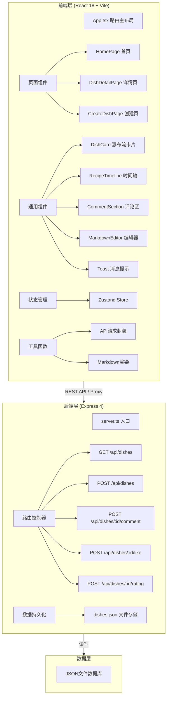
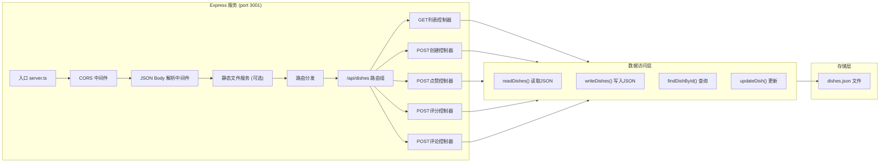
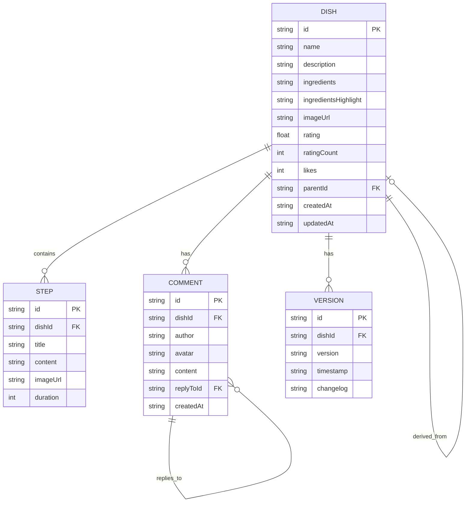

## 1. 架构设计



## 2. 技术描述

- **前端技术栈**：
  - React@18.2.0 + React DOM@18.2.0
  - TypeScript@5.3.3（严格模式）
  - Vite@5.0.0 构建工具
  - React Router DOM（路由管理）
  - Zustand（轻量状态管理）
  - Lucide React（图标库）
  - 自定义CSS（无UI框架，厨房风格定制化样式）

- **后端技术栈**：
  - Express@4.18.2
  - CORS@2.8.5
  - UUID@9.0.0（ID生成）
  - Nodemon（开发热重载）
  - dishes.json 文件模拟数据库

- **初始化工具**：vite-init
- **开发模式**：Vite开发服务器（端口5173）代理API请求到Express后端（端口3001）
- **性能优化**：Vite原生代码分割、路由级懒加载、组件懒加载

## 3. 路由定义

| 路由路径 | 页面组件 | 用途 |
|---------|---------|------|
| `/` | HomePage | 首页：搜索框 + 瀑布流菜谱卡片展示 |
| `/dish/:id` | DishDetailPage | 详情页：时间轴步骤 + 评论区 + 版本历史 |
| `/create` | CreateDishPage | 创建菜谱：Markdown双栏实时预览编辑器 |
| `/create/:parentId` | CreateDishPage | 基于已有菜谱创建改进版本（预填内容） |

## 4. API 定义

### TypeScript 类型定义
```typescript
// 菜谱步骤
interface RecipeStep {
  id: string;
  title: string;
  content: string;
  imageUrl?: string;
  duration?: number; // 分钟
}

// 评论（支持嵌套）
interface Comment {
  id: string;
  author: string;
  avatar?: string;
  content: string;
  createdAt: string;
  replies?: Comment[];
}

// 版本历史
interface Version {
  version: string; // v1.0_20240101_120000
  timestamp: string;
  changelog?: string;
}

// 菜谱完整数据
interface Dish {
  id: string;
  name: string;
  description: string;
  ingredients: string[];
  ingredientsHighlight: string[]; // 卡片展示的高亮关键词
  steps: RecipeStep[];
  imageUrl?: string;
  rating: number; // 平均评分 0-5
  ratingCount: number;
  likes: number;
  comments: Comment[];
  versions: Version[];
  parentId?: string; // 父菜谱ID（改进版本）
  createdAt: string;
  updatedAt: string;
}

// API 响应结构
interface ApiResponse<T> {
  success: boolean;
  data?: T;
  message?: string;
}
```

### API 接口列表
| 方法 | 路径 | 请求体 | 响应 | 说明 |
|------|------|--------|------|------|
| GET | `/api/dishes` | - | `Dish[]` | 获取所有菜谱列表（用于首页瀑布流） |
| GET | `/api/dishes/:id` | - | `Dish` | 获取单个菜谱详情 |
| POST | `/api/dishes` | `Partial<Dish>` | `Dish` | 创建新菜谱（含改进版本） |
| POST | `/api/dishes/:id/like` | - | `{ likes: number }` | 点赞 +1 |
| POST | `/api/dishes/:id/rating` | `{ score: number }` | `{ rating: number; ratingCount: number }` | 提交评分 |
| POST | `/api/dishes/:id/comment` | `{ content: string; author: string; replyToId?: string }` | `Comment` | 发表评论/回复 |

## 5. 服务器架构图



## 6. 数据模型

### 6.1 数据模型ER图



### 6.2 dishes.json 初始数据结构
```json
{
  "dishes": [
    {
      "id": "uuid-generated",
      "name": "番茄炒蛋",
      "description": "经典家常菜，酸甜可口",
      "ingredients": ["番茄2个", "鸡蛋3个", "葱花适量", "盐少许", "糖一勺"],
      "ingredientsHighlight": ["番茄", "鸡蛋"],
      "steps": [
        {
          "id": "step-1",
          "title": "备料",
          "content": "番茄切块，鸡蛋打散加少许盐"
        }
      ],
      "rating": 4.5,
      "ratingCount": 128,
      "likes": 256,
      "comments": [],
      "versions": [
        {
          "version": "v1.0_20240101_120000",
          "timestamp": "2024-01-01T12:00:00.000Z",
          "changelog": "初始版本"
        }
      ],
      "createdAt": "2024-01-01T12:00:00.000Z",
      "updatedAt": "2024-01-01T12:00:00.000Z"
    }
  ]
}
```
