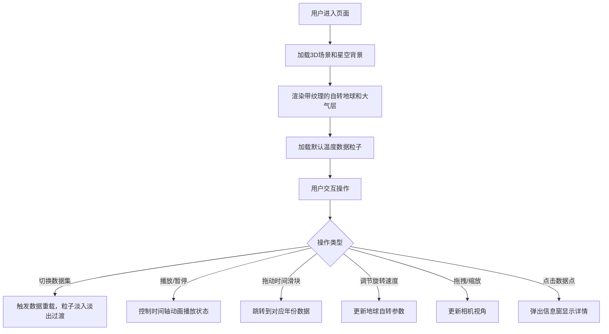

## 1. 产品概述
基于Web的交互式3D地球气候数据可视化系统，为地球科学家提供全球温度、降水等气候数据的动态展示与分析工具。
- 主要目的：通过沉浸式3D可视化辅助气候变化趋势分析，支持多维度数据探索
- 目标用户：地球科学家、气候研究员、环境数据分析师
- 产品价值：将抽象的气候数据转化为直观的3D可视化，降低数据分析门槛，提升科研效率

## 2. 核心功能

### 2.1 功能模块
1. **主场景页面**：3D地球渲染、星空背景、大气层效果、数据粒子展示
2. **UI控制面板**：数据集切换、播放/暂停控制、时间轴滑块、旋转速度调节
3. **交互系统**：鼠标拖拽旋转、滚轮缩放、数据点点击弹窗

### 2.2 页面详情
| 页面名称 | 模块名称 | 功能描述 |
|-----------|-------------|---------------------|
| 主场景页面 | 3D地球渲染 | 带有高清纹理的自转地球，支持旋转速度调节，半透明发光大气层 |
| 主场景页面 | 数据粒子层 | 在经纬度位置生成彩色粒子，温度用红蓝渐变、降水用绿色渐变，粒子大小随数值变化 |
| 主场景页面 | 星空背景 | 深蓝黑色太空主题背景，配以星空粒子闪烁效果 |
| UI控制面板 | 数据集切换 | 下拉菜单选择温度/降水数据集，切换时粒子0.5秒淡入淡出过渡 |
| UI控制面板 | 时间轴播放 | 2000-2020年逐年数据动画播放，每秒更新一帧，播放/暂停按钮，时间滑块可拖动跳转 |
| UI控制面板 | 旋转速度 | 滑块控制地球自转速度 |
| 交互系统 | 视角控制 | 鼠标拖拽旋转地球视角，滚轮缩放，响应时间≤50ms |
| 交互系统 | 数据点交互 | 点击数据点弹出信息窗，显示经纬度和数值 |

## 3. 核心流程
用户进入系统后，看到3D地球和默认温度数据展示。用户可通过控制面板切换数据集、播放时间轴动画、调节自转速度，同时可自由交互探索地球视角。

## 4. 用户界面设计

### 4.1 设计风格
- **主色调**：深蓝黑色太空背景（#0a0e27），蓝紫色渐变UI面板
- **配色方案**：
  - 温度数据：低温蓝色（#1e90ff）→ 中温白色 → 高温红色（#ff4444）
  - 降水数据：浅绿（#90ee90）→ 深绿（#006400）梯度
  - UI强调色：蓝紫色渐变（#6366f1 → #8b5cf6）
- **按钮风格**：半透明毛玻璃背景，圆角8px，hover时放大1.05倍，点击有水波纹反馈
- **字体**：等宽字体（JetBrains Mono / Consolas / monospace）
- **布局风格**：左侧悬浮控制面板，3D场景全屏铺满剩余区域
- **动画效果**：平滑缓动（ease-in-out，0.3s），数据切换0.5秒淡入淡出

### 4.2 页面设计概述
| 页面名称 | 模块名称 | UI元素 |
|-----------|-------------|-------------|
| 主场景页面 | 3D场景 | 全屏Canvas，深蓝黑背景，星空粒子闪烁，地球居中展示 |
| 主场景页面 | 大气层效果 | 半透明蓝紫色光晕，径向渐变发光 |
| UI控制面板 | 面板容器 | 左上角固定，毛玻璃效果（backdrop-filter: blur），蓝紫色渐变边框，可折叠/展开 |
| UI控制面板 | 数据集选择 | 下拉菜单，等宽字体，自定义箭头 |
| UI控制面板 | 播放控制 | 播放/暂停按钮组，时间轴滑块，年份显示 |
| UI控制面板 | 速度控制 | 旋转速度滑块，数值显示 |
| 数据弹窗 | 信息卡片 | 点击数据点时在旁显示，半透明背景，显示经纬度、年份、数值 |

### 4.3 响应式设计
- **桌面端（1920x1080及以上）**：左侧展开控制面板（宽度320px），3D场景铺满剩余区域
- **平板端（768x1024）**：控制面板默认折叠为图标按钮，点击展开为浮层，3D场景始终全屏
- **触控优化**：支持手势旋转和缩放，按钮最小触控区域44px

### 4.4 3D场景设计
- **环境与氛围**：深蓝黑色太空背景，数百颗随机分布的闪烁星星
- **光照设置**：环境光（0.3强度）+ 方向光（1.0强度，模拟太阳）+ 半球光调节大气色调
- **相机设置**：PerspectiveCamera，初始距离3.5，fov 45°，支持OrbitControls交互
- **构图与焦点**：地球居中，占画面约60%，大气层外发光增强视觉层次
- **交互与动画**：地球匀速自转，时间轴播放时粒子颜色/大小平滑插值过渡
- **后处理效果**：轻微Bloom发光效果增强科技感
- **性能预算**：粒子数量控制在2000以内，目标帧率≥30 FPS（i5+GTX 1050）
