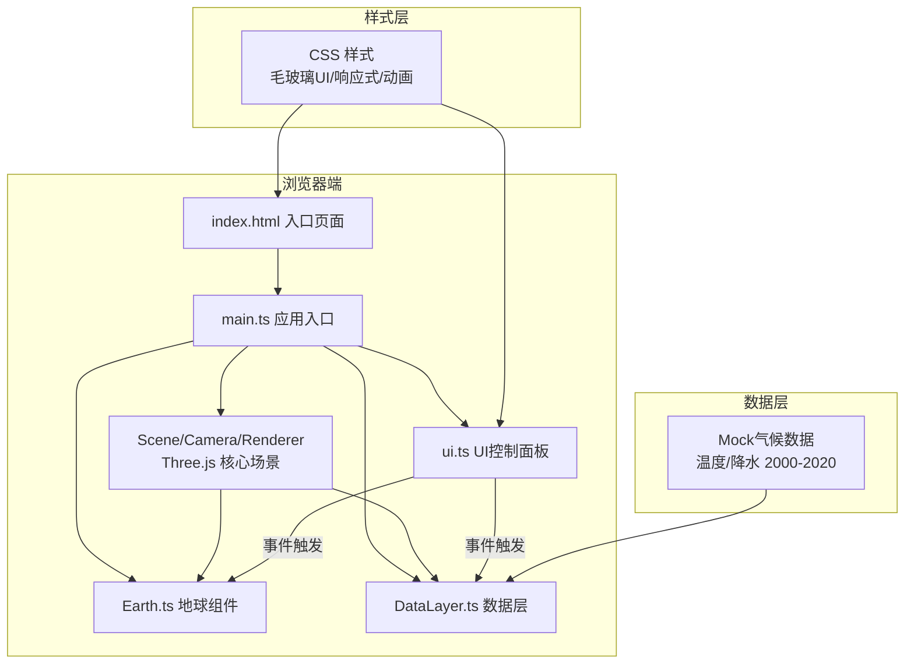

## 1. 架构设计



## 2. 技术描述

- **前端框架**：原生 TypeScript (非 React/Vue，按用户需求)
- **3D 渲染引擎**：Three.js r160+
- **构建工具**：Vite 5.x
- **编程语言**：TypeScript (strict 模式，target ES2020)
- **样式方案**：原生 CSS3 + CSS Variables，支持 backdrop-filter 毛玻璃效果
- **数据来源**：内置 Mock 气候数据（全球约 500 个监测点，覆盖 2000-2020 年）

**依赖清单**：
| 包名 | 版本 | 用途 |
|------|------|------|
| three | ^0.160.0 | 3D 渲染引擎 |
| @types/three | ^0.160.0 | Three.js TypeScript 类型定义 |
| typescript | ^5.3.0 | TypeScript 编译器 |
| vite | ^5.0.0 | 构建工具与开发服务器 |

## 3. 模块职责与调用关系

### 3.1 文件结构

```
auto1/
├── package.json           # 项目依赖配置
├── vite.config.js         # Vite 构建配置
├── tsconfig.json          # TypeScript 配置
├── index.html             # 入口 HTML
└── src/
    ├── main.ts            # 应用入口
    ├── Earth.ts           # 3D 地球组件
    ├── DataLayer.ts       # 数据粒子层
    ├── ui.ts              # UI 控制面板
    ├── data/
    │   └── climateData.ts # Mock 气候数据
    └── styles/
        └── main.css       # 全局样式
```

### 3.2 模块调用关系

```
main.ts (入口)
  ├── 初始化: THREE.Scene, PerspectiveCamera, WebGLRenderer
  ├── 创建: new Earth(scene, rotationSpeed) → 返回 Group
  ├── 创建: new DataLayer(scene) → 返回 DataLayer 实例
  ├── 创建: createUI(container, callbacks) → 返回 UI 控制对象
  ├── 启动: requestAnimationFrame 动画循环
  │     ├── 更新 Earth.rotation
  │     ├── 更新 DataLayer (时间轴插值)
  │     └── Renderer.render()
  └── 事件绑定:
        ├── UI.onDatasetChange → DataLayer.setDataset()
        ├── UI.onYearChange → DataLayer.setYear()
        ├── UI.onPlayToggle → DataLayer.togglePlay()
        └── UI.onRotationSpeed → Earth.setRotationSpeed()

Earth.ts (地球渲染)
  ├── 依赖: THREE
  ├── 输入: scene, rotationSpeed
  ├── 输出: Group (内含地球Mesh + 大气层Mesh)
  ├── 方法: setRotationSpeed(), update(delta)
  └── 资源: 程序生成地球纹理 (Canvas 绘制)

DataLayer.ts (数据可视化层)
  ├── 依赖: THREE, climateData
  ├── 输入: scene, datasetType, year
  ├── 输出: Points (粒子系统)
  ├── 方法: setDataset(), setYear(), togglePlay(), update(delta)
  └── 数据流向: 数据数组 → BufferGeometry → 粒子位置/颜色/大小

ui.ts (用户界面)
  ├── 依赖: DOM API
  ├── 输入: container, callbacks (onChange, onPlay, etc.)
  ├── 输出: UI 控制元素
  └── 方法: setYear(), setPlaying(), collapse()/expand()
```

### 3.3 数据流向

```
climateData.ts (Mock数据)
    │
    ▼
DataLayer.ts
    ├── 接收: { lat, lng, value }[] × 21年
    ├── 转换: 经纬度 → 3D球面坐标 (Vector3)
    ├── 映射: value → 颜色(温度:蓝→红, 降水:浅绿→深绿)
    ├── 映射: value → 粒子大小 (0.02 ~ 0.08)
    └── 输出: THREE.Points (BufferGeometry + ShaderMaterial)
    
时间轴动画:
    当前年份 → 邻近两年数据线性插值 → 粒子属性平滑过渡
```

## 4. 数据模型

### 4.1 气候数据结构

```typescript
// 单个数据点
interface ClimatePoint {
  lat: number;       // 纬度 -90 ~ 90
  lng: number;       // 经度 -180 ~ 180
  name?: string;     // 监测点名称（可选）
}

// 单年数据集
interface YearlyData {
  year: number;      // 年份 2000-2020
  temperature: number[];  // 温度值 -30 ~ 50 (°C)
  precipitation: number[]; // 降水量 0 ~ 500 (mm/月)
}

// 完整数据集
interface ClimateDataset {
  points: ClimatePoint[];
  yearly: YearlyData[];
}

// 数据集类型
type DatasetType = 'temperature' | 'precipitation';
```

## 5. 核心技术实现方案

### 5.1 3D 地球渲染
- **球体几何体**：`THREE.SphereGeometry(1, 64, 64)`（高分段保证平滑）
- **地球纹理**：Canvas 程序生成，包括陆地轮廓、颜色渐变（避免依赖外部图片资源）
- **大气层**：放大 1.05 倍的球体，`MeshBasicMaterial` 配合 `AdditiveBlending`，`BackSide` 渲染，实现半透明发光效果
- **着色器优化**：使用自定义 ShaderMaterial 实现大气层菲涅尔边缘发光

### 5.2 数据粒子系统
- **几何体**：`THREE.BufferGeometry`，使用 Float32Array 存储位置、颜色、大小
- **材质**：`THREE.PointsMaterial` 或自定义 ShaderMaterial，支持 per-point 大小和颜色
- **经纬度转换**：`Vector3.setFromSphericalCoords(1, phi, theta)`，其中 phi = π/2 - lat*π/180, theta = lng*π/180
- **颜色映射**：
  - 温度：-30°C → #1e90ff (蓝), 15°C → #ffffff (白), 50°C → #ff4444 (红)
  - 降水：0mm → #90ee90 (浅绿), 250mm → #228b22 (绿), 500mm → #006400 (深绿)
- **平滑过渡**：在相邻年份数据间进行线性插值 (lerp)

### 5.3 交互系统
- **视角控制**：自定义 OrbitControls 实现（不依赖 three/examples 以保持模块清晰），支持拖拽旋转、滚轮缩放
- **射线检测**：`THREE.Raycaster` 检测数据点点击
- **弹窗显示**：DOM 元素覆盖层，根据 3D 坐标投影到屏幕位置显示

### 5.4 性能优化
- **粒子数量**：控制在 500 个监测点，每点为单个 Point Sprite
- **几何体复用**：使用 BufferGeometry，避免每帧重建
- **材质优化**：共享材质，使用 ShaderMaterial 降低 Draw Call
- **帧率监控**：内置 FPS 计数器，确保 ≥ 30 FPS

## 6. UI 实现要点

### 6.1 毛玻璃面板
```css
.glass-panel {
  background: rgba(99, 102, 241, 0.15);
  backdrop-filter: blur(16px);
  -webkit-backdrop-filter: blur(16px);
  border: 1px solid rgba(139, 92, 246, 0.3);
  border-radius: 12px;
}
```

### 6.2 按钮微交互
- **Hover**：`transform: scale(1.05)`，过渡时间 0.3s ease-in-out
- **Click**：CSS `::after` 伪元素实现水波纹扩散动画

### 6.3 响应式断点
- **≥ 1200px**：面板展开固定宽度 320px
- **< 1200px**：面板折叠为 56px 图标按钮，点击展开浮层
