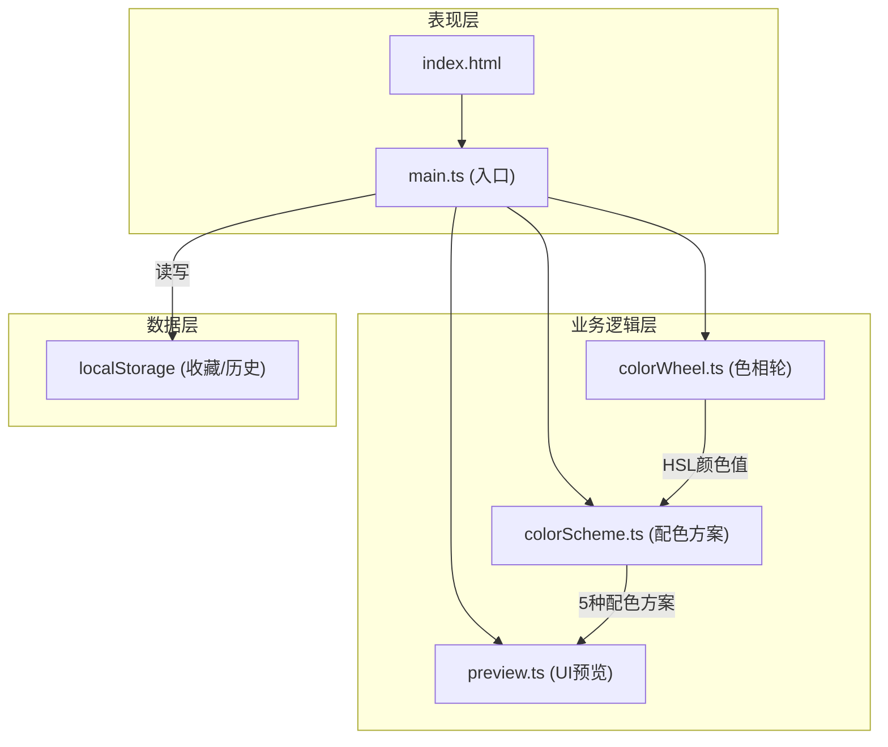

## 1. 架构设计



**数据流说明：**
1. 用户交互 → main.ts 事件监听 → colorWheel.ts 计算选中颜色(HSL)
2. colorWheel.ts → 回调通知 main.ts → colorScheme.ts 生成5种配色方案
3. colorScheme.ts → 返回配色数据 → main.ts → preview.ts 渲染UI预览
4. main.ts → localStorage 管理收藏和历史记录

**模块调用关系：**
- `main.ts` → 调用 `colorWheel.ts` 初始化和事件绑定
- `main.ts` → 调用 `colorScheme.ts` 生成配色方案
- `main.ts` → 调用 `preview.ts` 渲染UI预览
- `colorWheel.ts` → 独立模块，通过回调输出颜色值
- `colorScheme.ts` → 纯函数模块，输入HSL输出配色方案
- `preview.ts` → 独立模块，输入配色方案输出DOM渲染

## 2. 技术描述

- **前端框架**：无框架（原生TypeScript + 纯CSS）
- **构建工具**：Vite 5.x
- **开发语言**：TypeScript 5.x (严格模式, target ES2020)
- **样式方案**：纯CSS + CSS变量
- **图形绘制**：HTML5 Canvas API
- **数据持久化**：localStorage
- **初始化方式**：手动配置Vite + TypeScript项目

## 3. 文件结构定义

```
auto10/
├── package.json          # 依赖配置(typescript, vite)
├── vite.config.js        # Vite构建配置(端口3000)
├── tsconfig.json         # TypeScript配置(严格模式, ES2020, DOM类型)
├── index.html            # 入口HTML
└── src/
    ├── main.ts           # 应用入口：DOM初始化、事件绑定、状态管理
    ├── colorWheel.ts     # 色相轮Canvas绘制与交互
    ├── colorScheme.ts    # 配色方案生成算法
    ├── preview.ts        # UI预览区域渲染
    └── styles.css        # 全局样式
```

## 4. 核心类型定义

```typescript
// HSL颜色表示
interface HSLColor {
  h: number; // 色相 0-360
  s: number; // 饱和度 0-100
  l: number; // 亮度 0-100
}

// 配色方案
interface ColorScheme {
  name: string;           // 方案名称
  type: SchemeType;       // 方案类型
  colors: HSLColor[];     // 颜色数组
}

// 方案类型枚举
type SchemeType = 'analogous' | 'complementary' | 'triadic' | 'monochromatic' | 'custom';

// 应用状态
interface AppState {
  baseColor: HSLColor;              // 当前基准色
  currentScheme: ColorScheme | null; // 当前选中的配色方案
  schemes: ColorScheme[];           // 所有配色方案
  history: HSLColor[];              // 历史记录
  historyIndex: number;             // 当前历史索引
  favorites: FavoriteItem[];        // 收藏列表
}

// 收藏项
interface FavoriteItem {
  id: string;
  baseColor: HSLColor;
  schemes: ColorScheme[];
  createdAt: number;
}
```

## 5. 模块接口定义

### 5.1 colorWheel.ts
```typescript
export class ColorWheel {
  constructor(canvas: HTMLCanvasElement, onChange: (color: HSLColor) => void);
  public render(): void;
  public setColor(color: HSLColor): void;
  public getColor(): HSLColor;
  public destroy(): void;
}
```

### 5.2 colorScheme.ts
```typescript
export function generateSchemes(baseColor: HSLColor): ColorScheme[];
export function hslToHex(color: HSLColor): string;
export function hexToHsl(hex: string): HSLColor;
export function hslToString(color: HSLColor): string;
```

### 5.3 preview.ts
```typescript
export class UIPreview {
  constructor(container: HTMLElement);
  public update(scheme: ColorScheme): void;
  public destroy(): void;
}
```

## 6. 性能优化策略

1. **色相轮渲染优化**：一次性预渲染色相轮渐变到离屏Canvas，选色时仅重绘选中指示器
2. **拖拽节流**：使用requestAnimationFrame节流拖拽事件，确保UI更新≤100ms
3. **CSS变量更新**：预览区颜色更新通过修改CSS变量实现，避免全量DOM重绘
4. **局部渲染**：配色方案色条仅更新背景色，保持DOM结构稳定
5. **历史记录限制**：最多保存20步历史，收藏最多50条，防止内存溢出
