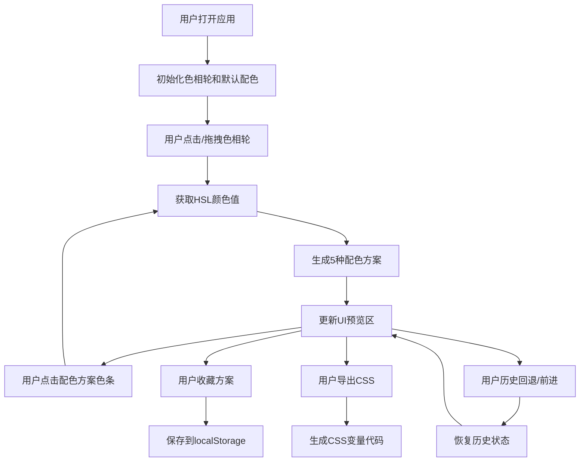

## 1. 产品概述

ColorPalette Studio 是一款面向前端工程师和设计师的在线交互式调色板工具，帮助用户快速生成和探索色彩搭配方案，并实时预览在UI界面上的效果。

- 核心价值：通过可视化色相轮选色和智能配色方案生成，降低色彩搭配的学习成本和探索时间
- 目标用户：前端工程师、UI设计师、产品经理

## 2. 核心功能

### 2.1 用户角色

| 角色 | 注册方式 | 核心权限 |
|------|----------|----------|
| 普通用户 | 无需注册 | 使用全部选色、配色、预览功能；本地收藏和导出 |

### 2.2 功能模块

1. **色相轮选色模块**：Canvas绘制色相轮，支持点击/拖拽选色，实时显示HEX和HSL值
2. **配色方案生成模块**：基于基准色生成5种配色方案（类比色、互补色、三角色、单色、自定义）
3. **UI预览模块**：卡片、按钮、输入框等组件的实时色彩预览
4. **收藏管理模块**：本地收藏配色方案，列表展示，支持删除
5. **历史记录模块**：记录最近20次选色，支持前进/回退
6. **导出模块**：一键导出为CSS变量代码片段

### 2.3 页面详情

| 页面名称 | 模块名称 | 功能描述 |
|-----------|-------------|---------------------|
| 主应用页 | 色相轮面板 | 300x300 Canvas色相轮，点击/拖拽选色，选中点高亮，显示HEX/HSL值 |
| 主应用页 | 配色方案面板 | 5组配色方案横向色条，点击色条设为新基准色，0.3s过渡动画 |
| 主应用页 | UI预览区 | 卡片、按钮、输入框、背景色块，CSS变量绑定，0.5s淡入过渡 |
| 主应用页 | 收藏侧边栏 | 收藏列表展示，支持删除和应用，最多50条 |
| 主应用页 | 历史工具栏 | 前进/后退按钮，20步历史记录 |
| 主应用页 | 导出功能 | CSS变量代码片段生成和复制 |

## 3. 核心流程

用户打开应用 → 默认显示色相轮和初始配色方案 → 在色相轮上点击/拖拽选择基准色 → 实时生成5种配色方案 → 点击配色方案色条可切换基准色 → 预览区实时更新UI效果 → 可收藏喜欢的方案 → 可通过历史记录回退/前进 → 可导出为CSS变量

## 4. 用户界面设计

### 4.1 设计风格
- 主色调：浅色主题，柔和灰背景 (#f8f9fa)
- 强调色：动态根据用户选色变化
- 按钮风格：圆角按钮，点击缩放0.95弹回微动画
- 字体：现代无衬线字体，标题使用优雅的显示字体
- 布局：左侧固定280px侧边栏，右侧主预览区，卡片式布局
- 阴影：柔和多层阴影营造层次感
- 动画：微交互动画（按钮缩放、色条高亮边框闪烁、颜色过渡0.3s ease-in-out）

### 4.2 页面设计概览

| 页面名称 | 模块名称 | UI元素 |
|-----------|-------------|-------------|
| 主应用页 | 色相轮面板 | 300x300 Canvas、柔和阴影、选中点高亮圈、HEX/HSL数值展示 |
| 主应用页 | 配色方案面板 | 圆角卡片、横向色条组、hover放大效果、0.3s平滑过渡 |
| 主应用页 | UI预览区 | 卡片组件、按钮组（主/次/轮廓）、输入框、背景色块、0.5s颜色淡入 |
| 主应用页 | 收藏侧边栏 | 列表布局、小型色条预览、删除按钮、空状态提示 |
| 主应用页 | 工具栏 | 历史前进/后退按钮、收藏按钮、导出按钮、响应式抽屉菜单 |

### 4.3 响应式设计
- 桌面端（≥768px）：左侧固定280px侧边栏 + 右侧主预览区
- 移动端（<768px）：侧边栏折叠为抽屉式菜单，顶部汉堡按钮展开
- 触摸优化：增大点击热区，支持触摸拖拽选色

### 4.4 性能约束
- 色相轮拖动选色 → UI预览更新延迟 ≤ 100ms
- UI预览区帧率 ≥ 30fps
- 本地收藏方案数量 ≤ 50个
- 历史记录步数 ≤ 20步
