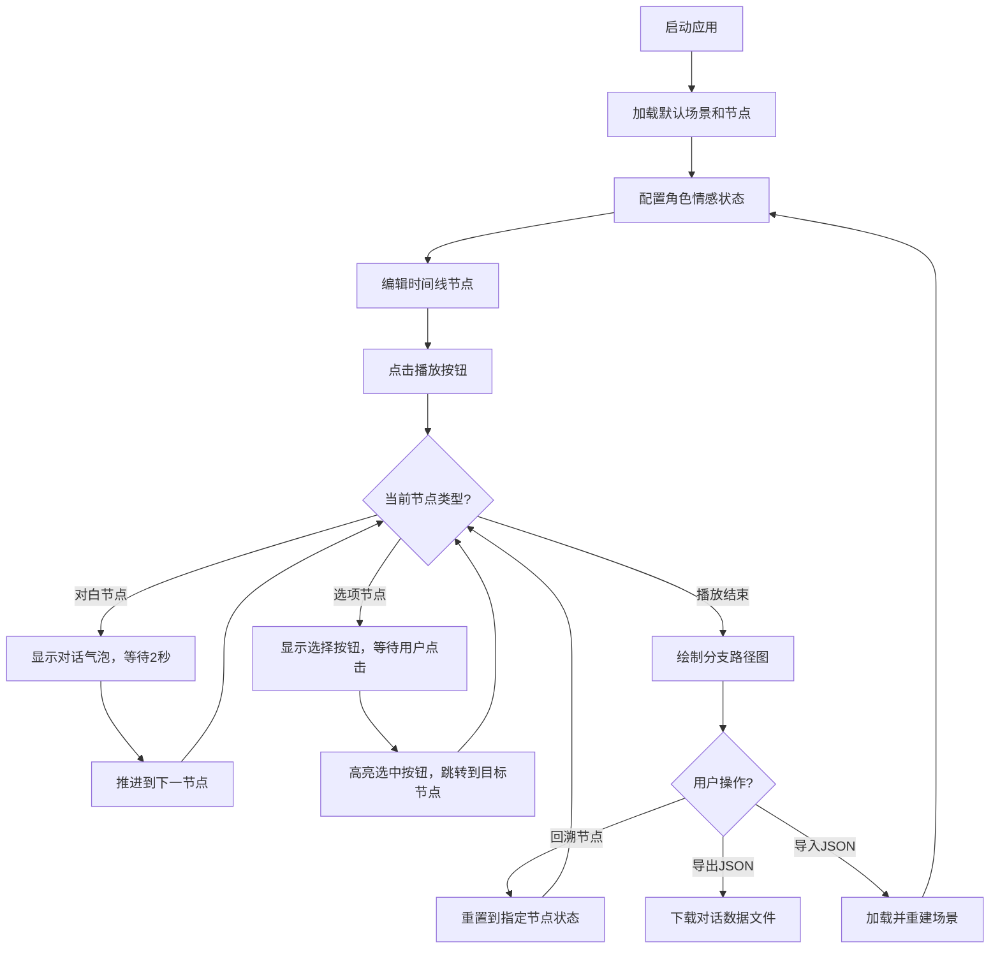

## 1. 产品概述

2D RPG对话系统交互式沙盒应用，帮助独立游戏开发者快速验证角色情感动画与选项分支逻辑的视觉配合效果。

- 主要用途：对话场景构建、情感动画预览、分支路径测试、时序验证
- 目标用户：独立游戏开发者、叙事设计师、对话系统策划
- 核心价值：可视化验证角色表情变化与玩家选择反馈的时序配合，确保不同分支路径下对话气泡位置和出场动画的视觉一致性

## 2. 核心特性

### 2.1 用户角色
| 角色 | 注册方式 | 核心权限 |
|------|----------|----------|
| 开发者 | 无需注册，本地应用 | 完整使用所有功能，导入导出对话数据 |

### 2.2 功能模块
1. **对话场景画布**：Canvas渲染的2D对话场景，左右角色站位，对话气泡动态显示
2. **角色情感配置面板**：为每个角色选择情感状态，实时预览表情动画
3. **时间线编辑器**：可视化编辑对话节点顺序，支持拖拽排序、节点编辑
4. **分支路径可视化**：播放完成后展示分支路径图，支持历史节点回溯
5. **数据导入导出**：JSON格式的对话数据持久化

### 2.3 页面详情
| 页面名称 | 模块名称 | 功能描述 |
|-----------|-------------|---------------------|
| 主工作区 | 工具栏 | 导入JSON、导出JSON按钮 |
| 主工作区 | 左侧角色面板 | 角色信息展示（响应式折叠） |
| 主工作区 | 中央画布 | 角色渲染、对话气泡、情感动画、选择按钮 |
| 主工作区 | 右侧情感面板 | 情感状态下拉选择 |
| 主工作区 | 底部时间线 | 节点拖拽编辑、播放控制、分支路径图 |

## 3. 核心流程

### 主工作流
开发者打开应用后，默认展示预设的3个对话节点。可通过右侧面板调整角色情感状态，在时间线上编辑/拖拽节点，点击播放按钮自动演示对话流程。遇到选项节点时需手动选择分支，播放结束后可查看分支路径图并回溯到任意节点。支持将对话配置导出为JSON文件，或导入已有JSON快速重建场景。

## 4. 用户界面设计

### 4.1 设计风格
- **主色调**：暗色主题，主背景#2d3436，控件区#1e272e，文字色#dfe6e9
- **节点配色**：对白节点浅蓝#74b9ff、选项节点亮橙#fdcb6e、跳转节点淡紫#a29bfe
- **强调色**：路径高亮绿色#00b894，按钮蓝色#0984e3（悬停#0a6dc1）
- **按钮样式**：圆角设计，0.2秒悬停颜色过渡，0.1秒点击缩放(0.95)反馈
- **字体**：系统默认无衬线字体，确保跨平台可读性
- **布局风格**：三栏固定布局（左面板+画布+右面板），底部固定时间线

### 4.2 页面设计概述
| 页面名称 | 模块名称 | UI元素 |
|-----------|-------------|-------------|
| 主工作区 | 画布区域 | 像素风角色（SVG）、对话气泡、情感补间动画、滑入动画、选择按钮闪烁反馈 |
| 主工作区 | 时间线 | 圆角矩形节点、拖拽吸附、高亮当前节点、贝塞尔曲线分支图 |
| 主工作区 | 侧面板 | 固定定位、响应式折叠抽屉、下拉选择框 |

### 4.3 响应式设计
- **桌面端(≥1100px)**：完整三栏布局，左右面板各150px固定宽度
- **平板端(700px-1100px)**：左侧面板折叠为图标按钮，点击展开抽屉式侧栏
- **移动端(<700px)**：底部时间线水平滚动（固定80px高度），分支路径图简化为小标签

### 4.4 动画与性能
- 情感状态切换：0.3秒补间动画
- 对话气泡出场：0.4秒ease-out滑入
- 选择按钮反馈：0.3秒透明度闪烁
- 帧率要求：20节点、5层嵌套时稳定40fps+
