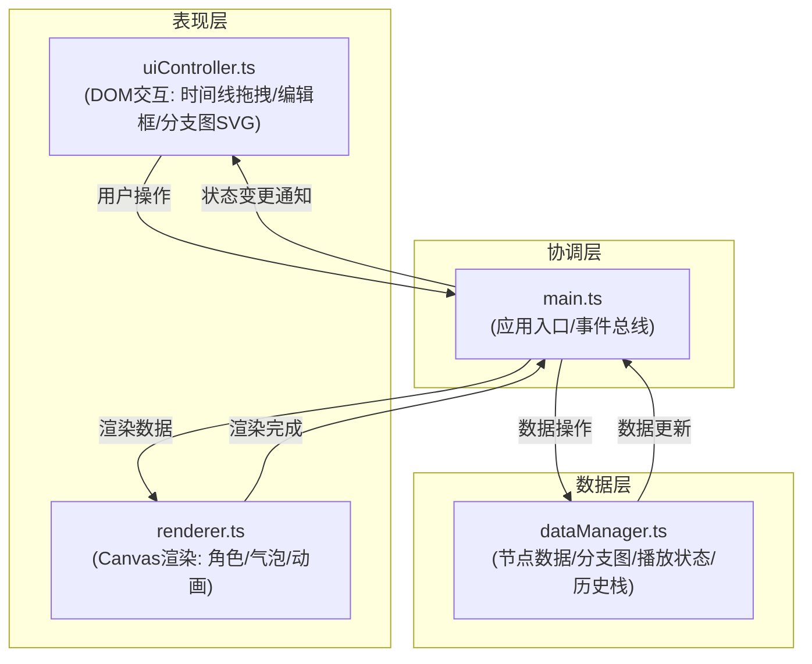

## 1. 架构设计



## 2. 技术说明

- **前端框架**：原生DOM + TypeScript（无框架）
- **构建工具**：Vite@5
- **渲染技术**：Canvas 2D API + 内联SVG
- **状态管理**：dataManager单例 + 观察者模式
- **后端**：无（纯前端应用）
- **数据持久化**：浏览器文件API（JSON导入导出）

## 3. 核心模块职责

### 3.1 src/main.ts
- 应用入口，初始化Canvas尺寸
- 创建并连接dataManager、renderer、uiController
- 作为事件中转站，转发数据流
- 绑定全局事件（窗口resize等）

### 3.2 src/renderer.ts
- Canvas场景绘制：角色（内联SVG转绘）、对话气泡、选择按钮
- 情感动画补间（眼睛/嘴巴形态过渡）
- 气泡滑入动画（ease-out）
- 暴露方法：drawScene(state)、animateEmotion(character, from, to, duration)

### 3.3 src/dataManager.ts
- 对话节点数据CRUD（addNode/removeNode/moveNode）
- 分支关系图管理（links数组）
- 播放状态管理（当前节点、播放中标志、计时器）
- 历史路径栈（用于回溯）
- JSON导入/导出
- 状态变更通知（观察者回调）

### 3.4 src/uiController.ts
- 时间线节点DOM创建与拖拽交互（80px格点吸附）
- 节点编辑框（双击弹出，文本≤60字，选项节点支持2个选项）
- 播放按钮控制
- 分支路径图SVG绘制（圆环节点+贝塞尔连线，路径高亮#00b894）
- 导入/导出按钮绑定
- 响应式面板折叠控制

## 4. 数据模型

### 4.1 类型定义

```typescript
type EmotionType = 'neutral' | 'happy' | 'sad' | 'angry' | 'surprised';
type NodeType = 'dialogue' | 'choice' | 'jump';

interface Choice {
  text: string;
  targetNodeId: string;
}

interface DialogueNode {
  id: string;
  type: NodeType;
  character: 'left' | 'right';
  emotion: EmotionType;
  text: string;
  choices?: Choice[];
}

interface Link {
  from: string;
  to: string;
}

interface DialogueData {
  nodes: DialogueNode[];
  links: Link[];
}

interface AppState {
  data: DialogueData;
  currentNodeId: string | null;
  isPlaying: boolean;
  history: string[];  // 已访问的节点ID栈
  activeChoice: number | null;  // 当前选中的选项索引
  characterEmotions: { left: EmotionType; right: EmotionType };
}
```

### 4.2 导出JSON格式
```json
{
  "nodes": [
    {
      "id": "node_1",
      "type": "dialogue",
      "character": "left",
      "emotion": "happy",
      "text": "你好，很高兴见到你！",
      "choices": []
    }
  ],
  "links": [
    { "from": "node_1", "to": "node_2" }
  ]
}
```

## 5. 文件结构

```
project-root/
├── package.json          # typescript、vite@5 依赖，dev脚本
├── vite.config.js        # Vite配置，端口3000
├── tsconfig.json         # 严格模式，ES2020，DOM类型
├── index.html            # 入口页面，容器结构，内联重置样式
└── src/
    ├── main.ts           # 应用入口
    ├── renderer.ts       # Canvas渲染
    ├── dataManager.ts    # 数据管理
    └── uiController.ts   # UI交互控制
```
